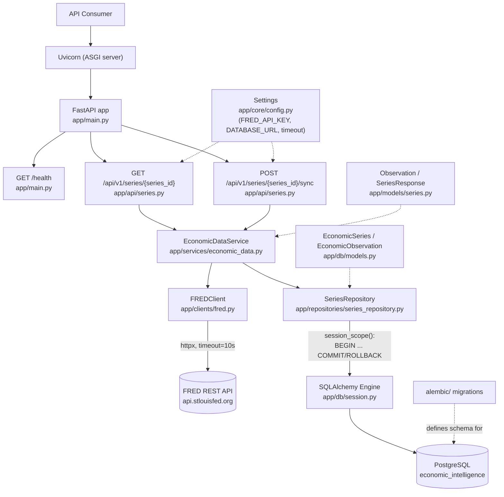

# Current Architecture

This document describes the system **as it exists right now**, after
Increment 003. It is not a history — see [`../ENGINEERING_JOURNAL.md`](../ENGINEERING_JOURNAL.md)
for how it got here, and [`../adr/`](../adr/) for why specific choices were
made.

## Components

| Component | Location | Responsibility |
|---|---|---|
| ASGI server | Uvicorn (process) | Runs the FastAPI app, handles HTTP connections |
| Application | `app/main.py` | Creates the `FastAPI` app, mounts routers, defines `/health` |
| Series route | `app/api/series.py` | HTTP layer for `/api/v1/series/{series_id}` and `.../sync`: request handling, exception → status code translation |
| Economic data service | `app/services/economic_data.py` (`EconomicDataService`) | Use-case logic: fetch + normalize a series; orchestrate fetch-then-persist for sync |
| FRED client | `app/clients/fred.py` (`FREDClient`) | All FRED-specific HTTP: request construction, timeout, FRED error → typed exception translation |
| Series repository | `app/repositories/series_repository.py` (`SeriesRepository`) | All SQL for series/observations: upserts series metadata and observations within a caller-owned transaction |
| Response models | `app/models/series.py` (`Observation`, `SeriesResponse`) | The application's own, provider-independent API response contract |
| ORM models | `app/db/models.py` (`EconomicSeries`, `EconomicObservation`) | The relational shape of persisted data |
| DB engine/session | `app/db/session.py` | Lazily-created SQLAlchemy engine (connection pool) and `session_scope()` transaction boundary |
| Configuration | `app/core/config.py` (`Settings`) | Reads `FRED_API_KEY`, `DATABASE_URL`, and the FRED request timeout from the environment |
| Schema migrations | `alembic/` | Version-controlled schema history, applied explicitly via `alembic upgrade head` |

## Architecture diagram



## Configuration boundary

`app/core/config.py` is the single place that reads from the process
environment. It exposes a module-level `settings` object with:

- `fred_api_key: str | None` — read from `FRED_API_KEY`; `None` if unset.
- `fred_timeout_seconds: float` — currently a fixed constant (`10.0`), not
  environment-configurable.
- `database_url: str | None` — read from `DATABASE_URL`; `None` if unset.

`load_dotenv()` runs at import time to populate `os.environ` from a local
`.env` file for development convenience; it is a no-op if no `.env` file is
present. Nothing outside `app/core/config.py` reads environment variables
directly, and no secret value is ever hardcoded in source.

Alembic (`alembic/env.py`) reads the same `settings.database_url` at
migration time rather than storing a URL of its own — one source of truth
for how to reach the database.

## Database boundary

- **Engine & pooling** (`app/db/session.py`) — a single SQLAlchemy
  `Engine` (and the connection pool it owns) is created lazily, on first
  use, and cached — never at import time. This means the application
  starts, and `/health` works, even with no `DATABASE_URL` configured;
  only an operation that actually touches the database can fail on
  missing/bad configuration.
- **Session & transaction** — `session_scope()` is a context manager and
  the *only* place a transaction is committed or rolled back: commit if
  the block completes normally, rollback (and re-raise) on any exception.
  One `Session` per use, never a shared/global one.
- **Repository** (`SeriesRepository`) — the only code that issues SQL for
  series/observation data. It performs writes on the `Session` it's given
  but never calls `commit()`/`rollback()` itself; the caller (the route,
  via `session_scope()`) owns the transaction boundary.
- **Migrations** (`alembic/`) — the schema is never created by
  `Base.metadata.create_all()` at startup. It exists only because a
  migration under `alembic/versions/` created it; schema changes must go
  through a new migration.

## Response models vs. ORM models

Two distinct sets of classes, on purpose:

- `app/models/series.py` (`Observation`, `SeriesResponse`) — Pydantic, the
  **API contract** returned to consumers of both `GET` and `POST .../sync`.
- `app/db/models.py` (`EconomicObservation`, `EconomicSeries`) — SQLAlchemy
  ORM, the **relational shape** persisted in PostgreSQL.

`SeriesRepository` is the only code that translates between them. API
consumers never see the ORM models or raw database rows; the database
never stores the API's Pydantic objects directly.

## Data model

```
economic_series (1) ──< economic_observations (N)
```

| Table | Key columns |
|---|---|
| `economic_series` | `id` (PK), `series_id` (unique, e.g. `"UNRATE"`), `title`, `units`, `source`, `created_at`, `updated_at` |
| `economic_observations` | `id` (PK), `economic_series_id` (FK → `economic_series.id`, `ON DELETE CASCADE`), `observation_date`, `value` (nullable), `created_at`; `UNIQUE(economic_series_id, observation_date)` |

`economic_series.id` is the internal database identity; `series_id` is the
external, FRED-assigned business identifier — kept as separate columns
deliberately (see [ADR-006](../adr/006-postgresql-persistence.md)).

## Response contract

API consumers only ever receive `app/models/series.py`'s Pydantic models —
never FRED's raw JSON and never a raw database row. Both
`GET /api/v1/series/{series_id}` and `POST /api/v1/series/{series_id}/sync`
return the same shape:

```json
{
  "series_id": "UNRATE",
  "title": "Unemployment Rate",
  "units": "Percent",
  "source": "FRED",
  "observations": [
    { "date": "2026-07-01", "value": 4.1 },
    { "date": "2026-08-01", "value": null }
  ]
}
```

Notes on the current implementation:
- `observations` is the 10 most recent data points (`DEFAULT_OBSERVATION_LIMIT`
  in `app/services/economic_data.py`), ordered oldest → newest.
- `value` is `null` when FRED reports a missing observation (FRED's raw `"."`),
  both in this response and as stored (`NULL`) in `economic_observations`.
- `source` is currently always the literal string `"FRED"` — there is only
  one provider.
- `GET` never touches the database — it is a pure, read-only pass-through
  to FRED, unchanged since Increment 002. `POST .../sync` is the only
  operation that writes.

## Health endpoint

`GET /health` is unchanged since Increment 001: a synchronous route with no
dependencies, returning `{"status": "ok"}`. It exists to prove the process
is up and serving, independent of any external integration's (FRED's or
the database's) health.

## External provider boundary

`FREDClient` (`app/clients/fred.py`) is the *only* code in the repository
that knows FRED's base URL, query parameter names, or response shape. It
communicates failure to its caller exclusively through five exception
types (`FREDError` and four subclasses — not-found, auth, timeout,
upstream/malformed), never through raw `httpx` exceptions or FRED's raw
error payload. Everything above the client (`EconomicDataService`, the
route) only ever sees those typed exceptions or valid data.

## What is deliberately NOT part of this architecture yet

The following are intentionally absent — not overlooked:

- **Database as a cache** — `GET /api/v1/series/{series_id}` does not read
  from PostgreSQL; there is no database-first lookup, freshness policy, or
  cache invalidation. The database is currently write-only from the
  application's perspective, populated exclusively by `POST .../sync`.
- **Automatic/background synchronization** — no scheduler, no background
  job, no Celery, no message queue. Sync only happens when a client calls
  `POST .../sync`.
- **Multiple data providers** — FRED is the only source. `EconomicDataService`
  is structured so a second provider could be added behind it later, but
  no such abstraction (registry, plugin interface, etc.) exists yet.
- **AI/LLM functionality** — no reasoning layer, tool calling, RAG, or
  embeddings.
- **Authentication/authorization** — the API is unauthenticated; anyone who
  can reach it can call it.
- **Async I/O** — both `FREDClient` and the database session are
  synchronous by deliberate choice (see [ADR-003](../adr/003-fred-rest-httpx.md)
  and [ADR-007](../adr/007-synchronous-sqlalchemy.md)), even though
  FastAPI/Uvicorn support async routes and SQLAlchemy supports async
  sessions.
- **Containerization / cloud infrastructure** — no Dockerfile, no deployment
  configuration, no Terraform.
- **Observability** — no structured logging, metrics, or tracing beyond
  Uvicorn's default access logs.
- **Automated test suite** — verification so far has been done by running
  the live application and scripted checks against a real database, not a
  committed test suite.
- **Generic repository/Unit-of-Work framework** — `SeriesRepository` is a
  single, concrete class for exactly the persistence this increment needs
  (see [ADR-009](../adr/009-repository-boundary.md)); no base class or
  abstraction exists for a second repository that doesn't exist yet.

## Future direction (not implemented)

This section is a pointer to intent only — nothing below exists in the
codebase today. Per the project purpose, later increments are expected to
add, in some order: database-backed reads with an explicit freshness
policy, additional external data providers, an AI reasoning/tool-calling
layer over the persisted data, and production infrastructure concerns
(Docker, CI/CD, observability, cloud deployment). Each will get its own
ADR(s) and journal entry when it happens, the same as Increments 001–003.
