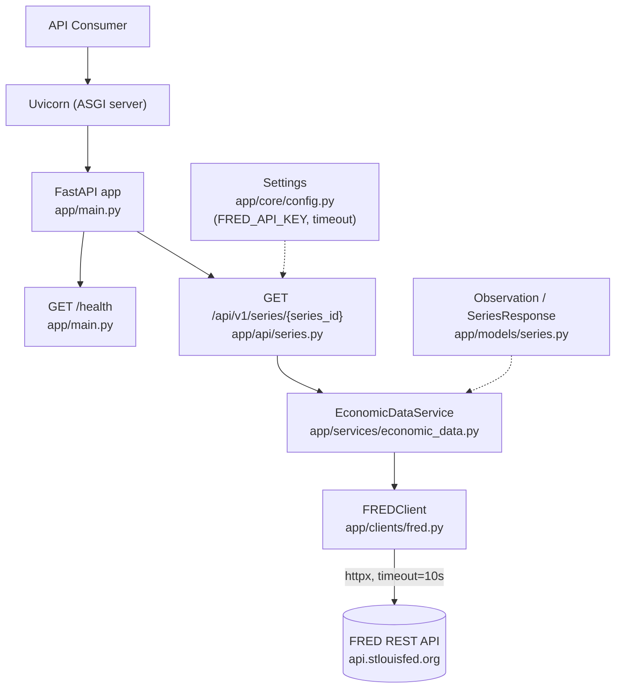

# Current Architecture

This document describes the system **as it exists right now**, after
Increment 002. It is not a history — see [`../ENGINEERING_JOURNAL.md`](../ENGINEERING_JOURNAL.md)
for how it got here, and [`../adr/`](../adr/) for why specific choices were
made.

## Components

| Component | Location | Responsibility |
|---|---|---|
| ASGI server | Uvicorn (process) | Runs the FastAPI app, handles HTTP connections |
| Application | `app/main.py` | Creates the `FastAPI` app, mounts routers, defines `/health` |
| Series route | `app/api/series.py` | HTTP layer for `/api/v1/series/{series_id}`: request handling, exception → status code translation |
| Economic data service | `app/services/economic_data.py` (`EconomicDataService`) | Use-case logic: fetch + normalize a series |
| FRED client | `app/clients/fred.py` (`FREDClient`) | All FRED-specific HTTP: request construction, timeout, FRED error → typed exception translation |
| Response models | `app/models/series.py` (`Observation`, `SeriesResponse`) | The application's own, provider-independent response contract |
| Configuration | `app/core/config.py` (`Settings`) | Reads `FRED_API_KEY` and the FRED request timeout from the environment |

## Architecture diagram



## Configuration boundary

`app/core/config.py` is the single place that reads from the process
environment. It exposes a module-level `settings` object with:

- `fred_api_key: str | None` — read from `FRED_API_KEY`; `None` if unset.
- `fred_timeout_seconds: float` — currently a fixed constant (`10.0`), not
  environment-configurable.

`load_dotenv()` runs at import time to populate `os.environ` from a local
`.env` file for development convenience; it is a no-op if no `.env` file is
present. Nothing outside `app/core/config.py` reads environment variables
directly, and no secret value is ever hardcoded in source.

## Response contract

API consumers only ever receive `app/models/series.py`'s Pydantic models —
never FRED's raw JSON. Current shape of `GET /api/v1/series/{series_id}`:

```json
{
  "series_id": "UNRATE",
  "title": "Unemployment Rate",
  "units": "Percent",
  "source": "FRED",
  "observations": [
    { "date": "2026-07-01", "value": 4.1 },
    { "date": "2026-08-01", "value": null }
  ]
}
```

Notes on the current implementation:
- `observations` is the 10 most recent data points (`DEFAULT_OBSERVATION_LIMIT`
  in `app/services/economic_data.py`), ordered oldest → newest.
- `value` is `null` when FRED reports a missing observation (FRED's raw `"."`).
- `source` is currently always the literal string `"FRED"` — there is only
  one provider.

## Health endpoint

`GET /health` is unchanged since Increment 001: a synchronous route with no
dependencies, returning `{"status": "ok"}`. It exists to prove the process
is up and serving, independent of any external integration's health.

## External provider boundary

`FREDClient` (`app/clients/fred.py`) is the *only* code in the repository
that knows FRED's base URL, query parameter names, or response shape. It
communicates failure to its caller exclusively through five exception
types (`FREDError` and four subclasses — not-found, auth, timeout,
upstream/malformed), never through raw `httpx` exceptions or FRED's raw
error payload. Everything above the client (`EconomicDataService`, the
route) only ever sees those typed exceptions or valid data.

## What is deliberately NOT part of this architecture yet

The following are intentionally absent — not overlooked:

- **Persistence** — no database, no ORM, no caching layer. Every request
  hits FRED live.
- **Multiple data providers** — FRED is the only source. `EconomicDataService`
  is structured so a second provider could be added behind it later, but
  no such abstraction (registry, plugin interface, etc.) exists yet.
- **AI/LLM functionality** — no reasoning layer, tool calling, RAG, or
  embeddings.
- **Authentication/authorization** — the API is unauthenticated; anyone who
  can reach it can call it.
- **Async I/O** — `FREDClient` is synchronous by deliberate choice (see
  [ADR-003](../adr/003-fred-rest-httpx.md)), even though FastAPI/Uvicorn
  support async routes.
- **Containerization / cloud infrastructure** — no Dockerfile, no deployment
  configuration, no Terraform.
- **Observability** — no structured logging, metrics, or tracing beyond
  Uvicorn's default access logs.
- **Automated test suite** — verification so far has been done by running
  the live application and scripted checks, not a committed test suite.

## Future direction (not implemented)

This section is a pointer to intent only — nothing below exists in the
codebase today. Per the project purpose, later increments are expected to
add, in some order: persistent storage (PostgreSQL), additional external
data providers, an AI reasoning/tool-calling layer over the data, and
production infrastructure concerns (Docker, CI/CD, observability, cloud
deployment). Each will get its own ADR(s) and journal entry when it happens,
the same as Increments 001–002.
