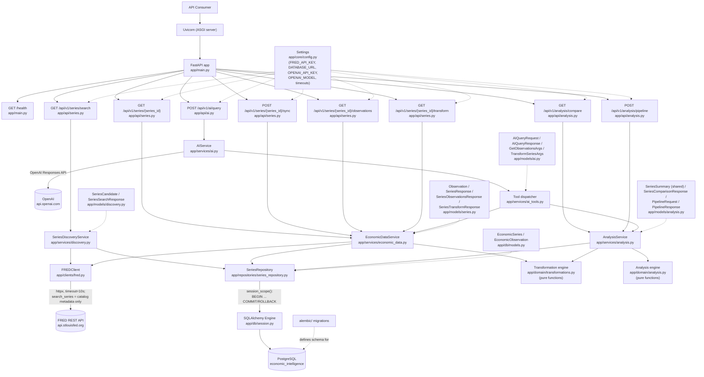

# Current Architecture

This document describes the system **as it exists right now**. It is not
a history — see [`../ENGINEERING_JOURNAL.md`](../ENGINEERING_JOURNAL.md)
for how it got here, and [`../adr/`](../adr/) for why specific choices were
made. The AI path (`app/api/ai.py`/`app/services/ai.py`/`app/services/ai_tools.py`)
reflects Increment 008 exactly and is frozen, non-canonical, and not
required for anything else described here — see the "Deterministic
discovery" section below and ADR-015/016/017's status notes for why.

## Components

| Component | Location | Responsibility |
|---|---|---|
| ASGI server | Uvicorn (process) | Runs the FastAPI app, handles HTTP connections |
| Application | `app/main.py` | Creates the `FastAPI` app, mounts routers, defines `/health` |
| Series route | `app/api/series.py` | HTTP layer for `/api/v1/series/search`, `/{series_id}`, `.../sync`, `.../observations`, and `.../transform`: request/query-parameter handling, exception → status code translation |
| Analysis route | `app/api/analysis.py` | HTTP layer for `/api/v1/analysis/compare` and `.../pipeline`: request/body validation, exception → status code translation |
| Inflation Monitor route | `app/api/inflation.py` | HTTP layer for `GET /api/v1/monitors/inflation` and `GET /api/v1/monitors/inflation/changes`: no request parameters on either, exception → status code translation. Read-only; no FRED, no AI. |
| Release calendar route | `app/api/releases.py` | HTTP layer for `GET /api/v1/releases` (database-only, filterable, never calls FRED) and `POST /api/v1/releases/sync` (explicit, FRED-backed, per-release failure isolation). See [Flow 28](./request-flows.md#flow-28--release-calendar-read-get-apiv1releases-increment-17a)/[Flow 29](./request-flows.md#flow-29--release-calendar-sync-post-apiv1releasessync-increment-17a). Increment #18 (release-driven update pipeline) adds **no route here or anywhere else** — see the Release processing service row below and [docs/architecture/release-processing-v1.md](./release-processing-v1.md) §18. |
| AI route | `app/api/ai.py` | HTTP layer for `/api/v1/ai/query`: request validation, `AIService` failures → status code translation. Frozen at Increment 008 behavior (three tools, no discovery) — see above. |
| Economic data service | `app/services/economic_data.py` (`EconomicDataService`) | Single-series use-case logic: fetch + normalize a series from FRED; orchestrate fetch-then-persist for sync; validate and coordinate a persisted-observations query; validate and orchestrate a transformation (including boundary-context retrieval) |
| Analysis service | `app/services/analysis.py` (`AnalysisService`) | Multi-series use-case logic: look up two persisted series, retrieve and date-filter each independently, optionally transform each side (pipeline only), delegate alignment/spread/correlation to the analysis domain module. No FRED dependency at all. |
| Inflation Monitor service | `app/services/inflation.py` (`InflationMonitorService`) | Looks up the four canonical series (`PCEPILFE`, `CPILFESL`, `PCEPI`, `CPIAUCSL`) independently; a series not persisted at all yields an empty observation list rather than an error. `get_result` delegates every calculation to `app.domain.inflation` (latest snapshot, `inflation_v1.0`); `get_what_changed_result` additionally selects each section's exact current/previous calendar periods (`app.domain.inflation`'s `month_over_month_*` helpers) and delegates comparison to `app.domain.inflation_what_changed` (`inflation_what_changed_v1.0`). No FRED dependency; never mutates persisted data. |
| Release calendar service | `app/services/releases.py` (`ReleaseReadService`, `ReleaseSyncService`) | Deliberately two separate classes, not one with an optional `FREDClient` (the `EconomicDataService` pattern): `ReleaseReadService` has no FRED-shaped parameter anywhere on it, so the read path is structurally incapable of calling FRED, not just conventionally discouraged. `ReleaseSyncService` iterates the curated, active release catalog, syncing each independently (a per-release FRED failure never aborts the others). Neither ever writes `EconomicObservation` or touches a monitor. Statically forbidden from importing anything series/observation/Inflation-shaped (unchanged by #18 — see the next row). |
| Release processing service (Increment #18) | `app/services/release_processing.py` (`ReleaseProcessingService`) | The ONE new module that legitimately imports both the release-calendar side (`ReleaseRepository`, read-only) and the series/Inflation side (`ReleaseProcessingRepository`, `app.domain.inflation`, `app.domain.inflation_what_changed`) — deliberate, since `app.repositories.release_repository`/`app.services.releases`/`app.api.releases` remain structurally forbidden from that same import (checked by `tests/integration/test_transaction_and_safety.py::TestReleaseCalendarStructuralIndependence`, unmodified). Fetches each release's mapped series over a bounded five-year window, classifies NEW/REVISED/UNCHANGED, captures before/after Inflation evidence around the canonical write, and diffs the two via the EXISTING `app.domain.inflation_what_changed` comparators — never a reimplementation. See [docs/architecture/release-processing-v1.md](./release-processing-v1.md). |
| Discovery service | `app/services/discovery.py` (`SeriesDiscoveryService`) | Finds candidate series by concept/phrase: searches local persisted metadata and (if FRED is configured) FRED's catalog, merges and deterministically ranks the results. No AI, no ML/embedding relevance score, no analysis math, no ingestion — metadata only. See "Deterministic discovery" below. |
| AI service | `app/services/ai.py` (`AIService`) | Owns the OpenAI Responses API boundary and the bounded tool-calling loop (max 4 rounds). No transformation/analysis math, no direct database access — delegates every tool call to `app.services.ai_tools`. Frozen at Increment 008 behavior. |
| AI tool boundary | `app/services/ai_tools.py` | The explicit tool dispatcher: three tools (`get_observations`, `transform_series`, `analyze_series`), each validated (Pydantic) then executed via the existing `EconomicDataService`/`AnalysisService` methods. Read-only; no `FREDClient` reachable from here. Frozen at Increment 008 behavior. |
| FRED client | `app/clients/fred.py` (`FREDClient`) | All FRED-specific HTTP: request construction, timeout, FRED error → typed exception translation, including catalog search (`search_series` — metadata only, never observations) and release-dates lookup (`get_release_dates`, returning normalized `FredReleaseDate` pairs, date-only — never a raw provider payload). Never imported by the AI path. `get_observations` (Increment #18) gained two optional parameters, `observation_start`/`sort_order` — every pre-#18 call site is byte-for-byte unaffected (no new param sent, `sort_order` still defaults `"desc"`); release processing is the one caller that passes both, for its bounded five-year detection window. No second `FREDClient`/provider abstraction was added (ADR-020 unchanged). |
| Series repository | `app/repositories/series_repository.py` (`SeriesRepository`) | All SQL for series/observations: upserts series metadata and observations within a caller-owned transaction; series lookup; local metadata search (`search_series`); filtered/ordered/paginated observation queries; unpaginated range queries and preceding-context queries. Reused as-is by every consumer added since Increment 005 — no analysis-, pipeline-, or discovery-specific repository methods were ever needed beyond `search_series` itself. `_upsert_observations`' blind-overwrite behavior (backing the plain `/series/{id}/sync`) is unmodified by #18 — release processing owns a separate write path (next-but-one row), never retrofitted here. |
| Release repository | `app/repositories/release_repository.py` (`ReleaseRepository`) | All SQL for the release calendar: curated active-release lookup, provider-identity lookup, idempotent occurrence upsert (`(economic_release_id, scheduled_date)`, never deletes), filtered/ordered/paginated occurrence queries joined to their release. Never imports `app.clients.fred`/`httpx` (checked structurally) — the layer closest to the database never talks to FRED at all. Gained one new read-only method for Increment #18, `get_occurrence_by_id` — a plain lookup by internal id, adding no write capability and no import of anything series/Inflation-shaped. |
| Release processing repository (Increment #18) | `app/repositories/release_processing_repository.py` (`ReleaseProcessingRepository`) | The one write path for #18: `ReleaseSeriesMapping` reads, `EconomicSeries`/`EconomicObservation` create/read/write (a small, independent reimplementation of `SeriesRepository`'s basic upsert shape — deliberately not calling into it, so the plain `/series/{id}/sync` path's behavior is never touched), and `ReleaseCheckRun`/`ReleaseObservationUpdate`/`ReleaseAnalysisUpdate` persistence. See [docs/architecture/release-processing-v1.md](./release-processing-v1.md). |
| Transformation engine | `app/domain/transformations.py` (`absolute_change`, `percent_change`, `moving_average`) | Pure, deterministic math over one series' observation list — no FastAPI, SQLAlchemy, FRED, environment, or I/O of any kind. Unmodified since Increment 005; reused as-is by the pipeline. |
| Analysis engine | `app/domain/analysis.py` (`align_series`, `calculate_spread`, `count_usable_pairs`, `pearson_correlation`) | Pure, deterministic math over two series' observation lists — same no-I/O discipline as the transformation engine. Unmodified since Increment 006; reused as-is by the pipeline. |
| Inflation Monitor engine | `app/domain/inflation.py` (`classify_state`, `classify_period`, `compute_series_momentum`, `compute_confirmation`, `compute_target`, `compute_headline_context`, `compute_inflation_monitor_result`, and their calendar/index helpers, plus the exact-period siblings `compute_series_momentum_at`/`compute_target_at`/`compute_confirmation_at`, the new period-selection function `latest_shared_observation_period`, and the `month_over_month_*` convenience wrappers) | Pure, deterministic implementation of the frozen `inflation_v1.0` methodology — same no-I/O discipline as the other domain engines, plus one departure from `app/domain/transformations.py`'s convention: every horizon here resolves by an exact calendar-month lookup against a `{date: value}` index, never by row position, per the frozen specification. The exact-period siblings and `month_over_month_*` helpers exist for `inflation_what_changed_v1.0` (below) but reuse every existing classification primitive unmodified — no second methodology. |
| Inflation What Changed comparator | `app/domain/inflation_what_changed.py` (`compare_series_momentum_section`, `compare_target_section`, `compare_confirmation_section`, `assemble_what_changed_result`) | Pure, deterministic comparison layer for the frozen `inflation_what_changed_v1.0` contract — architecturally forbidden from importing `app.domain.inflation` (enforced by the architectural-independence test), so it structurally cannot know how CPI/PCE annualization, boundary classification, or confirmation-relationship rules work; it only diffs two already-canonical evidence objects (built by the engine above, at periods the service selects) and assembles the deterministically-ordered result. |
| Release calendar engine | `app/domain/releases.py` (`classify_schedule_status`) | Pure, deterministic: derives `SCHEDULED`/`PAST_DUE` from `(scheduled_date, as_of_date)` only — `as_of_date` is always an explicit parameter, never read from the system clock internally, so the function (and everything built on it) is reproducible under test. No `CANCELLED`/`UNKNOWN` in #17A (see [docs/architecture/release-intelligence-v1.md](./release-intelligence-v1.md) #7 for why). Unmodified by #18 — gained no write capability (checked structurally). |
| Release processing engine (Increment #18) | `app/domain/release_processing.py` (`classify_observation_change`, `five_year_observation_start`, `affected_evaluation_periods`, `components_for_series`) | Pure, deterministic — same no-I/O discipline as every other domain module, and (like `app.domain.inflation_what_changed`) deliberately imports no other domain module either, keeping every domain module in this package independent. Contains zero Inflation classification/annualization logic of its own; `components_for_series` is a verified mirror of `InflationMonitorService`'s own existing series-to-section wiring, never an invented economic-significance mapping. See [docs/architecture/release-processing-v1.md](./release-processing-v1.md). |
| Response models | `app/models/series.py`, `app/models/analysis.py` (see prior increments), `app/models/discovery.py` (`SeriesCandidate`, `SeriesSearchResponse`), `app/models/ai.py` (`AIQueryRequest`, `AIQueryResponse`, `ToolCallRecord`, `GetObservationsArgs`, `TransformSeriesArgs`), `app/models/inflation.py` (`InflationMonitorResult` and its nested evidence/coverage/period models; the one canonical definition of `inflation_v1.0`'s constants and enums), `app/models/inflation_what_changed.py` (`InflationWhatChangedResult`, its five section models, and `ChangeEvent` — reuses `SeriesMomentumResult`/`TargetResult` verbatim as canonical evidence, introduces no new economic type), `app/models/releases.py` (`ReleaseListResponse`, `ReleaseOccurrenceItem` — `schedule_status` computed at response time, never a persisted field this module knows how to derive; `ReleaseSyncResponse` and its per-release `synced`/`failed` shapes), `app/models/release_processing.py` (Increment #18 — `ReleaseCheckRunResult`, `SeriesCheckOutcome`, `ObservationChangeRecord`, `AnalysisChangeRecord`; `AnalysisChangeRecord` mirrors `ChangeEvent`'s field set with one deliberate adaptation, `evaluation_period` instead of `previous_period`/`current_period` — see [docs/architecture/release-processing-v1.md](./release-processing-v1.md) §8.1) | The application's own, provider-independent API response contract; AI tool argument models double as that (frozen) path's validation boundary |
| ORM models | `app/db/models.py` (`EconomicSeries`, `EconomicObservation`, `EconomicRelease`, `ReleaseOccurrence`, `ReleaseSeriesMapping`, `ReleaseCheckRun`, `ReleaseObservationUpdate`, `ReleaseAnalysisUpdate`) | The relational shape of persisted data. `EconomicRelease`/`ReleaseOccurrence` (Increment #17A) follow the same `id` (internal) vs. business-identifier (`provider`+`provider_release_id`, `scheduled_date`) separation `EconomicSeries`/`EconomicObservation` already established — see [docs/architecture/release-intelligence-v1.md](./release-intelligence-v1.md) #4/#5/#6. The four Increment #18 models (`ReleaseSeriesMapping`/`ReleaseCheckRun`/`ReleaseObservationUpdate`/`ReleaseAnalysisUpdate`) add release-driven detection and deterministic-analytical-consequence auditing without a full monitor-snapshot table and without an `EconomicObservation.updated_at` column (both deliberately absent — see [docs/architecture/release-processing-v1.md](./release-processing-v1.md) and [ADR-022](../adr/022-release-processing-audit-without-monitor-snapshots.md)). |
| Operational CLI (Increment #18) | `app/operations/process_release.py` | The sole trigger for release processing — `python -m app.operations.process_release --occurrence-id <id> [--as-of-date YYYY-MM-DD]`. No business logic: parses arguments, opens one real `session_scope()` transaction, delegates entirely to `ReleaseProcessingService`, renders a safe summary, maps the outcome to an exit code. No public HTTP equivalent exists (see [docs/architecture/release-processing-v1.md](./release-processing-v1.md) §18 — this project has no authentication anywhere). |
| DB engine/session | `app/db/session.py` | Lazily-created SQLAlchemy engine (connection pool) and `session_scope()` transaction boundary |
| Configuration | `app/core/config.py` (`Settings`) | Reads `FRED_API_KEY`, `DATABASE_URL`, `OPENAI_API_KEY`, `OPENAI_MODEL`, and request timeouts from the environment |
| Schema migrations | `alembic/` | Version-controlled schema history, applied explicitly via `alembic upgrade head`. Increment #18 added a schema migration (`dbd9a2889ef3`) and a separate curated-seed migration (`cd476d227f99`, CPI + Personal Income and Outlays release→series mappings only) — the same schema/seed separation Increment #17A established. |

## Architecture diagram



`SearchRoute` reaches `FREDClient` for catalog metadata only, never
observations, and degrades gracefully if FRED is unconfigured or
unreachable. `GetRoute` and `SyncRoute` reach `FREDClient` for full
series metadata/observations. `ObsRoute`, `TransformRoute`,
`CompareRoute`, `PipelineRoute`, and `AIRoute` never reach `FREDClient`
at all — those five are
wired only through a service (or, for AI, a service plus the tool
dispatcher) to `Repo` to PostgreSQL. This is a real structural fact, not
just a diagram simplification: `FREDClient` is never imported or
constructed anywhere in `get_series_observations`'s,
`get_series_transform`'s, `compare_series`'s, `run_pipeline`'s, or
`query_ai`'s call path. `AnalysisService` doesn't even carry an optional
`FREDClient` slot the way `EconomicDataService` does — it has no
FRED-backed method at all, even though it calls `Engine` (the
transformation module) as well as `AnalysisEngine` directly, reusing both
domain modules unmodified. `AISvc` has no edge to `FRED`, `Repo`, or `PG`
at all — its only outbound edge besides `OpenAI` is to `ToolDispatch`,
which itself only ever calls into the two existing services, never
`app.domain.*` directly and never `FREDClient`. `Engine` and
`AnalysisEngine` themselves have no edge to `Repo`, `Orm`, `PG`, `Client`,
or `AISvc`/`ToolDispatch` at all — they only ever receive plain
observation data already fetched by a service; none of them can reach
PostgreSQL, FRED, or OpenAI even indirectly.

## Seven paths over the same persisted data

```
DISCOVERY PATH (candidate series metadata, not analysis):
  Client -> GET /api/v1/series/search -> Route -> SeriesDiscoveryService
    -> SeriesRepository -> PostgreSQL   (SELECT only: local metadata match)
    -> FREDClient -> FRED API   (catalog search only, never observations -- optional: degrades to local-only if unconfigured/unreachable)
    -> deterministic merge + rank (pure, in-process; no ML/embedding/LLM score)

WRITE/SYNC PATH:
  Client -> POST /api/v1/series/{id}/sync -> Route -> EconomicDataService
    -> FREDClient -> FRED API
    -> SeriesRepository -> PostgreSQL   (INSERT/UPDATE, one transaction)

READ PATH (raw historical observations):
  Client -> GET /api/v1/series/{id}/observations -> Route -> EconomicDataService
    -> SeriesRepository -> PostgreSQL   (SELECT only)

DERIVED-DATA PATH (single-series transformations):
  Client -> GET /api/v1/series/{id}/transform -> Route -> EconomicDataService
    -> SeriesRepository -> PostgreSQL   (SELECT only: requested range + preceding context)
    -> Transformation engine (pure, in-process; no I/O)

MULTI-SERIES ANALYSIS PATH:
  Client -> GET /api/v1/analysis/compare -> Route -> AnalysisService
    -> SeriesRepository -> PostgreSQL   (SELECT only, twice: once per series, each independently date-filtered)
    -> Analysis engine (pure, in-process; no I/O: exact-date alignment, then spread/correlation)

COMPOSABLE PIPELINE PATH:
  Client -> POST /api/v1/analysis/pipeline -> Route -> AnalysisService
    -> SeriesRepository -> PostgreSQL   (SELECT only, per series: requested range + preceding context, independently)
    -> Transformation engine (pure, in-process; per series, only if requested)
    -> Analysis engine (pure, in-process; exact-date alignment of the FINAL values, then spread/correlation)

AI TOOL-CALLING PATH:
  Client -> POST /api/v1/ai/query -> Route -> AIService
    -> OpenAI Responses API   (native tool calling; up to MAX_TOOL_ROUNDS=4 rounds)
    -> Tool dispatcher (app/services/ai_tools.py; validates arguments, never trusts the model)
      -> EconomicDataService / AnalysisService -> SeriesRepository -> PostgreSQL   (SELECT only)
    -> OpenAI Responses API (tool results fed back)
    -> final natural-language answer
```

`POST .../sync` is the only way data enters PostgreSQL. `GET
.../search`, `.../observations`, `.../transform`, `GET /analysis/compare`,
`POST /analysis/pipeline`, and `POST /ai/query` are the only ways to read
data back through this API — discovery finds *candidate series*, never
their observation values; the next four return raw or computed
observation *values* for series already known; and the last lets an LLM
choose among those same four kinds of read (via three coarse tools) and
explain the result in natural language. No path touches another path's
external dependency: sync never reads more than it needs to upsert;
discovery reaches FRED for catalog metadata only, never observations,
and degrades to local-only rather than failing if FRED is unavailable;
the remaining read paths never call FRED at all; and none of these
paths ever writes anything back to PostgreSQL — a discovered
`persisted:false` candidate is never auto-synced (see ADR-016), and
none of the other paths' computed values (raw comparisons, single-
series transformations, pipeline results, or AI tool results) are
stored anywhere (see Data model below). `/analysis/compare`,
`/analysis/pipeline`, and `/ai/query`'s tools needed no analysis- or
AI-specific repository method between them — all call the same
`SeriesRepository` methods Increments 004/005 already built; discovery
needed exactly one more (`search_series`, local metadata only).

`GET /api/v1/series/{series_id}` (no suffix) is an eighth, separate path,
unchanged since Increment 002 — it still reads live from FRED and never
touches PostgreSQL at all, and is not reachable from the AI path at all
(see Read-only AI tools below). See Response contract below for how its
contract relates to the other read paths.

## Deterministic discovery: what it is, and what it deliberately is not

`GET /api/v1/series/search` (`SeriesDiscoveryService`) answers "what
series exist that might match this concept" -- nothing more:

- **Discovery ≠ semantic truth.** Ranking is retrieval ranking (exact-id
  match, then persisted-status tiebreak, then FRED's own `search_rank`)
  -- never a claim that the top result is "the" correct series for a
  concept. There is no concept→ticker alias table anywhere in this
  codebase, and none is planned; a user or calling application makes
  the semantic judgment, informed by the real metadata each candidate
  carries (title, units, frequency, seasonal adjustment).
- **Discovery ≠ analysis.** The discovery service never imports
  `AnalysisService`, `EconomicDataService`'s transformation methods, or
  either pure domain math module (verified directly, statically) —
  finding a candidate and computing something from its observations
  are two different endpoints, deliberately.
- **Discovery ≠ ingestion.** A `persisted:false` candidate — a real
  series, verified via FRED's catalog, just not yet in this database —
  is reported exactly as that. Searching for it never persists it;
  `POST /{series_id}/sync` remains the only, explicit, separately-
  invoked way data enters PostgreSQL (ADR-016).

This is the same deterministic capability originally built during
Increment 009 and preserved, unmodified, through the Increment 012.5
cleanup that removed the autonomous AI orchestration it used to be
wired into. Nothing about `SeriesDiscoveryService`/`SeriesRepository.search_series`/
`FREDClient.search_series`/`app/models/discovery.py` changed to expose
it here — Increment 013 only added the HTTP route.

## Configuration boundary

`app/core/config.py` is the single place that reads from the process
environment. It exposes a module-level `settings` object with:

- `fred_api_key: str | None` — read from `FRED_API_KEY`; `None` if unset.
- `fred_timeout_seconds: float` — currently a fixed constant (`10.0`), not
  environment-configurable.
- `database_url: str | None` — read from `DATABASE_URL`; `None` if unset.

`load_dotenv()` runs at import time to populate `os.environ` from a local
`.env` file for development convenience; it is a no-op if no `.env` file is
present. Nothing outside `app/core/config.py` reads environment variables
directly, and no secret value is ever hardcoded in source.

Alembic (`alembic/env.py`) reads the same `settings.database_url` at
migration time rather than storing a URL of its own — one source of truth
for how to reach the database.

## Database boundary

- **Engine & pooling** (`app/db/session.py`) — a single SQLAlchemy
  `Engine` (and the connection pool it owns) is created lazily, on first
  use, and cached — never at import time. This means the application
  starts, and `/health` works, even with no `DATABASE_URL` configured;
  only an operation that actually touches the database can fail on
  missing/bad configuration.
- **Session & transaction** — `session_scope()` is a context manager and
  the *only* place a transaction is committed or rolled back: commit if
  the block completes normally, rollback (and re-raise) on any exception.
  One `Session` per use, never a shared/global one.
- **Repository** (`SeriesRepository`) — the only code that issues SQL for
  series/observation data. It performs writes on the `Session` it's given
  but never calls `commit()`/`rollback()` itself; the caller (the route,
  via `session_scope()`) owns the transaction boundary.
- **Migrations** (`alembic/`) — the schema is never created by
  `Base.metadata.create_all()` at startup. It exists only because a
  migration under `alembic/versions/` created it; schema changes must go
  through a new migration.

## Response models vs. ORM models

Two distinct sets of classes, on purpose:

- `app/models/series.py` / `app/models/analysis.py` (`Observation`,
  `SeriesSummary`, `SeriesResponse`, `ComparisonObservation`,
  `SeriesComparisonResponse`, …) — Pydantic, the **API contract** returned
  to every consumer, single-series and multi-series alike.
- `app/db/models.py` (`EconomicObservation`, `EconomicSeries`) — SQLAlchemy
  ORM, the **relational shape** persisted in PostgreSQL.

`SeriesRepository` is the only code that translates between them. API
consumers never see the ORM models or raw database rows; the database
never stores the API's Pydantic objects directly.

## Data model

```
economic_series (1) ──< economic_observations (N)
```

| Table | Key columns |
|---|---|
| `economic_series` | `id` (PK), `series_id` (unique, e.g. `"UNRATE"`), `title`, `units`, `source`, `created_at`, `updated_at` |
| `economic_observations` | `id` (PK), `economic_series_id` (FK → `economic_series.id`, `ON DELETE CASCADE`), `observation_date`, `value` (nullable), `created_at`; `UNIQUE(economic_series_id, observation_date)` |

`economic_series.id` is the internal database identity; `series_id` is the
external, FRED-assigned business identifier — kept as separate columns
deliberately (see [ADR-006](../adr/006-postgresql-persistence.md)).

**No schema change in Increment 005 or 006.** Transformations
(`absolute_change`, `percent_change`, `moving_average`) and multi-series
analysis (`aligned`, `spread`, `correlation`) are both computed on demand
from these same two tables and never persisted — there is no derived-data
table for either. Neither increment's queries required a new index: the
existing `uq_observation_series_date` unique constraint's backing btree
index on `(economic_series_id, observation_date)` already serves the
full-range query, the "preceding observations" query (Increment 005), and
Increment 006's per-series range queries — the same query shape, just
issued twice (once per compared series) instead of once.

## Response contract

API consumers only ever receive `app/models/series.py`'s Pydantic models —
never FRED's raw JSON and never a raw database row.
`GET /api/v1/series/{series_id}` and `POST /api/v1/series/{series_id}/sync`
return the same shape:

```json
{
  "series_id": "UNRATE",
  "title": "Unemployment Rate",
  "units": "Percent",
  "source": "FRED",
  "observations": [
    { "date": "2026-07-01", "value": 4.1 },
    { "date": "2026-08-01", "value": null }
  ]
}
```

`GET /api/v1/series/{series_id}/observations` returns
`SeriesObservationsResponse`, which extends that same shape (via Pydantic
inheritance, not field duplication) with pagination metadata:

```json
{
  "series_id": "UNRATE",
  "title": "Unemployment Rate",
  "units": "Percent",
  "source": "FRED",
  "observations": [
    { "date": "2024-01-01", "value": 3.7 }
  ],
  "pagination": {
    "limit": 100,
    "offset": 0,
    "returned": 1,
    "total": 720
  }
}
```

`GET /api/v1/series/{series_id}/transform` returns `SeriesTransformResponse`
— a distinct shape (not built on `SeriesResponse`, since its `observations`
carry both the original and derived value per point, a genuinely different
shape from plain `Observation`):

```json
{
  "series_id": "UNRATE",
  "title": "Unemployment Rate",
  "units": "Percent",
  "source": "FRED",
  "transformation": { "type": "absolute_change", "window": null },
  "observations": [
    { "date": "2025-01-01", "original_value": 4.0, "value": null },
    { "date": "2025-02-01", "original_value": 4.2, "value": 0.2 }
  ]
}
```

For `moving_average`, `transformation.window` carries the window size used
(`null` for `absolute_change`/`percent_change`, which don't take one).

`GET /api/v1/analysis/compare` returns `SeriesComparisonResponse`
(`app/models/analysis.py`) — a distinct contract for a genuinely
two-series concept, reusing `SeriesSummary` (also new: `series_id`/
`title`/`units`/`source`, with no `observations`) as a *nested* object for
each side rather than duplicating those four fields inline:

```json
{
  "series_a": { "series_id": "UNRATE", "title": "Unemployment Rate", "units": "Percent", "source": "FRED" },
  "series_b": { "series_id": "CPIAUCSL", "title": "...", "units": "...", "source": "FRED" },
  "analysis": "spread",
  "matching_pairs": 10,
  "usable_pairs": 10,
  "correlation": null,
  "observations": [
    { "date": "2025-11-01", "value_a": 4.5, "value_b": 325.063, "spread": -320.563 }
  ]
}
```

`observations` holds the per-date pairs for `analysis=aligned` (`spread`
always `null`) and `analysis=spread` (`spread` populated where usable);
for `analysis=correlation`, `observations` is empty and `correlation`
carries the scalar result instead — returning every aligned pair
alongside a single number wasn't judged useful enough to justify the
response size.

`POST /api/v1/analysis/pipeline` returns `PipelineResponse`
(`app/models/analysis.py`), which reuses every field from
`SeriesComparisonResponse` via inheritance and narrows `series_a`/`series_b`
to `PipelineSeriesSummary` — `SeriesSummary` plus a `transformation` field
naming what (if anything) was applied to that side:

```json
{
  "series_a": { "series_id": "CPIAUCSL", "title": "...", "units": "...", "source": "FRED",
                "transformation": { "type": "percent_change", "window": null } },
  "series_b": { "series_id": "UNRATE", "title": "...", "units": "Percent", "source": "FRED",
                "transformation": { "type": "absolute_change", "window": null } },
  "analysis": "correlation",
  "matching_pairs": 10,
  "usable_pairs": 9,
  "correlation": 0.24,
  "observations": []
}
```

The **request** body (`PipelineRequest`) mirrors this shape: each of
`series_a`/`series_b` (`PipelineSeriesSpec`) carries a `series_id` and an
optional `transformation` (`TransformationSpec`: `type` +, only for
`moving_average`, `window`). `transformation` absent/`null` means "use
raw persisted observations for this side" — exactly what a `null`
`transformation` in the *response* also means. `observations`' per-pair
values (`value_a`/`value_b`) are always the *final* values fed into
alignment — the already-transformed number, when a transformation was
requested, never the original persisted value alongside it (the original
is visible only via `.../observations` or `.../transform` on that series
directly, not inside a pipeline response).

Notes on the current implementation:
- On `GET /api/v1/series/{series_id}` (FRED-backed), `observations` is the
  10 most recent data points (`DEFAULT_OBSERVATION_LIMIT` in
  `app/services/economic_data.py`), ordered oldest → newest, and is not
  paginated. On `GET .../observations` (database-backed), `observations`
  is one page — up to `limit`, offset by `offset`, ordered per `order` —
  of whatever's actually persisted, with `pagination.total` reporting how
  many rows matched before pagination. `GET .../transform` always returns
  the *entire* requested date range in ascending order, unpaginated (see
  the journal for why pagination doesn't compose safely with derived
  values that depend on a preceding point).
- `value` is `null` when FRED reports a missing observation (FRED's raw `"."`),
  both in these responses and as stored (`NULL`) in `economic_observations`.
  On `.../transform`, `value` is also `null` whenever the transformation
  itself cannot produce a result there (no predecessor, a missing source
  value, division by zero, or not yet enough points for a moving average)
  — `original_value` still shows what was actually persisted for that date.
- `source` is currently always the literal string `"FRED"` — there is only
  one provider.
- `GET /api/v1/series/{series_id}` never touches the database — it is a
  pure, read-only pass-through to FRED, unchanged since Increment 002.
  `GET .../observations`, `GET .../transform`, `GET /analysis/compare`,
  and `POST /analysis/pipeline` never touch FRED — all four are pure,
  read-only paths over PostgreSQL (the latter three additionally compute
  over what they read, in-process, before responding). `POST .../sync` is
  the only operation that writes, and the only path that touches both
  FRED and PostgreSQL.

## Health endpoint

`GET /health` is unchanged since Increment 001: a synchronous route with no
dependencies, returning `{"status": "ok"}`. It exists to prove the process
is up and serving, independent of any external integration's (FRED's or
the database's) health.

## External provider boundary

`FREDClient` (`app/clients/fred.py`) is the *only* code in the repository
that knows FRED's base URL, query parameter names, or response shape. It
communicates failure to its caller exclusively through five exception
types (`FREDError` and four subclasses — not-found, auth, timeout,
upstream/malformed), never through raw `httpx` exceptions or FRED's raw
error payload. Everything above the client (`EconomicDataService`, the
route) only ever sees those typed exceptions or valid data.

## Read-only AI tools: the second external-provider boundary

`AIService` (`app/services/ai.py`) is the only code that knows how to
talk to OpenAI — its base URL, request shape, and exception types are
never referenced anywhere else. Its counterpart on the *tool* side is
`app/services/ai_tools.py`: the only code that decides which application
capability a model-requested tool name maps to. Three properties hold
structurally, not just by convention, and were each verified directly
(see the journal):

- **No FRED reachability.** Neither `app/services/ai.py` nor
  `app/services/ai_tools.py` imports `FREDClient`; a series that isn't
  already persisted produces a `series_not_found` tool error, never a
  fetch attempt.
- **No write capability.** All three tools
  (`get_observations`/`transform_series`/`analyze_series`) call only
  read-only methods on `EconomicDataService`/`AnalysisService`;
  `sync_series` and `get_series` (FRED-backed) are not exposed as tools
  at all (see [ADR-014](../adr/014-read-only-ai-tools.md)).
- **No duplicated math.** Neither AI module imports anything from
  `app.domain.*` directly — every number a tool can return comes from the
  same, unmodified `EconomicDataService`/`AnalysisService` methods every
  HTTP endpoint already uses.

## Frontend architecture (Increment #17C: Explainability & Economic Education UX Foundation)

```
Browser
    ↓
React / Vite / TypeScript  (frontend/)
    ↓
typed frontend API client  (frontend/src/api/)
    ↓
FastAPI  (app/api/*, unchanged)
    ↓
services → deterministic domain → PostgreSQL  (unchanged)
```

A dedicated `frontend/` directory at the repository root holds a
separate, independent presentation application — never mixed into
`app/`. **FastAPI remains the canonical application/backend layer; the
frontend is a presentation client, not a second domain/application
layer.** It contains, and must always contain, zero economic formulas,
classifications, scoring rules, methodology thresholds, or canonical
calculations — every conclusion the UI will ever show is computed once,
by the backend, and only formatted/labeled/arranged/visualized/
progressively-disclosed on the client. A narrow, automated guard test
(`frontend/src/test/no-economic-logic.test.ts`) scans the frontend's
own source tree for the shapes this would take: the compounded-
annualization exponent, the frozen 0.10pp neutral-band arithmetic,
client-side delta recomputation (`current... - previous...`, which
should instead read the backend's own `ChangeEvent.delta`), the
COOLING/HEATING pair-literal shape the backend's own confirmation-
relationship derivation uses, and a declared function named after one
of the backend's period-selection helpers (a client reading
`latest_common_period`/`latest_shared_observation_period` off a
response object is fine and does not match this pattern — only
re-deriving one would). Increment #16B adds the first real inflation
display components (`frontend/src/components/inflation/`,
`frontend/src/pages/Inflation.tsx`) and this guard now runs against
them for real, not as a placeholder against an empty tree.

**Stack, and why:** React + Vite + TypeScript + Tailwind CSS, chosen
explicitly (not Next.js) because FastAPI already owns every backend/
application concern this project has — there is no server-rendering or
routing responsibility for a second framework to take on; Vite provides
a thin, fast presentation-layer build tool for what is fundamentally an
interactive client-side research application. TypeScript gives the
API-contract boundary real type safety (no `any` for canonical economic
response objects). Tailwind gives a lightweight styling foundation with
no component-library or design-token system to invent yet. Vitest +
React Testing Library provide frontend regression coverage using the
same Vite toolchain, rather than a second, separately-configured test
runner.

**Directory structure:**

```
frontend/
  src/
    api/
      client.ts, errors.ts          typed fetch foundation (Increment #16A)
      inflation.types.ts, inflation.ts    TS mirror of app/models/inflation*.py + fetchers
      releases.types.ts, releases.ts      TS mirror of app/models/releases.py (read contract
                                           only) + getReleases/fetchUpcomingReleases/
                                           fetchRecentReleases -- GET only, never the sync path
      useApiResource.ts             one independent load/error/success/reload hook per resource
    components/
      PageContainer.tsx, Disclosure.tsx, LoadingSkeleton.tsx, ErrorMessage.tsx
      explanations/  ExplanationTrigger.tsx -- the one reusable "i" progressive-
                      disclosure primitive both product surfaces below reuse
                      (Increment #17C)
      inflation/   presentation-only Inflation Monitor components (Badge,
                   InflationHero, MomentumMetrics, TargetPanel,
                   ConfirmationPanel, HeadlineContext, WhatChangedSection,
                   EvidenceDisclosure, DataBasisNote, MethodologyDisclosure,
                   WhyThisState -- the one result-explanation component,
                   Increment #17C)
      releases/    presentation-only release calendar components (ScheduleStatusBadge,
                   ReleaseDateBadge, ReleaseRow, ReleaseCalendarSection)
    content/
      explanations/  curated, static explanation copy (Increment #17C) --
                      types.ts (the one Explanation shape), inflation.ts,
                      releases.ts; see "Explainability foundation" below
    layouts/     the application shell (AppShell: header, nav, main)
    lib/         format.ts (presentation-only formatting), inflationLabels.ts
                 (state/relationship → label + tone lookups), releases.ts (query-window
                 date math + same-date grouping + compact date display -- never a
                 status classification), releasePresentation.ts (frontend-only
                 short-label/category map for the curated V1 releases)
    pages/       one component per route (Overview, Inflation, Releases, NotFound)
    styles/      global.css (Tailwind entry + minimal visual foundation)
    test/        Vitest setup, fixtures/, the no-economic-logic,
                 no-release-sync-or-coupling, and
                 no-explanation-classification-logic architectural guards
    App.tsx      route table
    main.tsx     React root, router provider
  public/
  index.html
  package.json
  tsconfig*.json
  vite.config.ts  (Vite + Vitest config, merged; dev proxy configuration)
```

**API client foundation** (`frontend/src/api/client.ts`): a single
`apiGet<T>(path)` function — resolves the configured base URL, issues
the request, verifies HTTP success, parses JSON. It distinguishes
exactly two infrastructure-failure kinds via `ApiError`
(`frontend/src/api/errors.ts`) — `"network"` (the request never
reached the server) and `"http"` (a non-2xx response) — and never
converts a successful, economically "unavailable" response
(`state: "INSUFFICIENT_DATA"`, `relationship: "UNAVAILABLE"`,
`comparison_available: false`) into an error: that distinction between
*infrastructure failure* and *economic-data unavailability* is exactly
the one `docs/methodology/inflation-monitor-v1.0.md` and
`docs/methodology/inflation-what-changed-v1.0.md` already establish on
the backend, and the frontend must preserve it, never collapse it.
`apiGet` itself stays generic and endpoint-agnostic; Increment #16B adds
its first real callers — `getInflationMonitor`/`getInflationWhatChanged`
(`frontend/src/api/inflation.ts`), typed against
`frontend/src/api/inflation.types.ts`, a field-for-field TypeScript
mirror of `app/models/inflation.py`/`app/models/inflation_what_changed.py`
built by direct inspection of those Pydantic models, not inferred or
guessed from prior prompts.

**The Inflation page** (`frontend/src/pages/Inflation.tsx`) calls
`useApiResource(getInflationMonitor)` and
`useApiResource(getInflationWhatChanged)` independently — two separate
`loading`/`success`/`error` states, each with its own retry, neither
fabricated from the other. Page hierarchy: primary Core PCE state
(`InflationHero`) → What Changed (`WhatChangedSection`, one of the most
prominent sections, rendering canonical `ChangeEvent`s — including the
explicit "state remains X" vs. true "no canonical changes detected" vs.
"previous-period comparison unavailable" distinctions the
`inflation_what_changed_v1.0` contract requires) → Core PCE momentum
metrics (`MomentumMetrics`: 3M/6M/12M, with 1M as secondary context) →
target/level (`TargetPanel`: headline PCE YoY vs. the backend-exposed
`fed_objective_percent`, and its signed `target_gap_pp`) → confirmation
(`ConfirmationPanel`: Core CPI's relationship to Core PCE, never an
equal vote — a `relationship: "UNAVAILABLE"` never hides the primary
state above it) → headline context (`HeadlineContext`: headline PCE and
headline CPI shown independently, no combined score) → an
"Evidence & methodology" disclosure (`MethodologyDisclosure`, plus a
per-metric `EvidenceDisclosure` beside every individual reading).
Every section renders its own comparison-period pair
(`lib/format.ts`'s `formatPeriodPair`) rather than the page assuming one
shared "as of" date — Core PCE, confirmation, target, and each headline
series can legitimately be reporting on different calendar periods at
once. `lib/inflationLabels.ts` maps each closed enum
(`InflationState`, `ConfirmationRelationship`) to a label and a quiet,
restrained visual "tone" — `INSUFFICIENT_DATA`/`UNAVAILABLE` always
resolve to the same muted tone as every other unavailable value, never
a direction. A failed `GET /api/v1/monitors/inflation` renders one
truthful `ErrorMessage` with Retry in place of the sections it drives,
while What Changed (or vice versa) still renders normally if its own
call succeeded — partial, truthful rendering, never a blanked page for
one endpoint's failure.

**The Releases page** (`frontend/src/pages/Releases.tsx`, Increment
#17B) calls `useApiResource(fetchUpcomingReleases)` and
`useApiResource(fetchRecentReleases)` independently — same partial-
failure pattern as Inflation. Both fetchers call the single, database-
only `GET /api/v1/releases` (see
[Flow 28](./request-flows.md#flow-28--release-calendar-read-get-apiv1releases-increment-17a))
with different date-range/`order` query parameters computed by
`lib/releases.ts`'s `upcomingWindow`/`recentWindow` (today through +45
days ascending; -30 days through today descending — a product default,
not frozen by `docs/architecture/release-intelligence-v1.md` §13; see
the Increment #17B journal entry for why). This window math is
UI/query-window logic only — it decides which dates to ask about, never
what a date means; every `schedule_status` badge renders the backend's
own `"SCHEDULED"`/`"PAST_DUE"` value verbatim, with no client-side
reclassification (proven directly by tests where a future-dated release
carries `PAST_DUE` and a past-dated one carries `SCHEDULED` from the
mock, and the UI shows exactly what the backend said either way).
Same-date releases are grouped under one compact date badge
(`ReleaseDateBadge`, a real `<time dateTime>` element — date only, no
time-of-day, no timezone, no countdown) by `lib/releases.ts`'s
`groupReleasesByDate`, purely a display concern that never re-sorts or
touches status. `lib/releasePresentation.ts` adds an optional, frontend-
only short label and economic-category tag for the six curated V1
releases, keyed by their stable `provider_release_id`, always falling
back to the real canonical `name`; this is presentation only and is
architecturally distinct from #18's eventual release-to-series mapping
(different purpose, different code, never shared). The frontend never
calls the release calendar's explicit sync write path anywhere — proven
both by a dedicated test (`test/no-release-sync-or-coupling.test.ts`)
and by direct inspection of the built source.

**Explainability foundation** (Increment #17C) is a reusable,
product-wide progressive-disclosure system — not an AI feature; there
is no LLM, no generated copy, and no `POST` call anywhere in its import
graph. Its one governing rule, and the reason it warranted a new ADR
rather than being left as UI convention — see
[ADR-021](../adr/021-explanations-never-determine-canonical-results.md):
**explanations never determine canonical results.** Facts are sourced,
calculations are deterministic, canonical classifications are
deterministic — explanations only describe results the backend already
produced. Dependency direction is one-way:
`canonical backend result → frontend presentation → curated explanation
content`; nothing here ever flows back into a calculation, a
classification, or a mutation of an API response. `content/
explanations/types.ts` defines a single `Explanation` shape (`{ id,
title, definition, whyItMatters?, sourceNote? }`) used for both a
**concept explanation** (static educational copy, e.g. "What is Core
PCE?") and a **result explanation** (why *this* canonical result
occurred, e.g. "Why is momentum MIXED?") — the latter is just an
`Explanation` looked up by the backend's own already-classified value
(`state`, `schedule_status`) and rendered alongside backend-supplied
evidence a component already has, never a second, independently
computed shape. `content/explanations/inflation.ts` and `.../
releases.ts` hold the curated copy — 19 inflation concepts (including a
lookup covering all five `InflationState` values) and 10 release
concepts (a `ScheduleStatus` lookup and a `provider_release_id`-keyed
lookup for the six curated V1 release types) — grounded directly in
`inflation-monitor-v1.0.md`'s classification rules and each release's
real BLS/BEA/Census definition. `components/explanations/
ExplanationTrigger.tsx` is the one reusable UI primitive: a compact "i"
`<details>/<summary>` — the same native, zero-dependency disclosure
pattern `Disclosure.tsx` already established for "Latest revised data",
no new UI library added. `components/inflation/WhyThisState.tsx` is the
one result-explanation component, combining a `SeriesMomentumResult`'s
own evidence (3M/6M/12M, neutral band) with the curated explanation for
whatever `state` the backend returned; it never recomputes or
second-guesses that state — proven directly by a test that gives it a
mock response whose numbers, read by a human, might suggest a different
classification than the backend's own `state`, and asserts the
component still renders exactly what the backend said. A standing
convention this increment established for any future trigger
placement: **an `ExplanationTrigger` must be a DOM sibling of the text
it annotates, never a descendant** — nesting one inside a heading or
label corrupts that ancestor's accessible name and `textContent` (the
DOM accname algorithm folds a descendant's own accessible name into its
parent's), which is why every integration point below wraps the label
and its trigger together in a sibling `<div>` rather than nesting.
Three architectural guards enforce the one governing rule as executable
tests rather than convention alone: the pre-existing
`no-economic-logic.test.ts` and `no-release-sync-or-coupling.test.ts`
already cover the new content/component files by virtue of their
existing recursive/path-based scans, and a new, narrowly-scoped
`test/no-explanation-classification-logic.test.ts` checks every file
under `content/explanations/` and `components/explanations/` (plus
`WhyThisState.tsx`) imports no AI/LLM module, calls no `fetch`/`axios`/
sync endpoint, imports only API *types* (never a function) from `api/`,
and never assigns into a prop/parameter object. Integrated into exactly
two surfaces — `InflationHero`/`MomentumMetrics`/`TargetPanel`/
`ConfirmationPanel`/`HeadlineContext`/`DataBasisNote` on `/inflation`,
and `Releases`/`ReleaseCalendarSection`/`ReleaseRow` on `/releases` —
establishing the pattern for later features to reuse rather than
applying it to every existing page in this increment.

**Local development** (see [Flow 26](./request-flows.md#flow-26--frontend-local-development-proxy-increment-16a)):
the Vite dev server proxies `/api/*` requests to
the local FastAPI backend (`frontend/vite.config.ts`, default target
`http://localhost:8000`, overridable via a plain — not `VITE_`-prefixed
— `BACKEND_PROXY_TARGET` environment variable read only by the Node-side
Vite config, never bundled into the browser). This means application
code always calls relative paths like `/api/v1/monitors/inflation`,
never a hardcoded hostname, and **no backend CORS configuration was
added** — the proxy makes every request same-origin from the browser's
perspective. Production base-URL configuration is explicit and
non-secret: `VITE_API_BASE_URL` (`frontend/.env.example`), documented
as client-visible (everything prefixed `VITE_` ships in the browser
bundle) and never used for a real secret.

**No AI, no charts, no live FRED calls, no additional product
dimensions** exist anywhere in the frontend as of Increment #17C — no
"Ask AI"/"Explain with AI"/chat surface (the new explainability system
above is curated static copy, not AI — see the "Explainability
foundation" section for the guard proving it), no charting library
(deferred until a deterministic historical monitor API exists), and no
second product dimension (Explore, Compare, watchlists, auth, alerts)
beyond Inflation and Releases. See "Future direction" below.

## What is deliberately NOT part of this architecture yet

The following are intentionally absent — not overlooked:

- **Database as a cache for the FRED-backed endpoint** —
  `GET /api/v1/series/{series_id}` still does not read from PostgreSQL and
  has no fallback/freshness logic; it answers strictly from FRED, as it
  always has. `GET .../observations` reads the database, but only because
  a client explicitly asked for persisted data — there is still no
  automatic "serve from DB if fresh enough, else hit FRED" behavior
  anywhere, and no cache invalidation.
- **Automatic/background synchronization** — no scheduler, no background
  job, no Celery, no message queue. Sync only happens when a client calls
  `POST .../sync`.
- **Multiple data providers** — FRED is the only source. `EconomicDataService`
  is structured so a second provider could be added behind it later, but
  no such abstraction (registry, plugin interface, etc.) exists yet.
- **AI conversation memory, streaming, or series discovery** — `POST /ai/query`
  takes one message and returns one response; no chat history, no
  conversation IDs, no WebSockets/streaming, and no semantic search over
  available series. If the model can't determine a series identifier
  from the message, it says so rather than guessing or searching.
- **RAG, embeddings, or a vector database** — nothing in the AI path
  retrieves unstructured documents; every tool result comes from the
  same structured, relational data every other endpoint already serves.
- **Write-capable AI tools** — see the new "Read-only AI tools" section
  above and [ADR-014](../adr/014-read-only-ai-tools.md); `sync_series`
  and any future write operation are deliberately unreachable from
  natural language.
- **Authentication/authorization** — the API is unauthenticated; anyone who
  can reach it can call it.
- **Async I/O** — both `FREDClient` and the database session are
  synchronous by deliberate choice (see [ADR-003](../adr/003-fred-rest-httpx.md)
  and [ADR-007](../adr/007-synchronous-sqlalchemy.md)), even though
  FastAPI/Uvicorn support async routes and SQLAlchemy supports async
  sessions.
- **Containerization / cloud infrastructure** — no Dockerfile, no deployment
  configuration, no Terraform.
- **Observability** — no structured logging, metrics, or tracing beyond
  Uvicorn's default access logs.
- **Automated test suite** — verification so far has been done by running
  the live application and scripted checks against a real database, not a
  committed test suite.
- **Generic repository/Unit-of-Work framework** — `SeriesRepository` is a
  single, concrete class for exactly the persistence this increment needs
  (see [ADR-009](../adr/009-repository-boundary.md)); no base class or
  abstraction exists for a second repository that doesn't exist yet.
- **Persisted/cached derived data** — `.../transform` results are never
  stored; every call recomputes from raw `economic_observations`. No
  invalidation, versioning, or staleness concern exists for derived data
  because none of it is retained anywhere.
- **Pagination on derived data** — `.../transform` always returns its
  full requested range in one response; `limit`/`offset` don't apply
  here (unlike `.../observations`), because a derived value can depend on
  a preceding point that a naive page boundary could cut off.
- **Transformations beyond the three implemented** — no year-over-year,
  CAGR, volatility, z-score, or interpolation, on either the single-series
  or pipeline (composable) paths.
- **Lagged/lead correlation, regression, or a standalone covariance
  metric** — neither `/analysis/compare` nor `/analysis/pipeline` supports
  anything beyond same-date pairing and the three named analyses.
- **Unit-compatibility checking for spread** — `spread` computes
  `value_a - value_b` regardless of whether the two (possibly transformed)
  series share units; no dimensional-analysis or unit-reconciliation logic
  exists to flag or block a spread between incompatible units.
- **Pagination on multi-series analysis** — neither `/analysis/compare`
  nor `/analysis/pipeline` paginates; both always return their full
  requested (date-filtered) comparison in one response, for the same
  population-integrity reason `.../transform` isn't paginated: slicing
  the compared population into pages would change what a correlation over
  "one page" actually measures.
- **Frequency-aware alignment** — `/analysis/pipeline` composes
  transformations with exact-date alignment ([ADR-011](../adr/011-exact-date-alignment.md)),
  but alignment itself is unchanged: two series (transformed or raw) with
  different native reporting frequencies still only align on dates that
  match exactly. No resampling, period-label matching (e.g. "Q1 2025" vs.
  a specific date), or frequency inference exists anywhere.
- **Persisted/cached pipeline results** — same reasoning as single-series
  transformations: a pipeline result is fully reproducible from persisted
  raw data plus its request body, so nothing about it is stored.

## Future direction (not implemented)

This section is a pointer to intent only — nothing below exists in the
codebase today. Per the project purpose, later increments are expected to
add, in some order: a freshness policy connecting the FRED-backed and
database-backed read paths (e.g. serving from PostgreSQL with an
explicit staleness check, rather than two independent endpoints),
additional transformations, frequency-aware alignment, or a pagination
strategy for derived/comparison/pipeline data if a real need emerges,
additional external data providers, conversation memory/streaming and
semantic series discovery for the AI path, a well-scoped and explicitly
confirmed write-capable AI action (see
[ADR-014](../adr/014-read-only-ai-tools.md)'s "Revisit When"), and
production infrastructure concerns (Docker, CI/CD, observability, cloud
deployment). Each will get its own ADR(s) and journal entry when it
happens, the same as Increments 001–008.

The **Inflation Monitor** (Increment #14) is the one addition from this
section that has since moved from frozen contract to running code:
`GET /api/v1/monitors/inflation` (see "Components" above and
[Flow 22](./request-flows.md#flow-22--inflation-monitor-inflation_v10))
implements `inflation_v1.0` exactly as specified in
[docs/methodology/inflation-monitor-v1.0.md](../methodology/inflation-monitor-v1.0.md)
(itself selected from repository-based research in
`research/inflation_momentum/`). What Increment #14 deliberately did
NOT add, consistent with the rest of this section's scope discipline:
no AI interpretation of the result (the methodology's AI boundary is
enforced by simply never calling AI from this path, not by a
disableable flag), no freshness/staleness policy beyond exposing raw
dates, no ALFRED-style point-in-time historical vintages, and no UI —
this increment is the deterministic backend foundation only.

**Increment #15** extends the Inflation Monitor with a second,
independent deterministic contract: `GET /api/v1/monitors/inflation/changes`
implements `inflation_what_changed_v1.0` exactly as specified in
[docs/methodology/inflation-what-changed-v1.0.md](../methodology/inflation-what-changed-v1.0.md)
(see "Components" above and
[Flow 24](./request-flows.md#flow-24--inflation-what-changed-inflation_what_changed_v10)).
It is a comparison layer, not a second methodology: every economic
value it reports comes from re-evaluating `inflation_v1.0`'s own,
unmodified classification primitives at explicit calendar periods this
contract selects (`latest_observation_period` for ordinary series,
the new `latest_shared_observation_period` for confirmation — both
deliberately distinct from `inflation_v1.0`'s own "latest valid"
concepts, precisely so an unclassifiable current period is reported as
an availability change rather than silently skipped). The comparator
itself (`app/domain/inflation_what_changed.py`) is architecturally
forbidden from importing `app.domain.inflation`, so "zero inflation
formula knowledge" is a checked fact, not a convention. Same scope
discipline as Increment #14: no AI, no live FRED reads, no new
repository method, no migration, no UI.

**Increment #16A** added the frontend *foundation* only — a working
shell, routing, styling, and API-client scaffolding, deliberately with
no inflation product UI: `/inflation` was a static placeholder route
that fetched nothing. **Increment #16B** replaces that placeholder with
the real Inflation Monitor product page (see "Frontend architecture"
above) — primary Core PCE state, What Changed, Core PCE momentum
metrics, target/level, confirmation, headline context, and evidence/
methodology disclosure, consuming both
`GET /api/v1/monitors/inflation` and `.../inflation/changes` for real,
each section preserving the backend's own independent period semantics
rather than flattening them into one page-wide "as of" date. No
charting library was added — historical visualization stays deferred
until a deterministic historical monitor API exists — and no AI, live
FRED call, or second product dimension exists anywhere in the frontend
(see the frontend's own dependency list in `frontend/package.json` for
exactly what is installed today).

**Increment #17A (Release Intelligence backend foundation)** implements
the deterministic backend half of
[docs/architecture/release-intelligence-v1.md](./release-intelligence-v1.md)
(status: FROZEN FOR #17A/#17B, backed by
[ADR-019](../adr/019-release-calendar-structurally-separate.md) and
[ADR-020](../adr/020-fred-v1-date-level-releases-no-provider-abstraction.md)):
`EconomicRelease`/`ReleaseOccurrence` (see "Components" above and
[Flow 28](./request-flows.md#flow-28--release-calendar-read-get-apiv1releases-increment-17a)/
[Flow 29](./request-flows.md#flow-29--release-calendar-sync-post-apiv1releasessync-increment-17a)),
`ReleaseRepository`, `ReleaseReadService`/`ReleaseSyncService` (kept as
two separate classes specifically so the read path is structurally
incapable of constructing a `FREDClient`, not just conventionally
discouraged from it), `FREDClient.get_release_dates` (extends the
existing client; no provider abstraction), `GET /api/v1/releases`
(database-only, filterable by `start_date`/`end_date`/`limit`/`offset`/
`order`, no `/upcoming`/`/recent` routes), and `POST /api/v1/releases/sync`
(explicit only, per-release failure isolation, never deletes a
historical occurrence). Schedule status (`SCHEDULED`/`PAST_DUE`) is
derived by a pure `app/domain/releases.py` function that takes the
comparison date as an explicit parameter — never `date.today()` inside
canonical logic — and is never persisted. The schema migration
(`alembic/versions/42114760e4c8_*.py`) creates the two tables with no
seed data — the curated catalog itself is a separate, later migration
(`alembic/versions/fbbe6b1ab8d9_*.py`), deliberately kept independent
of the schema so product curation can change without ever touching a
table definition. It seeds exactly the six approved V1 releases (CPI,
Personal Income and Outlays, Employment Situation, JOLTS, GDP, and
Advance Monthly Retail Sales — see the Increment #17A follow-up journal
entry for the verified FRED `provider_release_id` for each), each
`active=true`; FOMC, PPI, Industrial Production, housing, and Initial
Claims are deliberately not curated yet. No `published_at`,
`data_status`/`analysis_status`, or scheduler exists anywhere in this
increment. `/releases` frontend UI (#17B) does not exist yet either.
`ReleaseSeriesMapping`, observation-availability checking, and
deterministic Inflation-analytical-consequence auditing were designed
and implemented in Increment #18 (below) — not in #17A.

**Increment #18 (Release-Driven Update Pipeline)** connects Release
Intelligence to canonical economic data updates —
[docs/architecture/release-processing-v1.md](./release-processing-v1.md)
(backed by [ADR-022](../adr/022-release-processing-audit-without-monitor-snapshots.md)).
Four new ORM models (`ReleaseSeriesMapping`, `ReleaseCheckRun`,
`ReleaseObservationUpdate`, `ReleaseAnalysisUpdate` — see "Components"
above), one new pure domain module
(`app/domain/release_processing.py`), one new repository
(`ReleaseProcessingRepository`), and exactly one new orchestration
service (`ReleaseProcessingService`) that legitimately imports both the
release-calendar side and the series/Inflation side — the one place
this project deliberately bridges those two previously-independent
subsystems, never by weakening the existing #17A structural-
independence guard. `FREDClient.get_observations` was extended
in-place with an optional `observation_start`/`sort_order` (no new
client, no provider abstraction; every pre-#18 call site is byte-for-
byte unaffected). Detection uses a bounded, deterministic five-year
rolling window (exact calendar-year arithmetic, not `365 * 5` days) —
ordinary release-driven detection, explicitly not a guarantee every
historical revision anywhere in a provider's full history is ever
caught; broader reconciliation is deliberately deferred. Every
analytical consequence is computed by calling `app.domain.inflation`'s
and `app.domain.inflation_what_changed`'s existing, frozen, unmodified
functions against a release-scoped before/after pair of snapshots —
never a full `InflationMonitorResult` snapshot persisted, never a
reimplementation of any classification/comparison logic. Seeded V1
mappings: Consumer Price Index → `CPIAUCSL`/`CPILFESL`; Personal
Income and Outlays → `PCEPI`/`PCEPILFE` (the four canonical Inflation
Monitor inputs) — Employment Situation/JOLTS/GDP/Advance Retail Sales
are deliberately not mapped yet, pending a real deterministic
consumer for any of them. Execution is manual/operational only —
`python -m app.operations.process_release` — no scheduler, and
deliberately **no public HTTP process endpoint** (this project has no
authentication anywhere; see [docs/architecture/release-processing-v1.md](./release-processing-v1.md)
§18). The frontend remains completely read-only and untouched — zero
frontend production changes in this increment.
