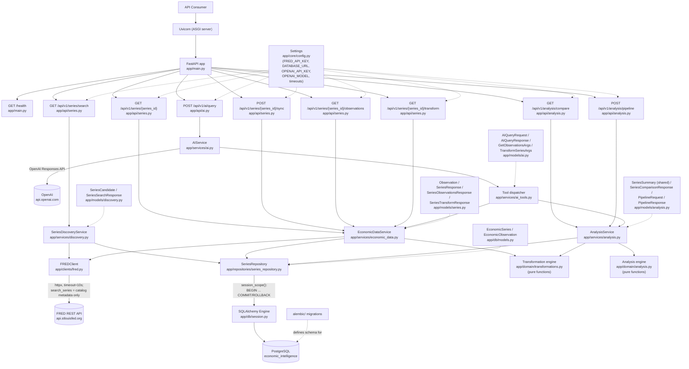

# Current Architecture

This document describes the system **as it exists right now**. It is not
a history — see [`../ENGINEERING_JOURNAL.md`](../ENGINEERING_JOURNAL.md)
for how it got here, and [`../adr/`](../adr/) for why specific choices were
made. The AI path (`app/api/ai.py`/`app/services/ai.py`/`app/services/ai_tools.py`)
reflects Increment 008 exactly and is frozen, non-canonical, and not
required for anything else described here — see the "Deterministic
discovery" section below and ADR-015/016/017's status notes for why.

## Components

| Component | Location | Responsibility |
|---|---|---|
| ASGI server | Uvicorn (process) | Runs the FastAPI app, handles HTTP connections |
| Application | `app/main.py` | Creates the `FastAPI` app, mounts routers, defines `/health` |
| Series route | `app/api/series.py` | HTTP layer for `/api/v1/series/search`, `/{series_id}`, `.../sync`, `.../observations`, and `.../transform`: request/query-parameter handling, exception → status code translation |
| Analysis route | `app/api/analysis.py` | HTTP layer for `/api/v1/analysis/compare` and `.../pipeline`: request/body validation, exception → status code translation |
| Inflation Monitor route | `app/api/inflation.py` | HTTP layer for `GET /api/v1/monitors/inflation`, `GET /api/v1/monitors/inflation/changes`, and `GET /api/v1/monitors/inflation/state-duration` (Increment #24C): no request parameters on any of the three, exception → status code translation. Read-only; no FRED, no AI. `state-duration` was added to the SAME router — no new router registration needed; deliberately not named `/history` (frozen contract [state-duration-v1.md](../product/state-duration-v1.md) §31), since V1 returns exactly one latest-revised-reconstruction fact, not a full history. |
| Labor Monitor route (Increments #20B, #20C.2, #24C) | `app/api/labor.py` | HTTP layer for `GET /api/v1/monitors/labor`, `GET /api/v1/monitors/labor/changes`, and `GET /api/v1/monitors/labor/state-duration` (Increment #24C): no request parameters on any of the three, exception → status code translation. Read-only; no FRED, no AI. A new, separate router file rather than an addition to the row above — the frozen `labor_v1.0` spec's own "no premature generic monitor framework, implement Labor independently first" instruction; both routers share the `/monitors` prefix without conflict (`/monitors/inflation*` vs. `/monitors/labor*`). `/changes` (#20C.2) and `/state-duration` (#24C) were each added to the SAME router — no new router registration needed either time. |
| Release calendar route | `app/api/releases.py` | HTTP layer for `GET /api/v1/releases` (database-only, filterable, never calls FRED) and `POST /api/v1/releases/sync` (explicit, FRED-backed, per-release failure isolation). See [Flow 28](./request-flows.md#flow-28--release-calendar-read-get-apiv1releases-increment-17a)/[Flow 29](./request-flows.md#flow-29--release-calendar-sync-post-apiv1releasessync-increment-17a). Increment #18 (release-driven update pipeline) adds **no route here or anywhere else** — see the Release processing service row below and [docs/architecture/release-processing-v1.md](./release-processing-v1.md) §18. |
| Release processing read route (Increment #19B) | `app/api/release_processing_read.py` | HTTP layer for `GET /api/v1/releases/processing-status`: the one public projection over #18's persisted evidence. A new, separate file (not an addition to the row above) — its service/repository import series/observation-shaped models that `app/api/releases.py` is structurally forbidden from reaching. Database-only, always 200 for a persisted `CHECK_FAILED`/`PARTIAL_CHECK` result; 400/422 for a malformed request, 503/500 for a genuine database failure. See [Flow 34](./request-flows.md#flow-34--release-processing-status-read-get-apiv1releasesprocessing-status-increment-19b) and [docs/architecture/release-processing-read-model-v1.md](./release-processing-read-model-v1.md). |
| AI route | `app/api/ai.py` | HTTP layer for `/api/v1/ai/query`: request validation, `AIService` failures → status code translation. Frozen at Increment 008 behavior (three tools, no discovery) — see above. |
| Economic data service | `app/services/economic_data.py` (`EconomicDataService`) | Single-series use-case logic: fetch + normalize a series from FRED; orchestrate fetch-then-persist for sync; validate and coordinate a persisted-observations query; validate and orchestrate a transformation (including boundary-context retrieval) |
| Analysis service | `app/services/analysis.py` (`AnalysisService`) | Multi-series use-case logic: look up two persisted series, retrieve and date-filter each independently, optionally transform each side (pipeline only), delegate alignment/spread/correlation to the analysis domain module. No FRED dependency at all. |
| Inflation Monitor service | `app/services/inflation.py` (`InflationMonitorService`) | Looks up the four canonical series (`PCEPILFE`, `CPILFESL`, `PCEPI`, `CPIAUCSL`) independently; a series not persisted at all yields an empty observation list rather than an error. `get_result` delegates every calculation to `app.domain.inflation` (latest snapshot, `inflation_v1.0`); `get_what_changed_result` additionally selects each section's exact current/previous calendar periods (`app.domain.inflation`'s `month_over_month_*` helpers) and delegates comparison to `app.domain.inflation_what_changed` (`inflation_what_changed_v1.0`). `get_state_duration_result` (Increment #24C) loads Core PCE once, determines the current `underlying_momentum.state`/`calculation_period`, and — if real and non-`INSUFFICIENT_DATA` — walks up to 60 prior exact calendar months via `compute_series_momentum_at` (unmodified), handing the reconstructed sequence to the shared pure helper `app.domain.state_duration.evaluate_state_duration`. No FRED dependency; never mutates persisted data. |
| Labor Monitor service (Increments #20B, #20C.2, #24C) | `app/services/labor.py` (`LaborMonitorService`) | Looks up PAYEMS/UNRATE independently via the *existing*, generic `SeriesRepository` — no Labor-specific repository exists; a series not persisted at all yields an empty observation list, identical precedent to `InflationMonitorService._load`. `get_result` delegates every calculation to `app.domain.labor` (`labor_v1.0`, frozen in `research/labor_momentum/LABOR_V1_FROZEN_METHODOLOGY.md`). `get_what_changed_result` (Increment #20C.2) additionally selects the shared previous/current period (`app.domain.labor.month_over_month_labor_periods`), evaluates both via `compute_labor_monitor_result_at`, and delegates comparison to `app.domain.labor_what_changed` (`labor_what_changed_v1.0`). `get_state_duration_result` (Increment #24C) mirrors the Inflation row's own shape exactly: load PAYEMS/UNRATE once, determine the current `LaborMonitorResult.state`/`evaluation_period`, and walk up to 60 prior exact calendar months via `compute_labor_monitor_result_at` (unmodified), handing the sequence to the same shared pure helper. No FRED dependency; never mutates persisted data. |
| Release calendar service | `app/services/releases.py` (`ReleaseReadService`, `ReleaseSyncService`) | Deliberately two separate classes, not one with an optional `FREDClient` (the `EconomicDataService` pattern): `ReleaseReadService` has no FRED-shaped parameter anywhere on it, so the read path is structurally incapable of calling FRED, not just conventionally discouraged. `ReleaseSyncService` iterates the curated, active release catalog, syncing each independently (a per-release FRED failure never aborts the others). Neither ever writes `EconomicObservation` or touches a monitor. Statically forbidden from importing anything series/observation/Inflation-shaped (unchanged by #18 — see the next row). |
| Release processing service (Increments #18, #20D.2) | `app/services/release_processing.py` (`ReleaseProcessingService`) | The ONE new module that legitimately imports both the release-calendar side (`ReleaseRepository`, read-only) and the series/Inflation/Labor side (`ReleaseProcessingRepository`, `app.domain.inflation`, `app.domain.inflation_what_changed`, `app.domain.labor`, `app.domain.labor_what_changed`, `app.domain.labor_release_processing`) — deliberate, since `app.repositories.release_repository`/`app.services.releases`/`app.api.releases` remain structurally forbidden from that same import (checked by `tests/integration/test_transaction_and_safety.py::TestReleaseCalendarStructuralIndependence`, unmodified). Fetches each release's mapped series over a bounded five-year window, classifies NEW/REVISED/UNCHANGED, captures before/after evidence around the canonical write, and diffs the two via the EXISTING comparators — never a reimplementation. Inflation and Labor are two independent, explicitly-dispatched branches inside `_apply_changes_and_compute_analysis` (never `elif` between them — a series could belong to both in the future); no adapter/registry framework was introduced for two integrations. See [docs/architecture/release-processing-v1.md](./release-processing-v1.md) and [docs/architecture/labor-release-integration-v1.md](./labor-release-integration-v1.md). |
| Release processing read service (Increment #19B) | `app/services/release_processing_read.py` (`ReleaseProcessingReadService`) | A NEW, separate class from `ReleaseProcessingService` above (same "structurally incapable, not just conventionally disciplined" reasoning `ReleaseReadService`/`ReleaseSyncService` already establish) — no `FREDClient`-shaped parameter anywhere on it. Derives each mapped occurrence's public 5-value status from its latest `ReleaseCheckRun` only (`completed_at DESC, id DESC` tie-break) but unions `ReleaseObservationUpdate`/`ReleaseAnalysisUpdate` rows across EVERY run the occurrence has ever had — the retry-history-preservation guarantee #19B exists for. Status filtering, pagination, and series-metadata enrichment all happen here, in Python, over a repository-fetched candidate set. See [ADR-023](../adr/023-release-processing-read-model-no-causal-nesting.md). |
| Discovery service | `app/services/discovery.py` (`SeriesDiscoveryService`) | Finds candidate series by concept/phrase: searches local persisted metadata and (if FRED is configured) FRED's catalog, merges and deterministically ranks the results. No AI, no ML/embedding relevance score, no analysis math, no ingestion — metadata only. See "Deterministic discovery" below. |
| AI service | `app/services/ai.py` (`AIService`) | Owns the OpenAI Responses API boundary and the bounded tool-calling loop (max 4 rounds). No transformation/analysis math, no direct database access — delegates every tool call to `app.services.ai_tools`. Frozen at Increment 008 behavior. |
| AI tool boundary | `app/services/ai_tools.py` | The explicit tool dispatcher: three tools (`get_observations`, `transform_series`, `analyze_series`), each validated (Pydantic) then executed via the existing `EconomicDataService`/`AnalysisService` methods. Read-only; no `FREDClient` reachable from here. Frozen at Increment 008 behavior. |
| FRED client | `app/clients/fred.py` (`FREDClient`) | All FRED-specific HTTP: request construction, timeout, FRED error → typed exception translation, including catalog search (`search_series` — metadata only, never observations) and release-dates lookup (`get_release_dates`, returning normalized `FredReleaseDate` pairs, date-only — never a raw provider payload). Never imported by the AI path. `get_observations` (Increment #18) gained two optional parameters, `observation_start`/`sort_order` — every pre-#18 call site is byte-for-byte unaffected (no new param sent, `sort_order` still defaults `"desc"`); release processing is the one caller that passes both, for its bounded five-year detection window. No second `FREDClient`/provider abstraction was added (ADR-020 unchanged). |
| Series repository | `app/repositories/series_repository.py` (`SeriesRepository`) | All SQL for series/observations: upserts series metadata and observations within a caller-owned transaction; series lookup; local metadata search (`search_series`); filtered/ordered/paginated observation queries; unpaginated range queries and preceding-context queries. Reused as-is by every consumer added since Increment 005 — no analysis-, pipeline-, or discovery-specific repository methods were ever needed beyond `search_series` itself. `_upsert_observations`' blind-overwrite behavior (backing the plain `/series/{id}/sync`) is unmodified by #18 — release processing owns a separate write path (next-but-one row), never retrofitted here. |
| Release repository | `app/repositories/release_repository.py` (`ReleaseRepository`) | All SQL for the release calendar: curated active-release lookup, provider-identity lookup, idempotent occurrence upsert (`(economic_release_id, scheduled_date)`, never deletes), filtered/ordered/paginated occurrence queries joined to their release. Never imports `app.clients.fred`/`httpx` (checked structurally) — the layer closest to the database never talks to FRED at all. Gained one new read-only method for Increment #18, `get_occurrence_by_id` — a plain lookup by internal id, adding no write capability and no import of anything series/Inflation-shaped. |
| Release processing repository (Increments #18, #20D.2, #25C, #25E) | `app/repositories/release_processing_repository.py` (`ReleaseProcessingRepository`) | The one write path for #18/#20D.2 (fully monitor-agnostic — Inflation and Labor share it unmodified): `ReleaseSeriesMapping` reads, `EconomicSeries`/`EconomicObservation` create/read/write (a small, independent reimplementation of `SeriesRepository`'s basic upsert shape — deliberately not calling into it, so the plain `/series/{id}/sync` path's behavior is never touched), and `ReleaseCheckRun`/`ReleaseObservationUpdate`/`ReleaseAnalysisUpdate` persistence. `write_observation` flushes immediately (#20D.2 fix — this project's session factory sets `autoflush=False`; a genuinely NEW observation's write was previously invisible to a later same-transaction "after" evidence read, a latent #18 defect never exercised by any prior Inflation test, all of which only ever revise already-persisted observations). Increment #25C adds one new read query, `list_due_occurrence_ids` — every mapped, eligible, not-yet-settled-today occurrence, bounded to a retry window — settlement is derived entirely from the existing `CheckRunStatus` enum (`NO_CHANGE`/`CHANGED` already mean "every mapped series succeeded," by `_determine_status`'s own construction), needing no new per-series bookkeeping. Increment #25E adds one new write method, `add_recorded_monitor_result` — chosen over a new, separate repository (unlike `MaintenanceRepository` below) because `RecordedMonitorResult` shares the exact transaction, FK, and closest-sibling-table repository placement `ReleaseObservationUpdate`/`ReleaseAnalysisUpdate` already have here; append-only, no update/delete method exists. See [docs/architecture/release-processing-v1.md](./release-processing-v1.md), [docs/product/automated-economic-maintenance-v1.md](../product/automated-economic-maintenance-v1.md), and [docs/product/recorded-state-history-v1.md](../product/recorded-state-history-v1.md). |
| Since Last Visit read model (Increment #25G) | `app/api/since_last_visit.py`, `app/services/since_last_visit.py` (`SinceLastVisitService`), `app/repositories/since_last_visit_repository.py` (`SinceLastVisitRepository`, a NEW, separate, purely read-only repository — no `add_*`/`write_*`/`create_*` method anywhere on it), `app/domain/since_last_visit.py` (pure categorization, mirrors `app.domain.state_duration`'s own zero-I/O precedent) | `GET /api/v1/since-last-visit` — a deterministic recap of canonical economic activity recorded after a client-supplied checkpoint, through a server-captured watermark. Uses `ReleaseCheckRun` as its own event spine (`completed_at` filtered first, then joined out to `ReleaseObservationUpdate`/`ReleaseAnalysisUpdate`/`RecordedMonitorResult`), never a new generic event ledger. Coverage (`CHECKED`/`GAP`/`UNKNOWN`) is derived from persisted `ReleaseCheckRun` settlement and `MaintenanceSweep` evidence only, never from code existence. See [docs/product/since-last-visit-v1.md](../product/since-last-visit-v1.md) and [ADR-026](../adr/026-since-last-visit-server-watermark-and-event-spine.md). |
| Release processing read repository (Increment #19B) | `app/repositories/release_processing_read_repository.py` (`ReleaseProcessingReadRepository`) | A NEW, read-only repository — no `add_*`/`write_*`/`create_*` method anywhere on it (checked structurally), never reuses `ReleaseProcessingRepository` (#18's write path). Excludes an occurrence whose release has zero currently-active `ReleaseSeriesMapping` rows at the SQL layer, before any status is ever derived — no occurrence, run, or update row for an unmapped release ever reaches the service. See [docs/architecture/release-processing-read-model-v1.md](./release-processing-read-model-v1.md). |
| Transformation engine | `app/domain/transformations.py` (`absolute_change`, `percent_change`, `moving_average`) | Pure, deterministic math over one series' observation list — no FastAPI, SQLAlchemy, FRED, environment, or I/O of any kind. Unmodified since Increment 005; reused as-is by the pipeline. |
| Analysis engine | `app/domain/analysis.py` (`align_series`, `calculate_spread`, `count_usable_pairs`, `pearson_correlation`) | Pure, deterministic math over two series' observation lists — same no-I/O discipline as the transformation engine. Unmodified since Increment 006; reused as-is by the pipeline. |
| Inflation Monitor engine | `app/domain/inflation.py` (`classify_state`, `classify_period`, `compute_series_momentum`, `compute_confirmation`, `compute_target`, `compute_headline_context`, `compute_inflation_monitor_result`, and their calendar/index helpers, plus the exact-period siblings `compute_series_momentum_at`/`compute_target_at`/`compute_confirmation_at`, the new period-selection function `latest_shared_observation_period`, and the `month_over_month_*` convenience wrappers) | Pure, deterministic implementation of the frozen `inflation_v1.0` methodology — same no-I/O discipline as the other domain engines, plus one departure from `app/domain/transformations.py`'s convention: every horizon here resolves by an exact calendar-month lookup against a `{date: value}` index, never by row position, per the frozen specification. The exact-period siblings and `month_over_month_*` helpers exist for `inflation_what_changed_v1.0` (below) but reuse every existing classification primitive unmodified — no second methodology. |
| Labor Monitor engine (Increments #20B, #20C.2) | `app/domain/labor.py` (`build_jobs_index`, `monthly_change`, `average_monthly_change`, `classify_employment_condition`, `classify_employment_momentum`, `combine_employment_state`, `compute_employment_result`, `average_rate`, `classify_unemployment_trend_state`, `compute_unemployment_result`, `combine_labor_state`, `determine_evaluation_period`, `compute_labor_monitor_result`, plus the exact-period sibling `compute_labor_monitor_result_at` and the period-selection helper `month_over_month_labor_periods`) | Pure, deterministic implementation of the frozen `labor_v1.0` methodology, imports no other domain module (checked structurally, same discipline `app.domain.release_processing`'s own guard already establishes). `build_jobs_index` is the ONE place PAYEMS's native "Thousands of Persons" is converted to actual jobs. `combine_employment_state`/`combine_labor_state` are small, explicit, fully-enumerated lookup tables transcribed directly from the frozen spec — never derived from intuition at runtime. A single PAYEMS level revision affects `EmploymentState` at exactly the non-contiguous `{M, M+3, M+6}` (two adjacent monthly-change values shift in opposite directions and cancel inside any 3-month average containing both) — re-verified in production code, not just inherited from research. `compute_labor_monitor_result_at`/`month_over_month_labor_periods` (Increment #20C.2) exist for `labor_what_changed_v1.0` (below) but reuse every existing classification primitive unmodified — no second methodology; `compute_labor_monitor_result` itself now delegates to `compute_labor_monitor_result_at`, a behavior-preserving refactor. |
| Labor What Changed comparator (Increment #20C.2) | `app/domain/labor_what_changed.py` (`compare_employment_section`, `compare_unemployment_section`, `compare_labor_state`, `assemble_labor_what_changed_result`) | Pure, deterministic comparison layer for the frozen `labor_what_changed_v1.0` contract — architecturally forbidden from importing `app.domain.labor` (enforced by both an import-name guard and an AST-level guard that no frozen deadband literal appears anywhere in its own code), so it structurally cannot know PAYEMS/UNRATE math, the 50,000-job/0.2pp deadbands, or the frozen state tables; it only diffs two already-canonical evidence objects (built by the engine above, at periods the service selects) and assembles the deterministically-ordered result. `EMPLOYMENT.state`/`condition`/`momentum` are each compared and flagged independently — see docs/ENGINEERING_JOURNAL.md's #20C.2 entry for the `state_changed` scoping refinement this required. |
| Inflation What Changed comparator | `app/domain/inflation_what_changed.py` (`compare_series_momentum_section`, `compare_target_section`, `compare_confirmation_section`, `assemble_what_changed_result`) | Pure, deterministic comparison layer for the frozen `inflation_what_changed_v1.0` contract — architecturally forbidden from importing `app.domain.inflation` (enforced by the architectural-independence test), so it structurally cannot know how CPI/PCE annualization, boundary classification, or confirmation-relationship rules work; it only diffs two already-canonical evidence objects (built by the engine above, at periods the service selects) and assembles the deterministically-ordered result. |
| Release calendar engine | `app/domain/releases.py` (`classify_schedule_status`) | Pure, deterministic: derives `SCHEDULED`/`PAST_DUE` from `(scheduled_date, as_of_date)` only — `as_of_date` is always an explicit parameter, never read from the system clock internally, so the function (and everything built on it) is reproducible under test. No `CANCELLED`/`UNKNOWN` in #17A (see [docs/architecture/release-intelligence-v1.md](./release-intelligence-v1.md) #7 for why). Unmodified by #18 — gained no write capability (checked structurally). |
| Release processing engine (Increment #18) | `app/domain/release_processing.py` (`classify_observation_change`, `five_year_observation_start`, `affected_evaluation_periods`, `components_for_series`) | Pure, deterministic — same no-I/O discipline as every other domain module, and (like `app.domain.inflation_what_changed`) deliberately imports no other domain module either, keeping every domain module in this package independent. Contains zero Inflation classification/annualization logic of its own; `components_for_series` is a verified mirror of `InflationMonitorService`'s own existing series-to-section wiring, never an invented economic-significance mapping. Inflation-only — untouched by #20D.2, which added a separate, independent Labor sibling below rather than generalizing this one. See [docs/architecture/release-processing-v1.md](./release-processing-v1.md). |
| State Duration engine (Increment #24C) | `app/domain/state_duration.py` (`evaluate_state_duration`) | Pure, deterministic, and — uniquely among the domain modules above — genuinely monitor-agnostic: one function walks an already-built, already-reconstructed sequence of `(period, state)` points and returns `duration_months`/`boundary_type`/`earliest_confirmed_period`/`previous_state`/`previous_period` via equality/sentinel checks only, never inspecting what any particular state label means. Imports no other domain module and (stricter than every sibling row above) no `app.models` module at all — checked structurally in `tests/test_domain_architectural_independence.py`. The one narrow exception to this project's "no premature generic framework" rule, justified the same way `app.domain.analysis`'s own `align_series`/`pearson_correlation` already were: the shared part contains zero economic content. Frozen and normative in [docs/product/state-duration-v1.md](../product/state-duration-v1.md) §29. |
| Labor release propagation engine (Increment #20D.2) | `app/domain/labor_release_processing.py` (`payems_affected_evaluation_periods`, `unrate_affected_evaluation_periods`, `labor_affected_evaluation_periods`, `LABOR_SERIES_IDS`) | Pure, deterministic — the Labor-specific sibling of the row above, not a generalization of it. Encodes the frozen `{0,3,6}` (PAYEMS, sparse, forward-only) and `{0,1,2}∪{12,13,14}` (UNRATE, two disjoint clusters, forward-only) dependency-propagation sets, re-verified by direct execution against `app.domain.labor`'s own primitives. Imports no other domain module (re-derives its own tiny calendar-offset helper rather than importing `month_before`). Returns `frozenset[date]` (periods only, no component dimension) — Labor has no per-component evaluation split the way Inflation does. See [docs/architecture/labor-release-integration-v1.md](./labor-release-integration-v1.md). |
| Response models | `app/models/series.py`, `app/models/analysis.py` (see prior increments), `app/models/discovery.py` (`SeriesCandidate`, `SeriesSearchResponse`), `app/models/ai.py` (`AIQueryRequest`, `AIQueryResponse`, `ToolCallRecord`, `GetObservationsArgs`, `TransformSeriesArgs`), `app/models/inflation.py` (`InflationMonitorResult` and its nested evidence/coverage/period models; the one canonical definition of `inflation_v1.0`'s constants and enums), `app/models/inflation_what_changed.py` (`InflationWhatChangedResult`, its five section models, and `ChangeEvent` — reuses `SeriesMomentumResult`/`TargetResult` verbatim as canonical evidence, introduces no new economic type), `app/models/releases.py` (`ReleaseListResponse`, `ReleaseOccurrenceItem` — `schedule_status` computed at response time, never a persisted field this module knows how to derive; `ReleaseSyncResponse` and its per-release `synced`/`failed` shapes), `app/models/release_processing.py` (Increments #18, #20D.2 — `ReleaseCheckRunResult`, `SeriesCheckOutcome`, `ObservationChangeRecord`, `AnalysisChangeRecord`; `AnalysisChangeRecord` mirrors `ChangeEvent`'s field set with one deliberate adaptation, `evaluation_period` instead of `previous_period`/`current_period` — see [docs/architecture/release-processing-v1.md](./release-processing-v1.md) §8.1; `.component` is plain `str` as of #20D.2, not `ChangeComponent` — this record is generic transport/provenance metadata shared by both Inflation and Labor, never the owner of either family's component vocabulary), `app/models/release_processing_read.py` (Increment #19B, `.component` widened #20D.2 identically — `ProcessingStatus`, `LatestCheck`, `ReleaseContext`, `DetectedObservationChange`, `DetectedAnalysisChange`, `ReleaseProcessingStatusItem`/`Response`; `detected_observation_changes`/`detected_analysis_changes` are sibling fields, never nested — see [ADR-023](../adr/023-release-processing-read-model-no-causal-nesting.md); reuses `PaginationMeta` from `app/models/releases.py` unmodified), `app/models/labor.py` (Increment #20B — `LaborMonitorResult`, `EmploymentResult`, `UnemploymentResult`, `LaborObservationEvidence`; the one canonical definition of `labor_v1.0`'s constants and enums — deliberately NOT a shared base class with `app/models/inflation.py`'s own evidence shapes, per the frozen spec's "no premature generic monitor framework" instruction), `app/models/labor_what_changed.py` (Increment #20C.2 — `LaborWhatChangedResult`, `EmploymentSectionChanges`, `UnemploymentSectionChanges`, and `LaborChangeEvent` — reuses `EmploymentResult`/`UnemploymentResult` verbatim as canonical evidence, introduces no new economic type; no per-section `comparison_available`/period triplet, unlike Inflation's own section models, since Labor's one shared `evaluation_period` makes top-level-only period fields sufficient) | The application's own, provider-independent API response contract; AI tool argument models double as that (frozen) path's validation boundary |
| ORM models | `app/db/models.py` (`EconomicSeries`, `EconomicObservation`, `EconomicRelease`, `ReleaseOccurrence`, `ReleaseSeriesMapping`, `ReleaseCheckRun`, `ReleaseObservationUpdate`, `ReleaseAnalysisUpdate`, `MaintenanceSweep`, `RecordedMonitorResult`) | The relational shape of persisted data. `EconomicRelease`/`ReleaseOccurrence` (Increment #17A) follow the same `id` (internal) vs. business-identifier (`provider`+`provider_release_id`, `scheduled_date`) separation `EconomicSeries`/`EconomicObservation` already established — see [docs/architecture/release-intelligence-v1.md](./release-intelligence-v1.md) #4/#5/#6. The four Increment #18 models (`ReleaseSeriesMapping`/`ReleaseCheckRun`/`ReleaseObservationUpdate`/`ReleaseAnalysisUpdate`) add release-driven detection and deterministic-analytical-consequence auditing without a full monitor-snapshot table and without an `EconomicObservation.updated_at` column (both deliberately absent — see [docs/architecture/release-processing-v1.md](./release-processing-v1.md) and [ADR-022](../adr/022-release-processing-audit-without-monitor-snapshots.md)). `MaintenanceSweep` (Increment #25C) is per-ORCHESTRATOR-RUN operational-health data, deliberately distinct from `ReleaseCheckRun`. `RecordedMonitorResult` (Increment #25E) is the one, deliberate exception to the "no monitor-snapshot table" rule above — it is NOT a full snapshot (state only, no evidence/metric columns): one immutable row per genuinely-executed canonical monitor AFTER result, `UNIQUE(release_check_run_id, monitor, evaluation_period)`, written regardless of whether the state changed — see [docs/product/recorded-state-history-v1.md](../product/recorded-state-history-v1.md) and [ADR-025](../adr/025-recorded-state-history-append-only-persistence.md). |
| Operational CLI — manual, single-occurrence (Increments #18, #20D.2, #25C) | `app/operations/process_release.py` | The manual, operator-facing trigger for one release occurrence — `python -m app.operations.process_release --occurrence-id <id> [--as-of-date YYYY-MM-DD]`. No business logic: parses arguments, opens one real `session_scope()` transaction, delegates to `try_acquire_and_process_occurrence` (below), renders a safe summary, maps the outcome to an exit code. Already fully monitor-agnostic — #20D.2 needed only a two-word docstring/description wording update ("Inflation" → "Inflation or Labor"), zero behavior change, for Employment Situation occurrences to be processable through this exact same entrypoint. Increment #25C's own one change: now acquires the shared occurrence-level advisory lock before processing (see the Maintenance orchestrator row below) — the same lock an automated sweep would, so the two paths can never diverge in safety; an occurrence already locked by another process returns a safe "already being processed" notice and exit code `1`, never a race. No public HTTP equivalent exists (see [docs/architecture/release-processing-v1.md](./release-processing-v1.md) §18 — this project has no authentication anywhere). |
| Operational CLI — automated, one bounded sweep (Increment #25C) | `app/operations/run_maintenance.py` | The automated trigger — `python -m app.operations.run_maintenance [--as-of-date YYYY-MM-DD] [--retry-window-days N]`. Runs exactly ONE bounded sweep via `MaintenanceOrchestrator.run_sweep` and terminates — never loops, sleeps, or schedules itself (ADR-024: the scheduler is external and swappable; this script has no opinion about, and no code path depends on, how or how often it is invoked). Exit codes distinguish three outcomes for an external scheduler: `0` (sweep completed, no occurrence failed), `1` (sweep completed, `failed_count > 0`), `2` (fatal/configuration failure, or a database error during the sweep's own orchestration outside any single occurrence's processing). See [docs/product/automated-economic-maintenance-v1.md](../product/automated-economic-maintenance-v1.md). |
| Maintenance orchestrator (Increment #25C) | `app/services/maintenance.py` (`MaintenanceOrchestrator`) | Discovers due release occurrences (`ReleaseProcessingRepository.list_due_occurrence_ids`) and processes each individually via the EXISTING, completely unmodified `ReleaseProcessingService.process_occurrence` — a pure trigger-and-record layer with zero economic logic of its own (checked structurally: `tests/test_maintenance_architecture.py::TestOrchestratorNeverReimplementsEconomicLogic`). Each occurrence is processed inside its own `session_scope()` (never batched — preserves release processing's own pre-existing one-transaction-per-occurrence crash-safety guarantee), guarded by a transaction-scoped PostgreSQL advisory lock (`try_acquire_and_process_occurrence`, `app/services/release_processing.py`, added alongside the unmodified service class) shared with the manual CLI above. Records sweep-level operational health (`MaintenanceRepository`, below) in a transaction separate from every occurrence's own. See ADR-024 and [docs/product/automated-economic-maintenance-v1.md](../product/automated-economic-maintenance-v1.md). |
| Maintenance repository (Increment #25C) | `app/repositories/maintenance_repository.py` (`MaintenanceRepository`) | Owns `MaintenanceSweep` CRUD — `start_sweep` (committed immediately, before any due-work discovery, so a crash mid-sweep leaves an honest, unfinished row), `finish_sweep` (called once, at completion, in its own transaction), `get_latest_sweep`. Deliberately separate from `ReleaseProcessingRepository`: a sweep row is per-ORCHESTRATOR-RUN, operational-health-shaped data, never the same concept as a `ReleaseCheckRun` row (per-OCCURRENCE, economic-check-shaped) — worker health and economic/domain freshness are never conflated. |
| DB engine/session | `app/db/session.py` | Lazily-created SQLAlchemy engine (connection pool) and `session_scope()` transaction boundary |
| Configuration | `app/core/config.py` (`Settings`) | Reads `FRED_API_KEY`, `DATABASE_URL`, `OPENAI_API_KEY`, `OPENAI_MODEL`, and request timeouts from the environment |
| Schema migrations | `alembic/` | Version-controlled schema history, applied explicitly via `alembic upgrade head`. Increment #18 added a schema migration (`dbd9a2889ef3`) and a separate curated-seed migration (`cd476d227f99`, CPI + Personal Income and Outlays release→series mappings only) — the same schema/seed separation Increment #17A established. |

## Architecture diagram



`SearchRoute` reaches `FREDClient` for catalog metadata only, never
observations, and degrades gracefully if FRED is unconfigured or
unreachable. `GetRoute` and `SyncRoute` reach `FREDClient` for full
series metadata/observations. `ObsRoute`, `TransformRoute`,
`CompareRoute`, `PipelineRoute`, and `AIRoute` never reach `FREDClient`
at all — those five are
wired only through a service (or, for AI, a service plus the tool
dispatcher) to `Repo` to PostgreSQL. This is a real structural fact, not
just a diagram simplification: `FREDClient` is never imported or
constructed anywhere in `get_series_observations`'s,
`get_series_transform`'s, `compare_series`'s, `run_pipeline`'s, or
`query_ai`'s call path. `AnalysisService` doesn't even carry an optional
`FREDClient` slot the way `EconomicDataService` does — it has no
FRED-backed method at all, even though it calls `Engine` (the
transformation module) as well as `AnalysisEngine` directly, reusing both
domain modules unmodified. `AISvc` has no edge to `FRED`, `Repo`, or `PG`
at all — its only outbound edge besides `OpenAI` is to `ToolDispatch`,
which itself only ever calls into the two existing services, never
`app.domain.*` directly and never `FREDClient`. `Engine` and
`AnalysisEngine` themselves have no edge to `Repo`, `Orm`, `PG`, `Client`,
or `AISvc`/`ToolDispatch` at all — they only ever receive plain
observation data already fetched by a service; none of them can reach
PostgreSQL, FRED, or OpenAI even indirectly.

## Seven paths over the same persisted data

```
DISCOVERY PATH (candidate series metadata, not analysis):
  Client -> GET /api/v1/series/search -> Route -> SeriesDiscoveryService
    -> SeriesRepository -> PostgreSQL   (SELECT only: local metadata match)
    -> FREDClient -> FRED API   (catalog search only, never observations -- optional: degrades to local-only if unconfigured/unreachable)
    -> deterministic merge + rank (pure, in-process; no ML/embedding/LLM score)

WRITE/SYNC PATH:
  Client -> POST /api/v1/series/{id}/sync -> Route -> EconomicDataService
    -> FREDClient -> FRED API
    -> SeriesRepository -> PostgreSQL   (INSERT/UPDATE, one transaction)

READ PATH (raw historical observations):
  Client -> GET /api/v1/series/{id}/observations -> Route -> EconomicDataService
    -> SeriesRepository -> PostgreSQL   (SELECT only)

DERIVED-DATA PATH (single-series transformations):
  Client -> GET /api/v1/series/{id}/transform -> Route -> EconomicDataService
    -> SeriesRepository -> PostgreSQL   (SELECT only: requested range + preceding context)
    -> Transformation engine (pure, in-process; no I/O)

MULTI-SERIES ANALYSIS PATH:
  Client -> GET /api/v1/analysis/compare -> Route -> AnalysisService
    -> SeriesRepository -> PostgreSQL   (SELECT only, twice: once per series, each independently date-filtered)
    -> Analysis engine (pure, in-process; no I/O: exact-date alignment, then spread/correlation)

COMPOSABLE PIPELINE PATH:
  Client -> POST /api/v1/analysis/pipeline -> Route -> AnalysisService
    -> SeriesRepository -> PostgreSQL   (SELECT only, per series: requested range + preceding context, independently)
    -> Transformation engine (pure, in-process; per series, only if requested)
    -> Analysis engine (pure, in-process; exact-date alignment of the FINAL values, then spread/correlation)

AI TOOL-CALLING PATH:
  Client -> POST /api/v1/ai/query -> Route -> AIService
    -> OpenAI Responses API   (native tool calling; up to MAX_TOOL_ROUNDS=4 rounds)
    -> Tool dispatcher (app/services/ai_tools.py; validates arguments, never trusts the model)
      -> EconomicDataService / AnalysisService -> SeriesRepository -> PostgreSQL   (SELECT only)
    -> OpenAI Responses API (tool results fed back)
    -> final natural-language answer
```

`POST .../sync` is the only way data enters PostgreSQL. `GET
.../search`, `.../observations`, `.../transform`, `GET /analysis/compare`,
`POST /analysis/pipeline`, and `POST /ai/query` are the only ways to read
data back through this API — discovery finds *candidate series*, never
their observation values; the next four return raw or computed
observation *values* for series already known; and the last lets an LLM
choose among those same four kinds of read (via three coarse tools) and
explain the result in natural language. No path touches another path's
external dependency: sync never reads more than it needs to upsert;
discovery reaches FRED for catalog metadata only, never observations,
and degrades to local-only rather than failing if FRED is unavailable;
the remaining read paths never call FRED at all; and none of these
paths ever writes anything back to PostgreSQL — a discovered
`persisted:false` candidate is never auto-synced (see ADR-016), and
none of the other paths' computed values (raw comparisons, single-
series transformations, pipeline results, or AI tool results) are
stored anywhere (see Data model below). `/analysis/compare`,
`/analysis/pipeline`, and `/ai/query`'s tools needed no analysis- or
AI-specific repository method between them — all call the same
`SeriesRepository` methods Increments 004/005 already built; discovery
needed exactly one more (`search_series`, local metadata only).

`GET /api/v1/series/{series_id}` (no suffix) is an eighth, separate path,
unchanged since Increment 002 — it still reads live from FRED and never
touches PostgreSQL at all, and is not reachable from the AI path at all
(see Read-only AI tools below). See Response contract below for how its
contract relates to the other read paths.

## Deterministic discovery: what it is, and what it deliberately is not

`GET /api/v1/series/search` (`SeriesDiscoveryService`) answers "what
series exist that might match this concept" -- nothing more:

- **Discovery ≠ semantic truth.** Ranking is retrieval ranking (exact-id
  match, then persisted-status tiebreak, then FRED's own `search_rank`)
  -- never a claim that the top result is "the" correct series for a
  concept. There is no concept→ticker alias table anywhere in this
  codebase, and none is planned; a user or calling application makes
  the semantic judgment, informed by the real metadata each candidate
  carries (title, units, frequency, seasonal adjustment).
- **Discovery ≠ analysis.** The discovery service never imports
  `AnalysisService`, `EconomicDataService`'s transformation methods, or
  either pure domain math module (verified directly, statically) —
  finding a candidate and computing something from its observations
  are two different endpoints, deliberately.
- **Discovery ≠ ingestion.** A `persisted:false` candidate — a real
  series, verified via FRED's catalog, just not yet in this database —
  is reported exactly as that. Searching for it never persists it;
  `POST /{series_id}/sync` remains the only, explicit, separately-
  invoked way data enters PostgreSQL (ADR-016).

This is the same deterministic capability originally built during
Increment 009 and preserved, unmodified, through the Increment 012.5
cleanup that removed the autonomous AI orchestration it used to be
wired into. Nothing about `SeriesDiscoveryService`/`SeriesRepository.search_series`/
`FREDClient.search_series`/`app/models/discovery.py` changed to expose
it here — Increment 013 only added the HTTP route.

## Configuration boundary

`app/core/config.py` is the single place that reads from the process
environment. It exposes a module-level `settings` object with:

- `fred_api_key: str | None` — read from `FRED_API_KEY`; `None` if unset.
- `fred_timeout_seconds: float` — currently a fixed constant (`10.0`), not
  environment-configurable.
- `database_url: str | None` — read from `DATABASE_URL`; `None` if unset.

`load_dotenv()` runs at import time to populate `os.environ` from a local
`.env` file for development convenience; it is a no-op if no `.env` file is
present. Nothing outside `app/core/config.py` reads environment variables
directly, and no secret value is ever hardcoded in source.

Alembic (`alembic/env.py`) reads the same `settings.database_url` at
migration time rather than storing a URL of its own — one source of truth
for how to reach the database.

## Database boundary

- **Engine & pooling** (`app/db/session.py`) — a single SQLAlchemy
  `Engine` (and the connection pool it owns) is created lazily, on first
  use, and cached — never at import time. This means the application
  starts, and `/health` works, even with no `DATABASE_URL` configured;
  only an operation that actually touches the database can fail on
  missing/bad configuration.
- **Session & transaction** — `session_scope()` is a context manager and
  the *only* place a transaction is committed or rolled back: commit if
  the block completes normally, rollback (and re-raise) on any exception.
  One `Session` per use, never a shared/global one.
- **Repository** (`SeriesRepository`) — the only code that issues SQL for
  series/observation data. It performs writes on the `Session` it's given
  but never calls `commit()`/`rollback()` itself; the caller (the route,
  via `session_scope()`) owns the transaction boundary.
- **Migrations** (`alembic/`) — the schema is never created by
  `Base.metadata.create_all()` at startup. It exists only because a
  migration under `alembic/versions/` created it; schema changes must go
  through a new migration.

## Response models vs. ORM models

Two distinct sets of classes, on purpose:

- `app/models/series.py` / `app/models/analysis.py` (`Observation`,
  `SeriesSummary`, `SeriesResponse`, `ComparisonObservation`,
  `SeriesComparisonResponse`, …) — Pydantic, the **API contract** returned
  to every consumer, single-series and multi-series alike.
- `app/db/models.py` (`EconomicObservation`, `EconomicSeries`) — SQLAlchemy
  ORM, the **relational shape** persisted in PostgreSQL.

`SeriesRepository` is the only code that translates between them. API
consumers never see the ORM models or raw database rows; the database
never stores the API's Pydantic objects directly.

## Data model

```
economic_series (1) ──< economic_observations (N)
```

| Table | Key columns |
|---|---|
| `economic_series` | `id` (PK), `series_id` (unique, e.g. `"UNRATE"`), `title`, `units`, `source`, `created_at`, `updated_at` |
| `economic_observations` | `id` (PK), `economic_series_id` (FK → `economic_series.id`, `ON DELETE CASCADE`), `observation_date`, `value` (nullable), `created_at`; `UNIQUE(economic_series_id, observation_date)` |

`economic_series.id` is the internal database identity; `series_id` is the
external, FRED-assigned business identifier — kept as separate columns
deliberately (see [ADR-006](../adr/006-postgresql-persistence.md)).

**No schema change in Increment 005 or 006.** Transformations
(`absolute_change`, `percent_change`, `moving_average`) and multi-series
analysis (`aligned`, `spread`, `correlation`) are both computed on demand
from these same two tables and never persisted — there is no derived-data
table for either. Neither increment's queries required a new index: the
existing `uq_observation_series_date` unique constraint's backing btree
index on `(economic_series_id, observation_date)` already serves the
full-range query, the "preceding observations" query (Increment 005), and
Increment 006's per-series range queries — the same query shape, just
issued twice (once per compared series) instead of once.

## Response contract

API consumers only ever receive `app/models/series.py`'s Pydantic models —
never FRED's raw JSON and never a raw database row.
`GET /api/v1/series/{series_id}` and `POST /api/v1/series/{series_id}/sync`
return the same shape:

```json
{
  "series_id": "UNRATE",
  "title": "Unemployment Rate",
  "units": "Percent",
  "source": "FRED",
  "observations": [
    { "date": "2026-07-01", "value": 4.1 },
    { "date": "2026-08-01", "value": null }
  ]
}
```

`GET /api/v1/series/{series_id}/observations` returns
`SeriesObservationsResponse`, which extends that same shape (via Pydantic
inheritance, not field duplication) with pagination metadata:

```json
{
  "series_id": "UNRATE",
  "title": "Unemployment Rate",
  "units": "Percent",
  "source": "FRED",
  "observations": [
    { "date": "2024-01-01", "value": 3.7 }
  ],
  "pagination": {
    "limit": 100,
    "offset": 0,
    "returned": 1,
    "total": 720
  }
}
```

`GET /api/v1/series/{series_id}/transform` returns `SeriesTransformResponse`
— a distinct shape (not built on `SeriesResponse`, since its `observations`
carry both the original and derived value per point, a genuinely different
shape from plain `Observation`):

```json
{
  "series_id": "UNRATE",
  "title": "Unemployment Rate",
  "units": "Percent",
  "source": "FRED",
  "transformation": { "type": "absolute_change", "window": null },
  "observations": [
    { "date": "2025-01-01", "original_value": 4.0, "value": null },
    { "date": "2025-02-01", "original_value": 4.2, "value": 0.2 }
  ]
}
```

For `moving_average`, `transformation.window` carries the window size used
(`null` for `absolute_change`/`percent_change`, which don't take one).

`GET /api/v1/analysis/compare` returns `SeriesComparisonResponse`
(`app/models/analysis.py`) — a distinct contract for a genuinely
two-series concept, reusing `SeriesSummary` (also new: `series_id`/
`title`/`units`/`source`, with no `observations`) as a *nested* object for
each side rather than duplicating those four fields inline:

```json
{
  "series_a": { "series_id": "UNRATE", "title": "Unemployment Rate", "units": "Percent", "source": "FRED" },
  "series_b": { "series_id": "CPIAUCSL", "title": "...", "units": "...", "source": "FRED" },
  "analysis": "spread",
  "matching_pairs": 10,
  "usable_pairs": 10,
  "correlation": null,
  "observations": [
    { "date": "2025-11-01", "value_a": 4.5, "value_b": 325.063, "spread": -320.563 }
  ]
}
```

`observations` holds the per-date pairs for `analysis=aligned` (`spread`
always `null`) and `analysis=spread` (`spread` populated where usable);
for `analysis=correlation`, `observations` is empty and `correlation`
carries the scalar result instead — returning every aligned pair
alongside a single number wasn't judged useful enough to justify the
response size.

`POST /api/v1/analysis/pipeline` returns `PipelineResponse`
(`app/models/analysis.py`), which reuses every field from
`SeriesComparisonResponse` via inheritance and narrows `series_a`/`series_b`
to `PipelineSeriesSummary` — `SeriesSummary` plus a `transformation` field
naming what (if anything) was applied to that side:

```json
{
  "series_a": { "series_id": "CPIAUCSL", "title": "...", "units": "...", "source": "FRED",
                "transformation": { "type": "percent_change", "window": null } },
  "series_b": { "series_id": "UNRATE", "title": "...", "units": "Percent", "source": "FRED",
                "transformation": { "type": "absolute_change", "window": null } },
  "analysis": "correlation",
  "matching_pairs": 10,
  "usable_pairs": 9,
  "correlation": 0.24,
  "observations": []
}
```

The **request** body (`PipelineRequest`) mirrors this shape: each of
`series_a`/`series_b` (`PipelineSeriesSpec`) carries a `series_id` and an
optional `transformation` (`TransformationSpec`: `type` +, only for
`moving_average`, `window`). `transformation` absent/`null` means "use
raw persisted observations for this side" — exactly what a `null`
`transformation` in the *response* also means. `observations`' per-pair
values (`value_a`/`value_b`) are always the *final* values fed into
alignment — the already-transformed number, when a transformation was
requested, never the original persisted value alongside it (the original
is visible only via `.../observations` or `.../transform` on that series
directly, not inside a pipeline response).

Notes on the current implementation:
- On `GET /api/v1/series/{series_id}` (FRED-backed), `observations` is the
  10 most recent data points (`DEFAULT_OBSERVATION_LIMIT` in
  `app/services/economic_data.py`), ordered oldest → newest, and is not
  paginated. On `GET .../observations` (database-backed), `observations`
  is one page — up to `limit`, offset by `offset`, ordered per `order` —
  of whatever's actually persisted, with `pagination.total` reporting how
  many rows matched before pagination. `GET .../transform` always returns
  the *entire* requested date range in ascending order, unpaginated (see
  the journal for why pagination doesn't compose safely with derived
  values that depend on a preceding point).
- `value` is `null` when FRED reports a missing observation (FRED's raw `"."`),
  both in these responses and as stored (`NULL`) in `economic_observations`.
  On `.../transform`, `value` is also `null` whenever the transformation
  itself cannot produce a result there (no predecessor, a missing source
  value, division by zero, or not yet enough points for a moving average)
  — `original_value` still shows what was actually persisted for that date.
- `source` is currently always the literal string `"FRED"` — there is only
  one provider.
- `GET /api/v1/series/{series_id}` never touches the database — it is a
  pure, read-only pass-through to FRED, unchanged since Increment 002.
  `GET .../observations`, `GET .../transform`, `GET /analysis/compare`,
  and `POST /analysis/pipeline` never touch FRED — all four are pure,
  read-only paths over PostgreSQL (the latter three additionally compute
  over what they read, in-process, before responding). `POST .../sync` is
  the only operation that writes, and the only path that touches both
  FRED and PostgreSQL.

## Health, readiness, and the migration command (extended #26C: `/readiness` + schema compatibility; #26D: `app.operations.release`)

`GET /health` is unchanged since Increment 001: a synchronous route with no
dependencies, returning `{"status": "ok"}`. It exists to prove the process
is up and serving, independent of any external integration's (FRED's, the
database's, or the schema's) health — it never calls the database and stays
`200 ok` even while `/readiness` reports the instance unready.

`GET /readiness` (Increment #26C, `docs/product/production-reliability-deployment-v1.md`
#26B's own frozen contract) answers a different question: is it safe to
route real traffic to this instance. It evaluates database reachability
and schema compatibility — nothing else; it never calls FRED, never calls
OpenAI, never performs an economic calculation. Schema compatibility is
computed by `app.core.schema_compatibility.check_schema_compatibility` — a
small, bounded module (no dependency on `app.services`/`app.domain`/
`app.repositories`/`app.clients`) that derives the application's own
expected Alembic revision from the packaged migration files themselves
(`alembic.script.ScriptDirectory`, never a duplicated hard-coded string)
and reads the database's actual revision via one read-only
`SELECT version_num FROM alembic_version` — never `alembic upgrade`,
never `Base.metadata.create_all()`. V1 compatibility is exact revision
equality (`docs/adr/027-schema-compatibility-exact-equality-and-readiness-split.md`);
`/readiness` returns `200 {"ready": true, ...}` only then, `503` with a
public-safe `reason` (`schema_mismatch`/`database_unreachable`/
`configuration_missing`) and the expected/actual revision strings
otherwise. Web process startup never runs a migration and never mutates
schema in any way — `/readiness` evaluates the check lazily, per request.

The same shared compatibility check is reused, unmodified, by
`app/operations/run_maintenance.py` and `app/operations/process_release.py`
as a preflight before either CLI does anything else — an incompatible
schema performs zero economic processing and creates zero
`MaintenanceSweep`/`ReleaseCheckRun`/`ReleaseObservationUpdate`/
`ReleaseAnalysisUpdate`/`RecordedMonitorResult` rows.

`app/operations/release.py` (Increment #26D, `docs/product/production-reliability-deployment-v1.md`
#26B §11-13, [ADR-028](../adr/028-single-container-image-and-ci-validates-never-deploys.md))
is the ONE place this application's own database schema is ever
advanced: `preflight` reports the identical shared compatibility
result read-only; `migrate` runs `preflight` first (aborting
identically if it refuses), calls `alembic.command.upgrade` exactly
once, and re-runs the compatibility check afterward to verify
`COMPATIBLE` before reporting success. Never invoked by web-process
startup, never by the maintenance worker — an operator- or
pipeline-invoked, separate release-phase step (`docs/operations/production-release-runbook.md`).

## External provider boundary

`FREDClient` (`app/clients/fred.py`) is the *only* code in the repository
that knows FRED's base URL, query parameter names, or response shape. It
communicates failure to its caller exclusively through five exception
types (`FREDError` and four subclasses — not-found, auth, timeout,
upstream/malformed), never through raw `httpx` exceptions or FRED's raw
error payload. Everything above the client (`EconomicDataService`, the
route) only ever sees those typed exceptions or valid data.

## Read-only AI tools: the second external-provider boundary

`AIService` (`app/services/ai.py`) is the only code that knows how to
talk to OpenAI — its base URL, request shape, and exception types are
never referenced anywhere else. Its counterpart on the *tool* side is
`app/services/ai_tools.py`: the only code that decides which application
capability a model-requested tool name maps to. Three properties hold
structurally, not just by convention, and were each verified directly
(see the journal):

- **No FRED reachability.** Neither `app/services/ai.py` nor
  `app/services/ai_tools.py` imports `FREDClient`; a series that isn't
  already persisted produces a `series_not_found` tool error, never a
  fetch attempt.
- **No write capability.** All three tools
  (`get_observations`/`transform_series`/`analyze_series`) call only
  read-only methods on `EconomicDataService`/`AnalysisService`;
  `sync_series` and `get_series` (FRED-backed) are not exposed as tools
  at all (see [ADR-014](../adr/014-read-only-ai-tools.md)).
- **No duplicated math.** Neither AI module imports anything from
  `app.domain.*` directly — every number a tool can return comes from the
  same, unmodified `EconomicDataService`/`AnalysisService` methods every
  HTTP endpoint already uses.

## Frontend architecture (Increment #19A: Economic Overview UI V1; extended #19C: Latest Data Detected UI; extended #20E.2: Labor UI + Overview Integration; extended #22B: Overview Attention & Navigation, "Latest Data Detected" renamed "Recent Data Updates"; extended #23C: Relate V1 composition; extended #24D: State Duration V1 UI; extended #25H: Since Last Visit V1 return experience; extended #27B: MacroChipz design system, shell, Home, theme)

```
Browser
    ↓
React / Vite / TypeScript  (frontend/)
    ↓
typed frontend API client  (frontend/src/api/)
    ↓
FastAPI  (app/api/*, unchanged)
    ↓
services → deterministic domain → PostgreSQL  (unchanged)
```

A dedicated `frontend/` directory at the repository root holds a
separate, independent presentation application — never mixed into
`app/`. **FastAPI remains the canonical application/backend layer; the
frontend is a presentation client, not a second domain/application
layer.** It contains, and must always contain, zero economic formulas,
classifications, scoring rules, methodology thresholds, or canonical
calculations — every conclusion the UI will ever show is computed once,
by the backend, and only formatted/labeled/arranged/visualized/
progressively-disclosed on the client. A narrow, automated guard test
(`frontend/src/test/no-economic-logic.test.ts`) scans the frontend's
own source tree for the shapes this would take: the compounded-
annualization exponent, the frozen 0.10pp neutral-band arithmetic,
client-side delta recomputation (`current... - previous...`, which
should instead read the backend's own `ChangeEvent.delta`), the
COOLING/HEATING pair-literal shape the backend's own confirmation-
relationship derivation uses, and a declared function named after one
of the backend's period-selection helpers (a client reading
`latest_common_period`/`latest_shared_observation_period` off a
response object is fine and does not match this pattern — only
re-deriving one would). Increment #16B adds the first real inflation
display components (`frontend/src/components/inflation/`,
`frontend/src/pages/Inflation.tsx`) and this guard now runs against
them for real, not as a placeholder against an empty tree.

**Stack, and why:** React + Vite + TypeScript + Tailwind CSS, chosen
explicitly (not Next.js) because FastAPI already owns every backend/
application concern this project has — there is no server-rendering or
routing responsibility for a second framework to take on; Vite provides
a thin, fast presentation-layer build tool for what is fundamentally an
interactive client-side research application. TypeScript gives the
API-contract boundary real type safety (no `any` for canonical economic
response objects). Tailwind gives a lightweight styling foundation with
no component-library or design-token system to invent yet. Vitest +
React Testing Library provide frontend regression coverage using the
same Vite toolchain, rather than a second, separately-configured test
runner. (The "no design-token system yet" position above was superseded
by Increment #27B — see the next section.)

**MacroChipz design foundation (Increment #27B).** The public brand
(MacroChipz, with "Economic Intelligence" as its category descriptor)
lives only at the presentation layer: document title, shell wordmark,
footer, and Home. Repository, package, API, database, storage-key, and
in-product engine copy ("Economic Intelligence classifies…") are
deliberately unchanged.

- *Semantic tokens* — `frontend/src/styles/globals.css` defines one
  token layer (`--mc-*`) twice, for `:root` (light) and
  `:root[data-theme="dark"]`, each value chosen independently (never an
  inversion), and binds it to Tailwind utilities (`bg-canvas`,
  `bg-surface*`, `text-fg*`, `border-line*`, `bg-brand`, `feedback-*`,
  `state-*`). Components consume these names, never raw palette
  utilities, for anything carrying meaning. Four disjoint families:
  structure (surfaces/text/borders), brand/interaction, generic
  **feedback** (success/error/warning/info), and **economic state**
  (cool/neutral/warm/caution/unavailable). Economic state tokens are
  never defined in terms of feedback tokens — a classification is not a
  verdict — enforced by `frontend/src/design/stateTone.test.ts`.
  `frontend/src/design/stateTone.ts` owns the `Tone` type and its
  token-backed class maps (re-exported from `lib/inflationLabels.ts` so
  domain imports are unchanged; every canonical-state → tone mapping is
  unmodified).
- *Typography* — system font stack (no web font), with named roles as
  Tailwind `@utility` classes (`type-display`, `type-page-title`,
  `type-section-heading`, `type-card-heading`, `type-label`,
  `type-meta`, `type-numeric`); tables and `<time>`/`<data>` use tabular
  numerals globally.
- *Shell and width* — `layouts/AppShell.tsx` owns background, header
  (brand, primary nav, theme control), main landmark, page spacing, and
  footer. `components/PageContainer.tsx` (`max-w-app`, 76rem) is the ONE
  width authority; the former per-page `max-w-3xl` wrappers (#27A's
  "double width constraint") are removed; only content that needs a reading
  measure caps itself (`max-w-prose` paragraphs, the What Changed
  comparison tables at `max-w-3xl`), never a whole page. Pages share
  `components/PageHeader.tsx`. Primary navigation is exactly Home ·
  Overview · Inflation · Labor · Releases; below `md` the same single
  list collapses behind an `aria-expanded` Menu button (Escape closes).
- *Routes* — `/` is Home (`pages/Home.tsx`, static: no fetch, no live
  economic conclusion); Overview moved from `/` to `/overview`.
- *Theme* — Light / Dark / System. `frontend/index.html` carries a small
  inline script that resolves the persisted preference (localStorage key
  `economic-intelligence:theme`, untrusted → `system`) or
  `prefers-color-scheme` and sets `data-theme` before first paint;
  `theme/ThemeProvider.tsx` then keeps it in sync (including live OS
  changes while on System). `theme/theme.test.ts` executes the inline
  script itself to keep the two implementations in agreement. Theme
  changes token values only — never which state, label, or tone renders.

**Directory structure:**

```
frontend/
  src/
    api/
      client.ts, errors.ts          typed fetch foundation (Increment #16A)
      inflation.types.ts, inflation.ts    TS mirror of app/models/inflation*.py + fetchers
      releases.types.ts, releases.ts      TS mirror of app/models/releases.py (read contract
                                           only) + getReleases/fetchUpcomingReleases/
                                           fetchRecentReleases -- GET only, never the sync path
      useApiResource.ts             one independent load/error/success/reload hook per resource
      sinceLastVisit.types.ts, sinceLastVisit.ts   TS mirror of app/models/since_last_visit.py
                                           (Increment #25G) + getSinceLastVisit -- GET only
      useSinceLastVisit.ts          Increment #25H -- a specialized useApiResource sibling: reads
                                     the local checkpoint once per request, persists the response's
                                     own `through` only after a successful render, never reactively
                                     re-fetches on its own write (see "Since Last Visit V1" below)
    components/
      PageContainer.tsx, Disclosure.tsx, LoadingSkeleton.tsx, ErrorMessage.tsx
      PageHeader.tsx, Section.tsx, Card.tsx, ThemeToggle.tsx   Increment #27B shell/Home primitives
      explanations/  ExplanationTrigger.tsx -- the one reusable "i" progressive-
                      disclosure primitive both product surfaces below reuse
                      (Increment #17C)
      inflation/   presentation-only Inflation Monitor components (Badge,
                   InflationHero, MomentumMetrics, TargetPanel,
                   ConfirmationPanel, HeadlineContext, WhatChangedSection,
                   EvidenceDisclosure, DataBasisNote, MethodologyDisclosure,
                   WhyThisState -- the one result-explanation component,
                   Increment #17C). `Badge` is reused verbatim by
                   components/labor/ too (Increment #20E.2) -- it has no
                   Inflation-specific logic despite its file location; a
                   third monitor reusing the same shared abstraction would
                   be the trigger to relocate it, not #20E.2 itself.
      labor/       presentation-only Labor Monitor components (Increment
                   #20E.2), mirroring inflation/'s own shape independently
                   -- LaborHero, WhyLaborState, EmploymentSection,
                   UnemploymentSection, WhatChangedSection, EvidenceDisclosure,
                   MethodologyDisclosure, LatestDataDetected (scoped to
                   Employment Situation's own occurrences, distinct from
                   overview/LatestDataDetected.tsx's unfiltered version),
                   RelevantRelease (reuses releases/ReleaseRow/ReleaseDateBadge
                   unchanged)
      releases/    presentation-only release calendar components (ScheduleStatusBadge,
                   ReleaseDateBadge, ReleaseRow, ReleaseCalendarSection,
                   ReleaseScheduleDisclosure -- the one mandatory schedule-vs-
                   publication sentence, extracted for reuse by /releases,
                   Overview, AND /labor)
      overview/    small, Overview-specific presentation components --
                   CurrentStateSection (Increment #19A, restructured #20E.2
                   into a peer-domain wrapper over InflationCurrentStateCard/
                   LaborCurrentStateCard), WhatChangedPreview/
                   LaborWhatChangedPreview (peer cards under one shared
                   heading; restructured #22B into a deterministic 4-tier
                   PRESENTATION salience, see "Overview attention model"
                   below, replacing the old flat truncate-to-3), RecentDataUpdates
                   (Increment #22B -- renamed/restructured from "Latest Data
                   Detected"; owns the one shared heading and two
                   independently-gated per-monitor-domain slots, each fed by
                   LatestDataDetected pre-filtered via
                   lib/releaseMonitorRelation.ts's canonical-monitor-relation
                   constant, never the broader releaseCategory() display tag),
                   LatestDataDetected (Increment #19C -- as of #22B, a
                   content-only slot renderer with no `<section>`/heading of
                   its own; called twice by RecentDataUpdates rather than
                   owning the page's evidence section directly),
                   UpcomingReleasesPreview, RecentReleasePreview, HowTheyRelate
                   (Increment #23C -- Relate V1, one deterministic COMPOSITION
                   sentence over Inflation's and Labor's own already-canonical
                   states, reusing the same two useApiResource results
                   CurrentStateSection already consumes; see "Relate V1" below),
                   SinceLastVisit (Increment #25H -- the return-orientation
                   section, deliberately FIRST in page order; renders the
                   already-categorized `useSinceLastVisit()` resource verbatim,
                   no derivation of its own -- see "Since Last Visit V1" below);
                   each only truncates/formats/composes already-canonical
                   backend values, reusing Badge/WhyThisState/WhyLaborState/
                   ReleaseRow/ReleaseDateBadge rather than re-deriving anything
    content/
      explanations/  curated, static explanation copy -- types.ts (the one
                      Explanation shape, Increment #17C), inflation.ts,
                      labor.ts (Increment #20E.2, mirroring inflation.ts's
                      exact lookup-by-canonical-value shape independently),
                      releases.ts, processingStatus.ts
    layouts/     the application shell (AppShell: header, nav, theme
                 control, main, footer) -- nav order Home → Overview →
                 Inflation → Labor → Releases (Increment #27B; Labor between
                 Inflation and Releases since #20E.2), no placeholder items
                 for future domains
    lib/         format.ts (presentation-only formatting, plus the
                 domain-agnostic humanizeEnumValue fallback added in
                 #20E.2), inflationLabels.ts (Inflation state/relationship →
                 label + tone lookups), laborLabels.ts (Labor's own
                 independent label/tone lookups, Increment #20E.2 -- no
                 directional color-coding, see "Labor UI" below),
                 laborFormat.ts (formatJobs/formatRawObservationValue/
                 formatLaborMetricValue -- the PAYEMS dual-unit distinction,
                 #20E.2), detectedChangeFormat.ts (generic release-processing
                 read-model formatting, extended #20E.2 to humanize any
                 analysis family's values, not just Inflation's), releases.ts
                 (query-window date math + same-date grouping + compact date
                 display -- never a status classification), releasePresentation.ts
                 (frontend-only short-label/category map for the curated V1
                 releases), inflationSalience.ts/laborSalience.ts (Increment
                 #22B -- deterministic PRESENTATION-only 4-tier classification
                 of already-canonical change events into fixed tiers by
                 component/field membership; Labor's is a refactor of
                 components/labor/WhatChangedSection.tsx's own already-shipped
                 filters, extracted for reuse, never a second hierarchy;
                 see "Overview attention model" below), releaseMonitorRelation.ts
                 (Increment #22B -- CANONICAL_MONITOR_RELEASE_IDS, a small
                 frontend constant restating the backend's own seeded
                 release-to-series mapping migrations; deliberately separate
                 from, and never conflated with, releasePresentation.ts's
                 releaseCategory() broad display tag -- see below),
                 relateComposition.ts (Increment #23C -- Relate V1's two pure
                 COMPOSITION functions, composeMonitorRelation/
                 composeLaborComponents; no backend import, no calculation,
                 no score -- see "Relate V1" below), sinceLastVisitCheckpoint.ts
                 (Increment #25H -- the frontend's first localStorage usage of
                 any kind; reads/writes only a server-issued `through`
                 watermark, never the browser's own clock -- see "Since Last
                 Visit V1" below), sinceLastVisitCopy.ts (Increment #25H --
                 pure copy templates over the already-categorized backend
                 response, mirroring stateDurationCopy.ts's own "zero economic
                 content" boundary)
    pages/       one component per route (Home -- `/`, Increment #27B;
                 Overview -- the real Economic Overview at `/overview`
                 since #27B, genuinely multi-domain as of #20E.2; Inflation;
                 Labor, Increment #20E.2; Releases; NotFound)
    design/      stateTone.ts (Increment #27B -- the domain-neutral Tone
                 taxonomy's token-backed class maps)
    theme/       theme.ts, ThemeProvider.tsx, themeContext.ts (Increment
                 #27B -- Light/Dark/System preference)
    styles/      globals.css (Tailwind entry + the #27B semantic token
                 layer, typography roles, base styles)
    test/        Vitest setup, fixtures/, the no-economic-logic,
                 no-release-sync-or-coupling, no-explanation-classification-logic,
                 no-overview-mutation, (Increment #23C) no-relate-inference, and
                 (Increment #25H) no-since-last-visit-derivation architectural
                 guards -- no-relate-inference and no-since-last-visit-derivation
                 are both deliberately scoped to their own small implementation
                 file sets rather than the whole tree (see "Relate V1"/"Since
                 Last Visit V1" below for why)
    App.tsx      route table
    main.tsx     React root, router provider
  public/
  index.html
  package.json
  tsconfig*.json
  vite.config.ts  (Vite + Vitest config, merged; dev proxy configuration)
```

**API client foundation** (`frontend/src/api/client.ts`): a single
`apiGet<T>(path)` function — resolves the configured base URL, issues
the request, verifies HTTP success, parses JSON. It distinguishes
exactly two infrastructure-failure kinds via `ApiError`
(`frontend/src/api/errors.ts`) — `"network"` (the request never
reached the server) and `"http"` (a non-2xx response) — and never
converts a successful, economically "unavailable" response
(`state: "INSUFFICIENT_DATA"`, `relationship: "UNAVAILABLE"`,
`comparison_available: false`) into an error: that distinction between
*infrastructure failure* and *economic-data unavailability* is exactly
the one `docs/methodology/inflation-monitor-v1.0.md` and
`docs/methodology/inflation-what-changed-v1.0.md` already establish on
the backend, and the frontend must preserve it, never collapse it.
`apiGet` itself stays generic and endpoint-agnostic; Increment #16B adds
its first real callers — `getInflationMonitor`/`getInflationWhatChanged`
(`frontend/src/api/inflation.ts`), typed against
`frontend/src/api/inflation.types.ts`, a field-for-field TypeScript
mirror of `app/models/inflation.py`/`app/models/inflation_what_changed.py`
built by direct inspection of those Pydantic models, not inferred or
guessed from prior prompts.

**The Inflation page** (`frontend/src/pages/Inflation.tsx`) calls
`useApiResource(getInflationMonitor)` and
`useApiResource(getInflationWhatChanged)` independently — two separate
`loading`/`success`/`error` states, each with its own retry, neither
fabricated from the other. Page hierarchy: primary Core PCE state
(`InflationHero`) → What Changed (`WhatChangedSection`, one of the most
prominent sections, rendering canonical `ChangeEvent`s — including the
explicit "state remains X" vs. true "no canonical changes detected" vs.
"previous-period comparison unavailable" distinctions the
`inflation_what_changed_v1.0` contract requires) → Core PCE momentum
metrics (`MomentumMetrics`: 3M/6M/12M, with 1M as secondary context) →
target/level (`TargetPanel`: headline PCE YoY vs. the backend-exposed
`fed_objective_percent`, and its signed `target_gap_pp`) → confirmation
(`ConfirmationPanel`: Core CPI's relationship to Core PCE, never an
equal vote — a `relationship: "UNAVAILABLE"` never hides the primary
state above it) → headline context (`HeadlineContext`: headline PCE and
headline CPI shown independently, no combined score) → an
"Evidence & methodology" disclosure (`MethodologyDisclosure`, plus a
per-metric `EvidenceDisclosure` beside every individual reading).
Every section renders its own comparison-period pair
(`lib/format.ts`'s `formatPeriodPair`) rather than the page assuming one
shared "as of" date — Core PCE, confirmation, target, and each headline
series can legitimately be reporting on different calendar periods at
once. `lib/inflationLabels.ts` maps each closed enum
(`InflationState`, `ConfirmationRelationship`) to a label and a quiet,
restrained visual "tone" — `INSUFFICIENT_DATA`/`UNAVAILABLE` always
resolve to the same muted tone as every other unavailable value, never
a direction. A failed `GET /api/v1/monitors/inflation` renders one
truthful `ErrorMessage` with Retry in place of the sections it drives,
while What Changed (or vice versa) still renders normally if its own
call succeeded — partial, truthful rendering, never a blanked page for
one endpoint's failure.

**The Labor page** (`frontend/src/pages/Labor.tsx`, Increment #20E.2,
frozen by `docs/architecture/labor-ui-v1.md`) calls five independent
`useApiResource` resources — `getLaborMonitor`, `getLaborWhatChanged`,
`getEmploymentSituationProcessingStatus` (a composed resolver, see
below), plus the same `fetchUpcomingReleases`/`fetchRecentReleases`
callers the Releases page already uses, filtered client-side to
Employment Situation's own `provider_release_id === "50"` — each with
its own `loading`/`success`/`error` state, none fabricated from
another. Page hierarchy (frozen, 7 sections, no reordering): primary
Labor state (`LaborHero`, rendering `LaborState` with no directional
color — see below) → Why This State (`WhyLaborState`, mirroring
Inflation's `WhyThisState` shape independently — as of Increment #23C,
also carries one appended Relate V1 COMPOSITION sentence over
Employment's/Unemployment's own states plus a verbatim report of the
`LaborState` they feed into, e.g. "Employment is Cooling and
Unemployment is Deteriorating. Together, Economic Intelligence
classifies Labor as Cooling." — deliberately placed inside this
existing disclosure rather than as a new eighth page section, so it
doesn't duplicate the methodology explanation this component already
exists to provide; see "How They Relate" above and
[docs/product/relate-composition-v1.md](../product/relate-composition-v1.md))
→ Employment
(`EmploymentSection`: `EmploymentCondition`/`EmploymentMomentum` as two
independently-reported lines, never three co-equal badges, plus the
PAYEMS dual-unit presentation — `current_3m_avg_jobs`/
`prior_3m_avg_jobs`/`momentum_delta_jobs` are already-converted actual
jobs, formatted by `formatJobs`; raw `observations[].value` is still
FRED-native "Thousands of Persons", formatted by
`formatRawObservationValue`; the two are never interchanged) →
Unemployment (`UnemploymentSection`: `UnemploymentTrendState`) → What
Changed (`WhatChangedSection`, filtering — never reordering — the
backend's already-ordered `changes[]` into 4 presentation tiers:
LABOR-component events, then EMPLOYMENT/UNEMPLOYMENT `state` events,
then `condition`/`momentum` events, then `METRIC_CHANGED` numeric
events behind a secondary "Metric updates" disclosure) → Latest Data
Detected (`LatestDataDetected`, scoped to Employment Situation's own
release via the backend's existing `release_id` query filter —
architecturally distinct from `overview/LatestDataDetected.tsx`'s
unfiltered, cross-release version) → an "Evidence & methodology"
disclosure (`MethodologyDisclosure` plus per-metric
`EvidenceDisclosure`, plus `RelevantRelease` reusing
`releases/ReleaseRow`/`ReleaseDateBadge` unchanged). `lib/laborLabels.ts`
maps every closed Labor enum to a label and tone, but — a deliberate
departure from Inflation's cool/warm palette — every real
`LaborState`/`EmploymentState`/`UnemploymentTrendState` value shares one
neutral tone; only `MIXED` gets a distinct "caution" tone and
`INSUFFICIENT_DATA` an "unavailable" tone. Reasoning: "strengthening"
vs. "cooling" labor reads as good/bad to users in a way Inflation's
temperature metaphor does not, so Labor carries every distinction in
text alone, never color. `getEmploymentSituationProcessingStatus`
(`api/labor.ts`) resolves Employment Situation's internal `release_id`
via `Promise.all([fetchUpcomingReleases(), fetchRecentReleases()])`
matched on `provider_release_id === "50"`, then calls the backend's
existing (previously-unused) `?release_id=` filter on
`fetchReleaseProcessingStatus` — presented as one composed resource,
decoupled from the page's own separately-rendered Upcoming/Recent
resources. Failure isolation matches Inflation's own pattern: each of
the five resources renders its own `ErrorMessage`/Retry in place of
only the sections it drives.

**The Releases page** (`frontend/src/pages/Releases.tsx`, Increment
#17B) calls `useApiResource(fetchUpcomingReleases)` and
`useApiResource(fetchRecentReleases)` independently — same partial-
failure pattern as Inflation. Both fetchers call the single, database-
only `GET /api/v1/releases` (see
[Flow 28](./request-flows.md#flow-28--release-calendar-read-get-apiv1releases-increment-17a))
with different date-range/`order` query parameters computed by
`lib/releases.ts`'s `upcomingWindow`/`recentWindow` (today through +45
days ascending; -30 days through today descending — a product default,
not frozen by `docs/architecture/release-intelligence-v1.md` §13; see
the Increment #17B journal entry for why). This window math is
UI/query-window logic only — it decides which dates to ask about, never
what a date means; every `schedule_status` badge renders the backend's
own `"SCHEDULED"`/`"PAST_DUE"` value verbatim, with no client-side
reclassification (proven directly by tests where a future-dated release
carries `PAST_DUE` and a past-dated one carries `SCHEDULED` from the
mock, and the UI shows exactly what the backend said either way).
Same-date releases are grouped under one compact date badge
(`ReleaseDateBadge`, a real `<time dateTime>` element — date only, no
time-of-day, no timezone, no countdown) by `lib/releases.ts`'s
`groupReleasesByDate`, purely a display concern that never re-sorts or
touches status. `lib/releasePresentation.ts` adds an optional, frontend-
only short label and economic-category tag for the six curated V1
releases, keyed by their stable `provider_release_id`, always falling
back to the real canonical `name`; this is presentation only and is
architecturally distinct from #18's eventual release-to-series mapping
(different purpose, different code, never shared). The frontend never
calls the release calendar's explicit sync write path anywhere — proven
both by a dedicated test (`test/no-release-sync-or-coupling.test.ts`)
and by direct inspection of the built source.

**Explainability foundation** (Increment #17C) is a reusable,
product-wide progressive-disclosure system — not an AI feature; there
is no LLM, no generated copy, and no `POST` call anywhere in its import
graph. Its one governing rule, and the reason it warranted a new ADR
rather than being left as UI convention — see
[ADR-021](../adr/021-explanations-never-determine-canonical-results.md):
**explanations never determine canonical results.** Facts are sourced,
calculations are deterministic, canonical classifications are
deterministic — explanations only describe results the backend already
produced. Dependency direction is one-way:
`canonical backend result → frontend presentation → curated explanation
content`; nothing here ever flows back into a calculation, a
classification, or a mutation of an API response. `content/
explanations/types.ts` defines a single `Explanation` shape (`{ id,
title, definition, whyItMatters?, sourceNote? }`) used for both a
**concept explanation** (static educational copy, e.g. "What is Core
PCE?") and a **result explanation** (why *this* canonical result
occurred, e.g. "Why is momentum MIXED?") — the latter is just an
`Explanation` looked up by the backend's own already-classified value
(`state`, `schedule_status`) and rendered alongside backend-supplied
evidence a component already has, never a second, independently
computed shape. `content/explanations/inflation.ts` and `.../
releases.ts` hold the curated copy — 19 inflation concepts (including a
lookup covering all five `InflationState` values) and 10 release
concepts (a `ScheduleStatus` lookup and a `provider_release_id`-keyed
lookup for the six curated V1 release types) — grounded directly in
`inflation-monitor-v1.0.md`'s classification rules and each release's
real BLS/BEA/Census definition. `components/explanations/
ExplanationTrigger.tsx` is the one reusable UI primitive: a compact "i"
`<details>/<summary>` — the same native, zero-dependency disclosure
pattern `Disclosure.tsx` already established for "Latest revised data",
no new UI library added. `components/inflation/WhyThisState.tsx` is the
one result-explanation component, combining a `SeriesMomentumResult`'s
own evidence (3M/6M/12M, neutral band) with the curated explanation for
whatever `state` the backend returned; it never recomputes or
second-guesses that state — proven directly by a test that gives it a
mock response whose numbers, read by a human, might suggest a different
classification than the backend's own `state`, and asserts the
component still renders exactly what the backend said. A standing
convention this increment established for any future trigger
placement: **an `ExplanationTrigger` must be a DOM sibling of the text
it annotates, never a descendant** — nesting one inside a heading or
label corrupts that ancestor's accessible name and `textContent` (the
DOM accname algorithm folds a descendant's own accessible name into its
parent's), which is why every integration point below wraps the label
and its trigger together in a sibling `<div>` rather than nesting.
Three architectural guards enforce the one governing rule as executable
tests rather than convention alone: the pre-existing
`no-economic-logic.test.ts` and `no-release-sync-or-coupling.test.ts`
already cover the new content/component files by virtue of their
existing recursive/path-based scans, and a new, narrowly-scoped
`test/no-explanation-classification-logic.test.ts` checks every file
under `content/explanations/` and `components/explanations/` (plus
`WhyThisState.tsx`) imports no AI/LLM module, calls no `fetch`/`axios`/
sync endpoint, imports only API *types* (never a function) from `api/`,
and never assigns into a prop/parameter object. Integrated into exactly
two surfaces — `InflationHero`/`MomentumMetrics`/`TargetPanel`/
`ConfirmationPanel`/`HeadlineContext`/`DataBasisNote` on `/inflation`,
and `Releases`/`ReleaseCalendarSection`/`ReleaseRow` on `/releases` —
establishing the pattern for later features to reuse rather than
applying it to every existing page in this increment.

**The Economic Overview page** (`frontend/src/pages/Overview.tsx`,
Increment #19A, extended by #19C, restructured to a genuine multi-domain
peer layout by #20E.2, extended again by #22B's attention/navigation
work) was the real `/` route, replacing the Increment #16A placeholder,
until Increment #27B moved it to `/overview` (Home now owns `/`).
It composes seven existing, unmodified canonical read functions —
`getInflationMonitor`/`getInflationWhatChanged`/`getLaborMonitor`/
`getLaborWhatChanged`/`fetchReleaseProcessingStatus`/`fetchUpcomingReleases`/
`fetchRecentReleases` — each through its own independent `useApiResource`
call, the identical pattern `/inflation` and `/labor` already
established. There is deliberately **no** `GET /api/v1/overview`
aggregate endpoint, no `Promise.all` across domains, and no aggregate
"Economy Score": a failure in any one resource never blanks, blocks, or
fabricates any of the other six (proven directly by dedicated
partial-failure tests, one per resource, plus cross-domain
failure-isolation tests added in #20E.2 — e.g. Labor failing never
blanks Inflation's card, and vice versa). Increment #25H adds an
eighth, independent resource (`useSinceLastVisit`, its own dedicated
`GET /api/v1/since-last-visit` call, #25G) with the identical
failure-isolation discipline. Hierarchy is Since Your Last Check →
Current State → How They Relate → What Changed → Recent Data Updates →
Releases (RETURN → NOW → RELATE → CHANGED → DETECTED → NEXT — "Since
Your Last Check" added #25H deliberately FIRST, since a return-
orientation layer's whole purpose is preceding, not following, the
page's own current-state re-scan; "How They Relate" added #23C
immediately after Current State, since relating is itself a
current-state question, not a change question; "Recent Data Updates"
renamed from "Latest Data Detected" in #22B, see below), each still
exactly one `<h2>` (proven by the `heading-sequence` test, updated for
every change). `components/overview/CurrentStateSection.tsx`
is a thin peer-domain wrapper — one shared `<h2>Current State</h2>`
over two independently-gated `<div>` sub-cards, `InflationCurrentStateCard`
and `LaborCurrentStateCard` (Increment #20E.2), neither owning the
section heading; each card shows only its own state Badge, an explicit
domain label beside it ("Inflation"/"Labor," so the page reads as
"Inflation is MIXED"/"Labor is COOLING," never "the economy is X"), the
period, and its own `WhyThisState`/`WhyLaborState` (each reused
unmodified, including their existing contradictory-evidence guarantees).

**"Since Your Last Check"** (`components/overview/SinceLastVisit.tsx`,
Increment #25H — Since Last Visit V1, frozen by
[docs/product/since-last-visit-v1.md](../product/since-last-visit-v1.md))
is the page's first RETURN capability, and the first frontend module in
this project to use `localStorage`. `api/useSinceLastVisit.ts` — a
specialized sibling of `useApiResource`, not `useApiResource` itself —
reads the local checkpoint (`lib/sinceLastVisitCheckpoint.ts`'s
`readSinceLastVisitCheckpoint`) exactly once per request, calls
`GET /api/v1/since-last-visit` (#25G) with that checkpoint's own
`through` value as `after` (or omits it entirely on a genuine first
visit), and — only once the response has been committed to this hook's
own rendered "success" state, never merely upon fetch resolution —
persists the response's own `through` value verbatim via a second,
independent effect keyed on that state transition. This ordering is
deliberate: writing in a *separate* effect, rather than inside the
fetch's own `.then()`, is what makes "checkpoint advances only after a
successful render" (contract §5/§92) a structural property rather than
a hoped-for one, and comparing against an already-persisted-value ref
before writing again makes the write idempotent under React Strict
Mode's own deliberate double-invocation of effects. The fetch effect
itself depends only on its own internal reload counter, never on
storage state, so persisting a new checkpoint can never itself trigger
a reactive refetch (the exact loop the frozen contract's own §13 warns
against). `lib/sinceLastVisitCheckpoint.ts` treats `localStorage` as
untrusted input throughout — a missing key, malformed JSON, a
`schemaVersion` mismatch, or `getItem`/`setItem` throwing all degrade
identically to "no checkpoint" (read) or "write silently skipped"
(write), never a thrown error. The component itself
(`components/overview/SinceLastVisit.tsx`) and its own pure copy module
(`lib/sinceLastVisitCopy.ts`) render the backend's already-categorized
response verbatim — no transition derivation, no "remains" inference,
no evaluation-period selection, no deduplication, no salience
recomputation; every classification was already made by #25G's own
deterministic summarizer (contract §63). A dedicated, narrowly-scoped
guard (`test/no-since-last-visit-derivation.test.ts`) proves this
structurally, plus the hard, separately-tested requirement that no
`Date.now()`/`new Date()` call anywhere in the checkpoint path can ever
construct or influence a persisted checkpoint value — the *only*
value ever written is the server's own `through`, copied verbatim.

**"How They Relate"** (`components/overview/HowTheyRelate.tsx`,
Increment #23C — Relate V1, frozen by
[docs/product/relate-composition-v1.md](../product/relate-composition-v1.md))
reuses the SAME two `useApiResource` results `CurrentStateSection`
already consumes — no new network call — and renders exactly one
deterministic COMPOSITION sentence over Inflation's and Labor's own
already-canonical top-level states
(`lib/relateComposition.ts`'s `composeMonitorRelation`), plus the two
existing "View Inflation →"/"View Labor →" CTAs. Five branches, decided
on state (never on period-nullness alone): same-period ("As of {period},
Inflation is {state} while Labor is {state}." — "while" used only
because the periods genuinely coincide), different-period (two
independent, explicitly period-stamped sentences, deliberately never
using "while" or any other word implying simultaneity), Inflation-
insufficient, Labor-insufficient, and both-insufficient. A resource
error is distinct from a successful `INSUFFICIENT_DATA` response and is
never composed into a sentence — mirroring `CurrentStateSection`'s own
failure-isolation discipline, the working side's own fact still renders
while the failed side shows its own existing error message; no sentence
renders while either resource is still loading. This is composition,
never inference: no cross-domain "agrees"/"diverges"/"confirms" word is
ever used (that vocabulary stays legitimate only for Core CPI vs. Core
PCE's own existing Confirmation, a same-type, same-concept, same-period
comparison Inflation vs. Labor structurally is not), and no regime
label (Goldilocks, bullish, etc.) is ever produced — enforced by a
dedicated, narrowly-scoped guard
(`test/no-relate-inference.test.ts`).

`components/overview/WhatChangedPreview.tsx`/`LaborWhatChangedPreview.tsx`
(Increment #22B, replacing the old flat `.slice(0, 3)` truncation) follow
the identical peer-card pattern under one shared `<h2>What Changed</h2>`,
but now render a deterministic 4-tier PRESENTATION salience over each
domain's own flat, already deterministically-ordered `changes` array —
Tier 1 (primary domain state) → Tier 2 (structural change, any-component
availability included) → Tier 3 (secondary/corroborating signal) → Tier
4 (routine metric, collapsed behind a count-labeled `Metric updates (N)`
disclosure, never capped, always inspectable) — computed by
`lib/inflationSalience.ts`/`lib/laborSalience.ts` from each event's
`component`/`field` membership only, never a score, a magnitude
comparison, or an inference beyond the backend's own response (frozen
by [docs/product/overview-attention-model-v1.md](../product/overview-attention-model-v1.md)).
Labor's module is a straight extraction of `/labor`'s own already-shipped
`WhatChangedSection.tsx` four-filter hierarchy (#20E.2), reused rather
than reimplemented; Inflation's is new, since `/inflation`'s own full
page uses fixed section order rather than tiering and was intentionally
left untouched (#21's audit found it, unlike Overview's old truncation,
not broken). Tiers 1–3 are always shown uncapped — the old
`MAX_EVENTS = 3` truncation, which #21's audit found could let three
routine metric updates crowd out a real state change from a later
component, is retired for structural events entirely. Deliberately
**not** replicating `/inflation`'s or `/labor`'s own `WhatChangedSection`,
which synthesizes a "State remains X" sentence from the *absence* of a
`STATE_CHANGED` event for its own, separately-reviewed per-section
summaries; Overview must never invent that inference — instead, a
domain whose Tiers 1–3 are all empty (but Tier 4 is not) renders the
exact copy "No structural change.", never "Nothing changed" (false,
since metrics did move) and never a canonical-state word unless the
backend's own current state literally equals it.

`components/overview/UpcomingReleasesPreview.tsx`/`RecentReleasePreview.tsx`
show the first 3 upcoming occurrences (from the raw, already-ordered
response, grouped by date only for display) and at most 1 recent
occurrence as a compact line, reusing `ReleaseDateBadge`/`ReleaseRow`/
`ScheduleStatusBadge`. As of #22B, `UpcomingReleasesPreview` is the one
place `ReleaseRow`'s new optional `showMonitorCta` prop is enabled — see
below. The mandatory release-schedule disclosure sentence, previously
hardcoded inline only in `pages/Releases.tsx`, was extracted into a
shared `components/releases/ReleaseScheduleDisclosure.tsx` so all three
pages (`/releases`, `/`, `/labor`) render the identical sentence. A
narrowly-scoped `test/no-overview-mutation.test.ts` proves every
Overview file imports no AI/news module, references no sync/process
endpoint, never calls `fetch` directly, and (for `pages/Overview.tsx`
specifically) imports only the seven documented read functions from
`api/*`. A new `test/no-economic-logic.test.ts` guard (#22B) additionally
proves the new salience modules contain no magnitude-based `.sort()` and
no declared significance-score/market-impact identifier — the explicit
non-goals `docs/product/overview-attention-model-v1.md` §4 freezes.

**Recent Data Updates** (`components/overview/RecentDataUpdates.tsx`,
Increment #19C, renamed and restructured #22B from "Latest Data
Detected") is the first frontend surface for #18's release-driven
evidence, consuming #19B's `GET /api/v1/releases/processing-status`
exclusively through its public contract — never #18's internal ORM
names (checked structurally; see `no-overview-mutation.test.ts`'s
extended guard). As of #22B it owns one shared `<h2>Recent Data
Updates</h2>` over two independently-gated domain slots (mirroring
`CurrentStateSection`'s own peer-card pattern), instead of showing one
occurrence system-wide — each slot pre-filters the already-loaded
`items` array by `lib/releaseMonitorRelation.ts`'s
`CANONICAL_MONITOR_RELEASE_IDS` (a small, migration-verified constant:
`{"10","54"} → Inflation`, `{"50"} → Labor`) before calling the SAME,
unmodified `selectLatestDataDetectedItem` (`lib/selectLatestDataDetected.ts`)
that previously ran once, globally. This is a deliberate correction,
not an original design decision — an early #22A draft used
`lib/releasePresentation.ts`'s existing, honest-but-broad `releaseCategory()`
display tag for this filter instead, which would have (and, in that
draft, did) attribute JOLTS ("192", display category "Labor") to the
Labor monitor slot despite JOLTS having zero seeded series-mapping rows
in either backend migration and being deferred from `labor_v1.0`
entirely — corrected before implementation, and guarded by a dedicated
regression test (`Overview.test.tsx`'s "THE JOLTS-EXCLUSION REGRESSION
TEST"). `selectLatestDataDetectedItem` itself is completely unmodified
by #22B: `CHANGES_DETECTED` > `PARTIAL_CHECK` > `CHECK_FAILED` >
`NO_CHANGE` > `NOT_CHECKED`, preserving the backend's own order within
one tier — not "the most recently scheduled occurrence," since #18/#19B
processing is manual-only and the most-recently-scheduled item is
almost always an uninformative future `NOT_CHECKED` row.
`components/overview/LatestDataDetected.tsx` itself lost only its own
`<section>`/`<h2>` wrapper in #22B — same `items` prop, same internals,
same exported `ObservationChangeRow`/`AnalysisChangeRow`
(`components/labor/LatestDataDetected.tsx` still imports both
unmodified) — now a content-only slot renderer called twice by
`RecentDataUpdates.tsx` rather than owning the page's evidence section
directly; its own pre-existing 294-line test file required zero
changes, since none of its assertions touched the now-removed heading.
`latest_check.status` alone still drives each slot's own primary
message (`lib/detectedChangeFormat.ts`'s `processingStatusLabel`);
historical `detected_observation_changes`/`detected_analysis_changes`
are shown separately and, for `NO_CHANGE`/`CHECK_FAILED` specifically,
explicitly framed as "earlier" evidence — proven with a
contradictory-fixture regression test (a `NO_CHANGE` item carrying real
historical evidence must still show "No new data detected," never
switch to "Data changes detected"). The two evidence lists render as
sibling groups, "Source data changes"/"Tracked analysis changes," never
nested and never implying causation between them (see
[ADR-023](../adr/023-release-processing-read-model-no-causal-nesting.md)).
`api/processingStatus.ts`/`.types.ts`, `lib/detectedChangeFormat.ts`,
`lib/selectLatestDataDetected.ts`, and `content/explanations/processingStatus.ts`
deliberately avoid the substring "release" in their file paths — an
import-boundary necessity, not a naming preference: `DetectedAnalysisChange`
originally reused only Inflation's own `ChangeComponent`/`ChangeEventType`
vocabulary and label maps; Increment #20D.2 had already widened the
backend read model's `DetectedAnalysisChange.component` from the
Inflation-only `ChangeComponent` Literal to plain `str` (a generic
transport/provenance boundary must never own any one family's
component vocabulary), but this frontend TypeScript type was left
stale, still typed `ChangeComponent` — a real, previously-invisible bug
found by #20E.1's audit and fixed in #20E.2 by widening it to `string`
to match, and adding `lib/detectedChangeFormat.ts`'s
`analysisComponentLabel`/`analysisFieldLabel`/fixed `formatAnalysisValue`
— each tries its own family's curated map first (Inflation's, then
Labor's) and falls back to `lib/format.ts`'s generic `humanizeEnumValue`
for any value neither map recognizes, so this overview-generic
component keeps working correctly as Employment Situation evidence
flows through the same unfiltered feed, with no Labor-specific branch
hardcoded into it. `test/no-release-sync-or-coupling.test.ts` still
forbids any "release"-pathed file from importing anything Inflation- or
Labor-shaped (the same reason `pages/Overview.tsx` itself avoids that
substring — see that guard's own docstring). Zero backend changes for
#19C — this endpoint already existed (#19B); #19C only adds a consumer.
Zero backend changes for #20E.2 either — the frontend type fix above
brings this file back in sync with the backend's own #20D.2 widening;
see `docs/architecture/labor-ui-v1.md` and the Increment #20E.2 journal
entry. Zero backend changes for #22B either — the per-domain restructuring
above is a pure frontend call-site/filter change over fields the
backend already returns; see
[docs/product/overview-attention-model-v1.md](../product/overview-attention-model-v1.md)
and the Increment #22B journal entry.

**Release-row navigation** (`components/releases/ReleaseRow.tsx`,
Increment #22B): an optional `showMonitorCta` prop (default `false`) —
"View Inflation →"/"View Labor →" for a release with a real canonical
monitor relation, "View Releases →" for one without (JOLTS/GDP/Advance
Retail Sales), closing a dead end #21's audit found (release rows
previously linked nowhere at all). Keyed by the same
`lib/releaseMonitorRelation.ts` constant Recent Data Updates uses, never
`releaseCategory()`. Deliberately opt-in rather than the default: the
CTA would be circular inside `ReleaseCalendarSection` (already on
`/releases`) and inside `RelevantRelease` (already on `/labor`,
Employment-Situation-only, so a non-monitor release never even reaches
it) — only `UpcomingReleasesPreview` (on Overview, never itself any of
the three destinations) opts in, regression-tested from both directions
(a `pages/Releases.test.tsx` test proves the CTA never renders on
`/releases` itself; a `pages/Labor.test.tsx` test proves the same for
`RelevantRelease`).

**Local development** (see [Flow 26](./request-flows.md#flow-26--frontend-local-development-proxy-increment-16a)):
the Vite dev server proxies `/api/*` requests to
the local FastAPI backend (`frontend/vite.config.ts`, default target
`http://localhost:8000`, overridable via a plain — not `VITE_`-prefixed
— `BACKEND_PROXY_TARGET` environment variable read only by the Node-side
Vite config, never bundled into the browser). This means application
code always calls relative paths like `/api/v1/monitors/inflation`,
never a hardcoded hostname, and **no backend CORS configuration was
added** — the proxy makes every request same-origin from the browser's
perspective. Production base-URL configuration is explicit and
non-secret: `VITE_API_BASE_URL` (`frontend/.env.example`), documented
as client-visible (everything prefixed `VITE_` ships in the browser
bundle) and never used for a real secret.

**No AI, no charts, no live FRED calls, no additional product
dimensions** exist anywhere in the frontend as of Increment #20E.2 — no
"Ask AI"/"Explain with AI"/chat surface (the explainability system
described above is curated static copy, not AI — see the
"Explainability foundation" section for the guard proving it, extended
by `content/explanations/labor.ts` in #20E.2 following the identical
static-copy pattern), no charting library (deferred until a
deterministic historical monitor API exists, for either Inflation or
Labor), and no aggregate cross-domain score or third product dimension
(Explore, Compare, watchlists, auth, alerts) beyond Inflation, Labor,
and Releases. See "Future direction" below.

## What is deliberately NOT part of this architecture yet

The following are intentionally absent — not overlooked:

- **Database as a cache for the FRED-backed endpoint** —
  `GET /api/v1/series/{series_id}` still does not read from PostgreSQL and
  has no fallback/freshness logic; it answers strictly from FRED, as it
  always has. `GET .../observations` reads the database, but only because
  a client explicitly asked for persisted data — there is still no
  automatic "serve from DB if fresh enough, else hit FRED" behavior
  anywhere, and no cache invalidation.
- **Automatic/background synchronization** — no scheduler, no background
  job, no Celery, no message queue. Sync only happens when a client calls
  `POST .../sync`.
- **Multiple data providers** — FRED is the only source. `EconomicDataService`
  is structured so a second provider could be added behind it later, but
  no such abstraction (registry, plugin interface, etc.) exists yet.
- **AI conversation memory, streaming, or series discovery** — `POST /ai/query`
  takes one message and returns one response; no chat history, no
  conversation IDs, no WebSockets/streaming, and no semantic search over
  available series. If the model can't determine a series identifier
  from the message, it says so rather than guessing or searching.
- **RAG, embeddings, or a vector database** — nothing in the AI path
  retrieves unstructured documents; every tool result comes from the
  same structured, relational data every other endpoint already serves.
- **Write-capable AI tools** — see the new "Read-only AI tools" section
  above and [ADR-014](../adr/014-read-only-ai-tools.md); `sync_series`
  and any future write operation are deliberately unreachable from
  natural language.
- **Authentication/authorization** — the API is unauthenticated; anyone who
  can reach it can call it.
- **Async I/O** — both `FREDClient` and the database session are
  synchronous by deliberate choice (see [ADR-003](../adr/003-fred-rest-httpx.md)
  and [ADR-007](../adr/007-synchronous-sqlalchemy.md)), even though
  FastAPI/Uvicorn support async routes and SQLAlchemy supports async
  sessions.
- **Cloud infrastructure / chosen hosting platform** — still none.
  Increment #26D added a `Dockerfile`/`.dockerignore` (one image, reused
  for the web process and every operational CLI via command override —
  see [ADR-028](../adr/028-single-container-image-and-ci-validates-never-deploys.md)),
  **not build-verified in this project's own development environment** (no
  Docker daemon available where it was written — disclosed honestly, not
  pretended), and `.github/workflows/ci.yml` (backend/frontend
  test/typecheck/lint/build validation only, against an ephemeral CI-local
  PostgreSQL service — no deploy job, never a production database or
  credential). `app/operations/release.py` (`preflight`/`migrate`) is the
  one place this application's own schema is ever advanced — see
  `docs/operations/production-release-runbook.md`.
- **Scheduler activation** — Increment #26E's own verdict: **implementation
  ready, not activated** (see
  [ADR-029](../adr/029-maintenance-health-semantics-and-scheduler-activation-deferred.md)).
  `app/operations/maintenance_health.py` (new) gives an operator a
  read-only heartbeat query over persisted `MaintenanceSweep` evidence
  (`HEALTHY`/`DEGRADED`/`STALE`/`UNFINISHED`/`NEVER_RUN`, classified by the
  pure `app.domain.maintenance_health` module); a reviewable, syntactically
  valid GitHub Actions template exists
  (`.github/workflows/scheduled-maintenance.yml.disabled`) but is
  deliberately named so GitHub Actions cannot recognize or run it —
  activation requires a real, network-reachable production database and an
  answered security question (can a scheduler reach it without weakening
  its own access controls) that this project, never having been deployed
  anywhere, cannot yet answer. Nothing in this repository invokes
  `app/operations/run_maintenance.py` on any real, external cadence.
- **Observability** — no structured logging, metrics, or tracing beyond
  Uvicorn's default access logs and each CLI's own existing safe stdout
  summary. `GET /readiness` (#26C) narrowly answers one specific
  question — schema/database compatibility — and is not itself a
  monitoring or alerting system.
- **Automated test suite** — verification so far has been done by running
  the live application and scripted checks against a real database, not a
  committed test suite.
- **Generic repository/Unit-of-Work framework** — `SeriesRepository` is a
  single, concrete class for exactly the persistence this increment needs
  (see [ADR-009](../adr/009-repository-boundary.md)); no base class or
  abstraction exists for a second repository that doesn't exist yet.
- **Persisted/cached derived data** — `.../transform` results are never
  stored; every call recomputes from raw `economic_observations`. No
  invalidation, versioning, or staleness concern exists for derived data
  because none of it is retained anywhere.
- **Pagination on derived data** — `.../transform` always returns its
  full requested range in one response; `limit`/`offset` don't apply
  here (unlike `.../observations`), because a derived value can depend on
  a preceding point that a naive page boundary could cut off.
- **Transformations beyond the three implemented** — no year-over-year,
  CAGR, volatility, z-score, or interpolation, on either the single-series
  or pipeline (composable) paths.
- **Lagged/lead correlation, regression, or a standalone covariance
  metric** — neither `/analysis/compare` nor `/analysis/pipeline` supports
  anything beyond same-date pairing and the three named analyses.
- **Unit-compatibility checking for spread** — `spread` computes
  `value_a - value_b` regardless of whether the two (possibly transformed)
  series share units; no dimensional-analysis or unit-reconciliation logic
  exists to flag or block a spread between incompatible units.
- **Pagination on multi-series analysis** — neither `/analysis/compare`
  nor `/analysis/pipeline` paginates; both always return their full
  requested (date-filtered) comparison in one response, for the same
  population-integrity reason `.../transform` isn't paginated: slicing
  the compared population into pages would change what a correlation over
  "one page" actually measures.
- **Frequency-aware alignment** — `/analysis/pipeline` composes
  transformations with exact-date alignment ([ADR-011](../adr/011-exact-date-alignment.md)),
  but alignment itself is unchanged: two series (transformed or raw) with
  different native reporting frequencies still only align on dates that
  match exactly. No resampling, period-label matching (e.g. "Q1 2025" vs.
  a specific date), or frequency inference exists anywhere.
- **Persisted/cached pipeline results** — same reasoning as single-series
  transformations: a pipeline result is fully reproducible from persisted
  raw data plus its request body, so nothing about it is stored.

## Future direction (not implemented)

This section is a pointer to intent only — nothing below exists in the
codebase today. Per the project purpose, later increments are expected to
add, in some order: a freshness policy connecting the FRED-backed and
database-backed read paths (e.g. serving from PostgreSQL with an
explicit staleness check, rather than two independent endpoints),
additional transformations, frequency-aware alignment, or a pagination
strategy for derived/comparison/pipeline data if a real need emerges,
additional external data providers, conversation memory/streaming and
semantic series discovery for the AI path, a well-scoped and explicitly
confirmed write-capable AI action (see
[ADR-014](../adr/014-read-only-ai-tools.md)'s "Revisit When"), and
production infrastructure concerns (Docker, CI/CD, observability, cloud
deployment). Each will get its own ADR(s) and journal entry when it
happens, the same as Increments 001–008.

The **Inflation Monitor** (Increment #14) is the one addition from this
section that has since moved from frozen contract to running code:
`GET /api/v1/monitors/inflation` (see "Components" above and
[Flow 22](./request-flows.md#flow-22--inflation-monitor-inflation_v10))
implements `inflation_v1.0` exactly as specified in
[docs/methodology/inflation-monitor-v1.0.md](../methodology/inflation-monitor-v1.0.md)
(itself selected from repository-based research in
`research/inflation_momentum/`). What Increment #14 deliberately did
NOT add, consistent with the rest of this section's scope discipline:
no AI interpretation of the result (the methodology's AI boundary is
enforced by simply never calling AI from this path, not by a
disableable flag), no freshness/staleness policy beyond exposing raw
dates, no ALFRED-style point-in-time historical vintages, and no UI —
this increment is the deterministic backend foundation only.

**Increment #15** extends the Inflation Monitor with a second,
independent deterministic contract: `GET /api/v1/monitors/inflation/changes`
implements `inflation_what_changed_v1.0` exactly as specified in
[docs/methodology/inflation-what-changed-v1.0.md](../methodology/inflation-what-changed-v1.0.md)
(see "Components" above and
[Flow 24](./request-flows.md#flow-24--inflation-what-changed-inflation_what_changed_v10)).
It is a comparison layer, not a second methodology: every economic
value it reports comes from re-evaluating `inflation_v1.0`'s own,
unmodified classification primitives at explicit calendar periods this
contract selects (`latest_observation_period` for ordinary series,
the new `latest_shared_observation_period` for confirmation — both
deliberately distinct from `inflation_v1.0`'s own "latest valid"
concepts, precisely so an unclassifiable current period is reported as
an availability change rather than silently skipped). The comparator
itself (`app/domain/inflation_what_changed.py`) is architecturally
forbidden from importing `app.domain.inflation`, so "zero inflation
formula knowledge" is a checked fact, not a convention. Same scope
discipline as Increment #14: no AI, no live FRED reads, no new
repository method, no migration, no UI.

**Increment #16A** added the frontend *foundation* only — a working
shell, routing, styling, and API-client scaffolding, deliberately with
no inflation product UI: `/inflation` was a static placeholder route
that fetched nothing. **Increment #16B** replaces that placeholder with
the real Inflation Monitor product page (see "Frontend architecture"
above) — primary Core PCE state, What Changed, Core PCE momentum
metrics, target/level, confirmation, headline context, and evidence/
methodology disclosure, consuming both
`GET /api/v1/monitors/inflation` and `.../inflation/changes` for real,
each section preserving the backend's own independent period semantics
rather than flattening them into one page-wide "as of" date. No
charting library was added — historical visualization stays deferred
until a deterministic historical monitor API exists — and no AI, live
FRED call, or second product dimension exists anywhere in the frontend
(see the frontend's own dependency list in `frontend/package.json` for
exactly what is installed today).

**Increment #17A (Release Intelligence backend foundation)** implements
the deterministic backend half of
[docs/architecture/release-intelligence-v1.md](./release-intelligence-v1.md)
(status: FROZEN FOR #17A/#17B, backed by
[ADR-019](../adr/019-release-calendar-structurally-separate.md) and
[ADR-020](../adr/020-fred-v1-date-level-releases-no-provider-abstraction.md)):
`EconomicRelease`/`ReleaseOccurrence` (see "Components" above and
[Flow 28](./request-flows.md#flow-28--release-calendar-read-get-apiv1releases-increment-17a)/
[Flow 29](./request-flows.md#flow-29--release-calendar-sync-post-apiv1releasessync-increment-17a)),
`ReleaseRepository`, `ReleaseReadService`/`ReleaseSyncService` (kept as
two separate classes specifically so the read path is structurally
incapable of constructing a `FREDClient`, not just conventionally
discouraged from it), `FREDClient.get_release_dates` (extends the
existing client; no provider abstraction), `GET /api/v1/releases`
(database-only, filterable by `start_date`/`end_date`/`limit`/`offset`/
`order`, no `/upcoming`/`/recent` routes), and `POST /api/v1/releases/sync`
(explicit only, per-release failure isolation, never deletes a
historical occurrence). Schedule status (`SCHEDULED`/`PAST_DUE`) is
derived by a pure `app/domain/releases.py` function that takes the
comparison date as an explicit parameter — never `date.today()` inside
canonical logic — and is never persisted. The schema migration
(`alembic/versions/42114760e4c8_*.py`) creates the two tables with no
seed data — the curated catalog itself is a separate, later migration
(`alembic/versions/fbbe6b1ab8d9_*.py`), deliberately kept independent
of the schema so product curation can change without ever touching a
table definition. It seeds exactly the six approved V1 releases (CPI,
Personal Income and Outlays, Employment Situation, JOLTS, GDP, and
Advance Monthly Retail Sales — see the Increment #17A follow-up journal
entry for the verified FRED `provider_release_id` for each), each
`active=true`; FOMC, PPI, Industrial Production, housing, and Initial
Claims are deliberately not curated yet. No `published_at`,
`data_status`/`analysis_status`, or scheduler exists anywhere in this
increment. `/releases` frontend UI (#17B) does not exist yet either.
`ReleaseSeriesMapping`, observation-availability checking, and
deterministic Inflation-analytical-consequence auditing were designed
and implemented in Increment #18 (below) — not in #17A.

**Increment #18 (Release-Driven Update Pipeline)** connects Release
Intelligence to canonical economic data updates —
[docs/architecture/release-processing-v1.md](./release-processing-v1.md)
(backed by [ADR-022](../adr/022-release-processing-audit-without-monitor-snapshots.md)).
Four new ORM models (`ReleaseSeriesMapping`, `ReleaseCheckRun`,
`ReleaseObservationUpdate`, `ReleaseAnalysisUpdate` — see "Components"
above), one new pure domain module
(`app/domain/release_processing.py`), one new repository
(`ReleaseProcessingRepository`), and exactly one new orchestration
service (`ReleaseProcessingService`) that legitimately imports both the
release-calendar side and the series/Inflation side — the one place
this project deliberately bridges those two previously-independent
subsystems, never by weakening the existing #17A structural-
independence guard. `FREDClient.get_observations` was extended
in-place with an optional `observation_start`/`sort_order` (no new
client, no provider abstraction; every pre-#18 call site is byte-for-
byte unaffected). Detection uses a bounded, deterministic five-year
rolling window (exact calendar-year arithmetic, not `365 * 5` days) —
ordinary release-driven detection, explicitly not a guarantee every
historical revision anywhere in a provider's full history is ever
caught; broader reconciliation is deliberately deferred. Every
analytical consequence is computed by calling `app.domain.inflation`'s
and `app.domain.inflation_what_changed`'s existing, frozen, unmodified
functions against a release-scoped before/after pair of snapshots —
never a full `InflationMonitorResult` snapshot persisted, never a
reimplementation of any classification/comparison logic. Seeded V1
mappings: Consumer Price Index → `CPIAUCSL`/`CPILFESL`; Personal
Income and Outlays → `PCEPI`/`PCEPILFE` (the four canonical Inflation
Monitor inputs) — Employment Situation/JOLTS/GDP/Advance Retail Sales
are deliberately not mapped yet, pending a real deterministic
consumer for any of them. Execution is manual/operational only —
`python -m app.operations.process_release` — no scheduler, and
deliberately **no public HTTP process endpoint** (this project has no
authentication anywhere; see [docs/architecture/release-processing-v1.md](./release-processing-v1.md)
§18). The frontend remains completely read-only and untouched — zero
frontend production changes in this increment.

**Increment #19A (Economic Overview UI V1)** replaces the Increment
#16A placeholder at `/` with the real Economic Overview — see "The
Economic Overview page" above for the full breakdown. Preceded by a
read-only product + architecture audit (Increment #19) that
recommended, and #19A then implemented exactly: no aggregate backend
endpoint, no surfacing of #18's release-processing evidence yet (no
read endpoint exists for it — deferred to a future increment), and no
fabricated Labor/Growth/Consumer/Housing/Financial-Conditions
dimensions. Zero backend production changes — confirmed directly
(`git status` shows every change confined to `frontend/` plus
documentation) and by an unchanged 785-passed/0-skipped backend
regression run.

**Increment #19B (Release Update Read Model V1)** builds that deferred
read endpoint — [docs/architecture/release-processing-read-model-v1.md](./release-processing-read-model-v1.md)
(backed by [ADR-023](../adr/023-release-processing-read-model-no-causal-nesting.md)).
Exactly one new route, `GET /api/v1/releases/processing-status`, in a
new file deliberately separate from `app/api/releases.py` (see
Components above); one new read-only repository and one new read-only
service, neither reusing #18's write path; one new response-model
module. No new ORM model, no migration (`alembic check`: no new
upgrade operations detected). A 5-value public `ProcessingStatus`
(`NOT_CHECKED`/`NO_CHANGE`/`CHANGES_DETECTED`/`PARTIAL_CHECK`/
`CHECK_FAILED`) is derived from each mapped occurrence's latest
`ReleaseCheckRun` only, while `detected_observation_changes`/
`detected_analysis_changes` union every run the occurrence has ever
had — a later `NO_CHANGE` retry can never erase an earlier run's
detected evidence from the response. The two change arrays are
siblings, never nested by causality (ADR-023); `successful_series_count`/
`failed_series_count` are omitted from V1, not approximated (not
reconstructable from persisted data alone). Zero frontend production
changes in this increment — no consumer of this endpoint exists yet.

**Increment #19C (Latest Data Detected UI)** is that consumer —
frontend-only, zero backend changes (confirmed by an unchanged
854-passed/0-skipped backend regression run). See "Latest Data
Detected" above for the component's own design (deterministic
status-priority item selection, backend-status-controls-the-message,
sibling not nested evidence groups) and
docs/ENGINEERING_JOURNAL.md's #19C entry for the full account,
including a real bug (a dangling empty section heading for the common
`NOT_CHECKED`-with-no-evidence case) caught only by live visual review
against a real, freshly-migrated dev database, not by the 487 passing
jsdom tests — fixed, with a permanent regression test added.

**Increment #20B (Deterministic Labor Monitor V1 Backend)** is the
second canonical monitor — `GET /api/v1/monitors/labor`, implementing
`labor_v1.0` exactly as frozen in
`research/labor_momentum/LABOR_V1_FROZEN_METHODOLOGY.md` (the product
of #20A's architecture audit, #20A.1's historical rejection of the
originally-proposed payroll formula, and #20A.2's redesigned,
re-validated replacement — see "Labor Monitor engine" above and that
row's own §13 affected-horizon note). Route → Service → pure domain,
mirroring Inflation's own layering exactly; no Labor-specific
repository (the existing generic `SeriesRepository` was already
sufficient); no shared base class with Inflation's own evidence
models (the frozen spec's own "implement Labor independently first,
let a real third monitor reveal any abstraction" instruction). PAYEMS
and UNRATE co-own `LaborState` through one small, explicit agreement
table (four clean cells, one documented `MIXED` default — no weights,
no score, no voting); JOLTS confirmation and `CIVPART` context are
both deliberately deferred (no defensible JOLTS deadband was ever
established across the whole #20A research arc). One genuinely
valuable moment during implementation: a test asserting the frozen
`{0,3,6}` PAYEMS affected-horizon property initially "failed" a
service-integration test that revised the wrong offset — not a bug,
but a live confirmation of the frozen spec's own cancellation finding
holding true through the full persistence→domain call path, not just
the isolated research code. 167 new backend tests (854 → 1,021, run
twice, identical); no migration (the existing generic observation
schema was already sufficient); zero frontend changes. Full account:
docs/ENGINEERING_JOURNAL.md's #20B entry.

**Increment #20C.2 (Deterministic Labor What Changed V1)** is the
Labor Monitor's comparison layer — `GET /api/v1/monitors/labor/changes`,
implementing `labor_what_changed_v1.0` exactly as frozen in
`research/labor_momentum/LABOR_WHAT_CHANGED_V1_FROZEN_METHODOLOGY.md`
(written in #20C.1's own design/audit/freeze turn — see "Labor What
Changed comparator" below). Mirrors Inflation's own What Changed
layering exactly: two small, additive, behavior-preserving seams in
`app/domain/labor.py` (`compute_labor_monitor_result_at`,
`month_over_month_labor_periods` — no refactor needed, unlike
Inflation's own `_at`-split, since Labor's existing primitives already
accepted an explicit period); a pure comparator
(`app/domain/labor_what_changed.py`) that never imports
`app.domain.labor`; one new service method
(`LaborMonitorService.get_what_changed_result`, reusing the existing
`_load` helper unmodified); one new route on the SAME router #20B
already registered. `EMPLOYMENT.state`/`condition`/`momentum` are
compared and reported fully independently (frozen contract §6) — this
surfaced a real design refinement during implementation: the summary
flag `EmploymentSectionChanges.state_changed` had to be scoped
specifically to the field literally named `state` (not "any of the
three state-shaped fields"), since Labor is the one section with three
independently-reported state-shaped fields where Inflation's
equivalent sections each have exactly one. The real UNRATE 2025-10 gap
stays inside the required prior-year window for three consecutive
monthly anchors, not one — reproduced fixture-based, not via live
FRED. 90 new backend tests (1,021 → 1,111, run twice, identical); no
migration (no schema change at all); zero frontend changes. Full
account: docs/ENGINEERING_JOURNAL.md's #20C.2 entry.

**Increment #20D.2 (Employment Situation Release Integration)** makes
#18's release-driven update pipeline process Employment Situation
(FRED 50) and update canonical Labor intelligence, implementing
exactly what #20D.1's audit froze in
[docs/architecture/labor-release-integration-v1.md](./labor-release-integration-v1.md).
One new data migration (mirroring the existing CPI/PIO mapping-seed
migration's exact shape) seeds `Employment Situation → PAYEMS`/`UNRATE`
— no schema migration. A new, independent domain module
(`app/domain/labor_release_processing.py`) encodes the frozen sparse
PAYEMS `{0,3,6}` and two-cluster UNRATE `{0,1,2}∪{12,13,14}`
dependency-propagation sets (re-verified by direct execution, not
copied from the freeze doc). The service layer gained an explicit,
independent Labor branch alongside its existing Inflation one — never
`elif`, so a series could belong to both families in the future — that
reuses `compute_labor_monitor_result_at` and the three
`app.domain.labor_what_changed` comparators unmodified, evaluated
same-period (`previous_period == current_period == t`), never the
monthly `/changes` orchestration. `AnalysisChangeRecord`/
`DetectedAnalysisChange.component` widened from Inflation's own
`ChangeComponent` Literal to plain `str` (the release-processing
boundary is generic transport metadata, never a component-vocabulary
owner) — the one real hidden-Inflation-coupling #20D.1's audit found.
A genuine, pre-existing #18 defect was found and fixed along the way:
`ReleaseProcessingRepository.write_observation` never flushed (this
project's session factory sets `autoflush=False`), so a genuinely NEW
observation's write was invisible to the same-run "after" evidence
read — silently producing an empty diff for exactly the
`AVAILABILITY_RESTORED` scenario this integration's own test matrix
required proving. This affected Inflation's own write path identically
but was never caught before (every existing Inflation before/after
test only ever revises already-persisted observations); fixed with one
`session.flush()` call, verified against the full existing #18/#19B
suite with zero regression. 62 new backend tests (1,111 → 1,173, run
twice, identical); one new data migration, no schema change; zero
frontend changes. Full account: docs/ENGINEERING_JOURNAL.md's #20D.2
entry.

**Increment #20E.1 (Labor UI + Overview Integration Product/Frontend
Architecture Audit)** is a read-only product and frontend design turn
— zero frontend production code, zero backend changes — that froze
[docs/architecture/labor-ui-v1.md](./labor-ui-v1.md): the `/labor`
page's full 7-section information architecture, PAYEMS's two-different-
units-in-one-response requirement, the frozen 4-tier What Changed
presentation priority (distinct from the backend's own canonical
`changes[]` order, which is filtered, never reordered), the no-
directional-color decision for Labor's state palette, the `MIXED`-state
presentation rules, and the Overview peer-domain integration design
(explicitly rejecting an aggregate "Economy Score"). Its audit of the
actual existing frontend code (not memory) found two real, previously-
invisible bugs — `DetectedAnalysisChange.component`'s stale TypeScript
type (still `ChangeComponent` after the backend's own #20D.2 widening)
and `formatAnalysisValue`'s Inflation-only state-map assumption — both
scoped for #20E.2 to fix.

**Increment #20E.2 (Labor UI + Overview Integration)** implements that
frozen contract exactly — see "The Labor page" and "The Economic
Overview page" above for the full breakdown. New: `api/labor.ts`/
`labor.types.ts`, nine `components/labor/*` presentation components,
`lib/laborLabels.ts`/`laborFormat.ts`, `content/explanations/labor.ts`,
`pages/Labor.tsx` at `/labor` (added to primary nav between Inflation
and Releases). Both #20E.1-identified bugs were fixed: the frontend
`DetectedAnalysisChange.component` type was widened to `string` to
match the backend's existing #20D.2 model, and `formatAnalysisValue`
gained a generic `humanizeEnumValue` fallback (`lib/format.ts`) used
identically by both families rather than a hardcoded Labor branch —
verified byte-identical to every existing curated Inflation/Labor
label. `components/overview/CurrentStateSection.tsx` and Overview's
"What Changed" section were restructured from Inflation-owned sections
into genuine two-domain peer layouts (one shared `<h2>`, independently-
gated sub-cards), while the existing 4-heading `heading-sequence` test
kept passing unmodified. Zero backend production changes — confirmed
directly (no files under `app/`, `alembic/`, or `tests/` touched) and
by an unchanged 1,173-passed backend regression run; frontend suite
grew 487 → 671 (run twice, identical), lint and typecheck clean, build
succeeds. Full account: docs/ENGINEERING_JOURNAL.md's #20E.2 entry.

**Increment #21 (Product Experience, Value & Workflow Audit)** is a
read-only product audit — zero production code changed — producing
[docs/product/product-experience-audit-v1.md](../product/product-experience-audit-v1.md).
Its highest-leverage finding: Overview's compact What Changed previews
truncate each domain's flat, canonically-ordered `changes[]` to 3
events by fixed component/section order, not importance, so a section
carrying only routine metric updates can crowd out a real state change
from a later component — demonstrated directly from
`app/domain/inflation_what_changed.py`'s own concatenation order, not
assumed. Also found: "Latest Data Detected" is too pipeline-oriented a
name; its single, system-wide occurrence selection can let one domain's
fresh evidence hide another's; and both release rows and Latest-Data-
Detected items were hard dead ends with no link anywhere.

**Increment #22A (Overview Attention Model — Product/Frontend
Architecture Audit + Contract Freeze, later corrected)** is a read-only
audit/freeze turn that froze
[docs/product/overview-attention-model-v1.md](../product/overview-attention-model-v1.md):
a shared 4-tier PRESENTATION salience vocabulary (Primary domain state
→ Structural change → Secondary/corroborating signal → Metric update),
explicit separate per-domain event→tier mappings for Inflation and
Labor, exact quiet-state copy, and navigation/CTA rules — explicitly
rejecting any economic-significance score, magnitude ranking, or
market-impact concept. A follow-up correction turn found the freeze's
own first draft had conflated `lib/releasePresentation.ts`'s
`releaseCategory()` (an honest but broad `/releases` display tag) with
"this release feeds a canonical monitor" — concretely, JOLTS would have
been incorrectly attributed to the Labor monitor despite having zero
seeded series-mapping rows in either backend migration. Corrected
before implementation by inspecting the actual migrations directly
(`alembic/versions/cd476d227f99_...`/`09f4c0959e9f_...`) and freezing a
separate, narrower, migration-verified constant instead.

**Increment #22B (Overview Attention & Navigation Implementation)**
implements that corrected contract exactly — see "The Economic Overview
page" and "Release-row navigation" above for the full breakdown. New:
`lib/inflationSalience.ts`/`lib/laborSalience.ts` (the latter a
refactor of `/labor`'s own already-shipped `WhatChangedSection.tsx`
filters, extracted for reuse), `lib/releaseMonitorRelation.ts`
(`CANONICAL_MONITOR_RELEASE_IDS`), `components/overview/RecentDataUpdates.tsx`.
`WhatChangedPreview.tsx`/`LaborWhatChangedPreview.tsx` replaced the old
flat truncate-to-3 with the frozen 4-tier salience, uncapped for
structural events; `LatestDataDetected.tsx` lost only its own
`<section>`/heading (now a content-only slot renderer, its own
294-line test file unchanged); `ReleaseRow.tsx` gained an opt-in
`showMonitorCta` prop closing #21's dead-end finding. Zero backend
production changes — confirmed directly (no files under `app/`,
`alembic/`, or `tests/` touched) and by an unchanged 1,173-passed
backend regression run; frontend suite grew 671 → 731 (run twice,
identical), lint and typecheck clean, build succeeds. One transient,
unrelated test failure was observed and investigated (not silently
rerun-and-dismissed) mid-increment and did not reproduce across eight
subsequent full-suite runs — see the Increment #22B journal entry for
the exact test name and evidence. Full account:
docs/ENGINEERING_JOURNAL.md's #22B entry.

**Increment #23A (Relate/Compare — Product, Methodology & Architecture
Audit)** is a read-only audit — zero production code changed —
producing
[docs/product/relate-compare-audit-v1.md](../product/relate-compare-audit-v1.md).
Audited the existing `/analysis/compare`/`/analysis/pipeline` backend
capability directly and found it real but product-unsafe as a generic,
open Series Compare surface today: correlation is computed on raw
levels by default, with only an `n ≥ 2` sample-size floor (mathematically
guaranteeing `|r| = 1.0` at exactly two points), and neither endpoint
knows about frequency, seasonal adjustment (not even persisted in the
schema), or concept compatibility. Found the minimum useful next step
is instead deterministic COMPOSITION of already-canonical facts — never
a score, never a regime label — and froze a composition-vs-inference
boundary as its own product concept, verified `LaborState` is itself
already a real relationship-intelligence result (`combine_labor_state`,
backed by real research), and verified Employment/Unemployment always
share one evaluation period directly in `app/domain/labor.py`'s own
function signatures.

**Increment #23B (Relate V1 Composition Contract Freeze)** froze
[docs/product/relate-composition-v1.md](../product/relate-composition-v1.md):
exact same-period/different-period sentence templates for an
Inflation↔Labor Overview surface, an exact Employment/Unemployment/
LaborState template for `/labor`, an absolute prohibited-vocabulary
list (no cross-domain "agrees"/"diverges"/"confirms," no regime label),
exact insufficient-data/resource-error/loading behavior, and exact
placement decisions — a new "How They Relate" Overview section
immediately after Current State, and the Labor sentence appended
inside the *existing* `WhyLaborState` disclosure rather than a new
eighth page section.

**Increment #23C (Relate V1 Composition Implementation)** implements
that frozen contract exactly — see "How They Relate" and "The Labor
page" above for the full breakdown. New: `lib/relateComposition.ts`
(two pure functions, `composeMonitorRelation`/`composeLaborComponents`,
72 unit tests), `components/overview/HowTheyRelate.tsx`,
`test/no-relate-inference.test.ts` (a guard deliberately scoped to just
the three Relate implementation files, not the whole tree, avoiding the
exact false-positive class #22B already found once for bare regime
words appearing in unrelated files' own correct explanatory prose).
`WhyLaborState.tsx` gained one appended sentence; no new heading, no
new CTA, no new route. Zero backend production changes — confirmed
directly and by an unchanged 1,173-passed backend regression run;
frontend suite grew 731 → 895 (run twice, identical, no transient
failures this increment), lint and typecheck clean, build succeeds.
Full account: docs/ENGINEERING_JOURNAL.md's #23C entry.

**Increment #24C (State Duration V1 Backend Implementation)**
implements the backend half of the frozen
[docs/product/state-duration-v1.md](../product/state-duration-v1.md)
contract (itself downstream of #24A's audit and #24B's contract
freeze): given a monitor's current canonical state, walk backward one
exact calendar month at a time — reusing `compute_series_momentum_at`/
`compute_labor_monitor_result_at` unmodified — and report how long that
state has held as a **latest-revised reconstruction**, never recorded
history. New: `app/domain/state_duration.py` (one pure, monitor-
agnostic sequence-evaluation helper — the sole new shared abstraction
in this increment, justified narrowly by the same "zero economic
content" reasoning `app.domain.analysis`'s own `align_series`/
`pearson_correlation` already established as acceptable precedent);
`app/models/state_duration.py` (a genuine two-shape Pydantic
discriminated union, `AVAILABLE`/`CURRENT_INSUFFICIENT`, deliberately
not a flat model with nulled fields); one new service method per
monitor (`get_state_duration_result`, load-once query strategy, zero
N+1); two new routes, `GET /api/v1/monitors/{inflation,labor}/state-
duration`, added to the existing per-monitor router files. Every
service-level and API-level test fixture was hand-derived against the
frozen classification formulas before being run, including the real
`2025-10` UNRATE gap (this project's own existing worked example) as
the canonical `DATA_BOUNDED` test case. 83 new backend tests (1,173 →
1,256, run twice, identical); zero migrations, zero new tables, zero
frontend changes (895-passed frontend suite unchanged). Full account:
docs/ENGINEERING_JOURNAL.md's #24C entry.

**Increment #24D (State Duration V1 Frontend Implementation)**
implements the frontend half of the same frozen contract, gated on
#24C. State Duration renders as one new line inside each monitor
page's existing Hero (`InflationHero.tsx`/`LaborHero.tsx`), directly
after the period text and before `WhyThisState`/`WhyLaborState` — never
a new page section, never on Overview. New:
`api/stateDuration.types.ts` (a shared type mirroring the backend's own
shared `StateDurationResult` union, reused by both monitors' fetchers
rather than duplicated), `lib/stateDurationCopy.ts` (the frontend's own
narrow exception to "no premature shared abstraction," mirroring
#24C's `evaluate_state_duration` reasoning — renders the exact frozen
§37 templates from already-supplied fields and caller-resolved labels,
with zero series/monitor knowledge of its own),
`components/StateDurationLine.tsx` (one shared presentation component
reused by both Heroes via a small per-monitor label-resolution
wrapper). The resource is fetched once, at the PAGE level
(`InflationPage`/`LaborPage`), matching this project's own established
"page owns every resource, components stay dumb" convention. The
frozen §38 disclosure sentence was added as a new, additional paragraph
inside the existing `DataBasisNote` "Latest revised data" disclosure,
alongside (never replacing) the existing sentence. 137 new frontend
tests (895 → 1,032, run twice consecutively, identical); zero backend
files touched (confirmed by an unchanged 1,256-passed backend
regression run). Full account: docs/ENGINEERING_JOURNAL.md's #24D
entry.

**Increment #25C (Automated Economic Maintenance Implementation)**
ends #18's own "execution is manual/operational only" era: release
processing can now run on an external scheduler's own cadence via a
new, additive, one-shot CLI (`python -m app.operations.run_maintenance`),
while the existing manual entrypoint remains fully available. Per
ADR-024, the scheduler (external, swappable) and orchestrator
(`app.services.maintenance.MaintenanceOrchestrator`, owns due-work
discovery and per-occurrence processing) are kept structurally
separate — no in-process scheduler, no public HTTP trigger for
processing, `ReleaseProcessingService.process_occurrence` reused
completely unmodified. Due-work settlement is derived entirely from
the existing `CheckRunStatus` enum (no new per-series bookkeeping);
concurrency safety uses a transaction-scoped PostgreSQL advisory lock
shared by both the manual and automated paths, so they can never
diverge in safety; a new, small `maintenance_sweeps` table (one
migration) records sweep-level operational health, deliberately kept
separate from `ReleaseCheckRun`'s own per-occurrence economic-check
data — worker health and economic freshness are never conflated.
Recorded canonical-state persistence remains explicitly deferred to
its own future increment. 68 new backend tests (1,256 → 1,324, run
twice, identical); zero frontend changes (1,032-passed frontend suite
unchanged). Full account: docs/ENGINEERING_JOURNAL.md's #25C entry.

**Increment #25E (Recorded State History V1 Persistence)** implements
the deferred snapshot persistence named above, per the frozen
`docs/product/recorded-state-history-v1.md` contract (#25D). A new
table, `recorded_monitor_results`, records every genuinely-executed
canonical AFTER result (`_evaluate_component_at`/`_evaluate_labor_at`)
regardless of whether the state changed — closing the exact gap #24A/
#25B each independently named: a check that recomputes and confirms
the *same* state writes zero `ReleaseAnalysisUpdate` rows, by that
table's own change-only design, so nothing previously proved the
recomputation happened at all. One new write step is inserted inside
`ReleaseProcessingService._apply_changes_and_compute_analysis`, at the
exact point the AFTER evidence was already being computed for
`ReleaseAnalysisUpdate`'s own purposes — never a second computation —
and persisted immediately after the existing `ReleaseCheckRun` row
obtains its id, with zero change to that row's own creation order,
meaning, or timing. Identity is `UNIQUE(release_check_run_id, monitor,
evaluation_period)`, deliberately not keyed on the period alone, so the
same period can be legitimately recorded again by a later, independent
check run (a revision, a retry, a later release) without collision.
Because the write lives inside `process_occurrence` itself, both the
manual CLI and the automated maintenance orchestrator (#25C) produce
identical results with zero automation-specific logic anywhere.
Backend/persistence-only — no read API, no frontend, no methodology
change. Two pre-existing architecture trip-wire guards (from #18 and
#25C, written specifically to force this exact decision) were updated
with a narrow, by-name allowlist for `recorded_monitor_results`, not
loosened generally. 51 new backend tests (1,324 → 1,375, run twice,
identical); zero frontend changes (1,032-passed frontend suite
unchanged). See ADR-025 and [docs/product/recorded-state-history-v1.md](../product/recorded-state-history-v1.md).
Full account: docs/ENGINEERING_JOURNAL.md's #25E entry.

**Increment #25G (Since Last Visit V1 Backend Read Model)** implements
the first RETURN capability this product has ever had, per the frozen
`docs/product/since-last-visit-v1.md` contract (#25F): a new, read-only
`GET /api/v1/since-last-visit` endpoint recaps canonical activity
recorded after a client checkpoint, through a server-captured
watermark — never AI, never a reconstruction, never an
economic-significance score. The watermark is captured once, before
any query executes, making the whole design race-safe by construction
(proven directly against a real, separately-committing session);
`ReleaseCheckRun` serves as the event spine, turning a genuinely hard
cross-table ordering problem into a single-table one with zero new
schema. A new, pure `app/domain/since_last_visit.py` module (mirroring
`app.domain.state_duration`'s own zero-I/O precedent) implements the
frozen unchanged-confirmation algorithm and a single "max
evaluation_period per (run, monitor)" current-result-selection rule
that governs both structural-change and unchanged-confirmation
surfacing — the direct fix for the multi-evaluation-period
over-surfacing risk #25E's own test suite discovered empirically, now
proven again end-to-end against a real PAYEMS-propagation fixture.
Coverage (`CHECKED`/`GAP`/`UNKNOWN`) is derived exclusively from
persisted `ReleaseCheckRun` settlement and `MaintenanceSweep` evidence,
never from the mere existence of automation code. Backend-only — no
migration, no frontend change, no methodology change; #25H (frontend)
remains a separate, gated, not-yet-built increment. 88 new backend
tests (1,375 → 1,463, run twice, identical); zero frontend changes
(1,032-passed frontend suite unchanged). See ADR-026 and
[docs/product/since-last-visit-v1.md](../product/since-last-visit-v1.md).
Full account: docs/ENGINEERING_JOURNAL.md's #25G entry.

**Increment #25H (Since Last Visit V1 Frontend)** completes the RETURN
loop #25A first identified and #25B/#25C/#25D/#25E/#25F/#25G each
sequentially made real: a new "Since Your Last Check" section
(deliberately first on Overview), a local, server-watermark-driven
checkpoint (`lib/sinceLastVisitCheckpoint.ts` — this frontend's first
use of `localStorage` of any kind), and a specialized resource hook
(`api/useSinceLastVisit.ts`) that writes that checkpoint only after a
successful, rendered response, never reactively, never from the
browser's own clock. The frontend renders truth; it does not derive
it — every transition, coverage state, and aggregation was already
decided by #25G's own deterministic summarizer, proven both by direct
inspection and by a dedicated, narrowly-scoped architecture guard
(`test/no-since-last-visit-derivation.test.ts`). A genuine, small
factual correction to #25F's own contract was discovered and applied
during implementation: §74's own claim that "no time-of-day formatter
exists yet" was superseded by `lib/detectedChangeFormat.ts`'s own,
already-existing `formatCheckedAt` (built for #19C's processing-status
display) — reused verbatim rather than building a redundant new one, a
smaller, more correct diff than the frozen contract itself anticipated.
Frontend-only — no backend, migration, or methodology change. 105 new
frontend tests (1,032 → 1,137, run twice, identical); zero backend
changes (1,463-passed backend suite unchanged). No new ADR — the
durable architectural decisions (server watermark, event spine,
coverage model) were already recorded by ADR-026; this increment's own
choices are implementation detail governed by, not extending, that
decision. See [docs/product/since-last-visit-v1.md](../product/since-last-visit-v1.md).
Full account: docs/ENGINEERING_JOURNAL.md's #25H entry.
