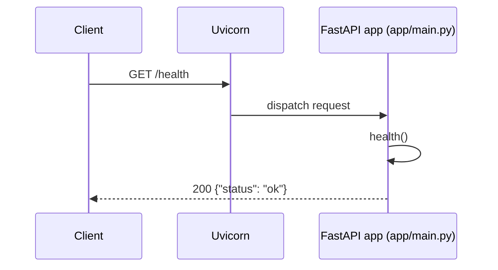
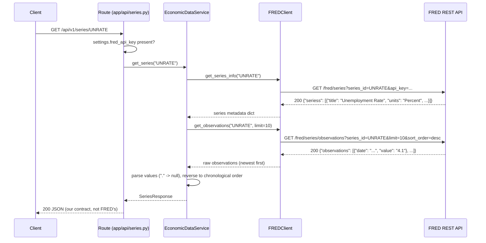
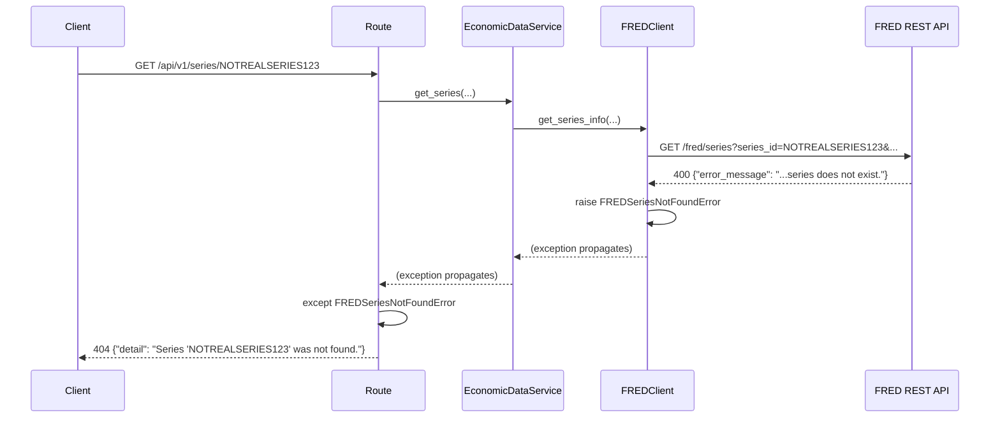
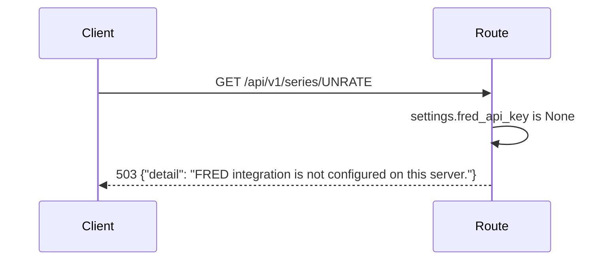
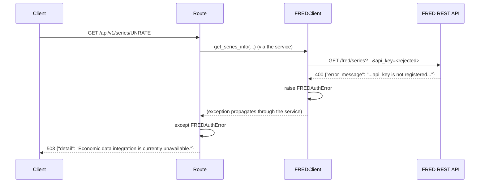
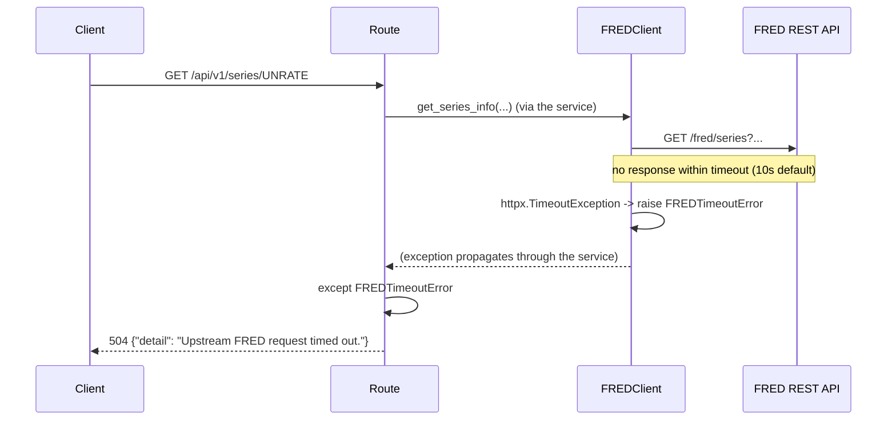
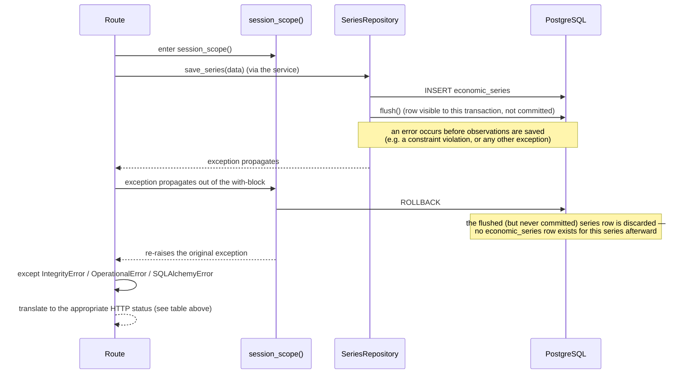
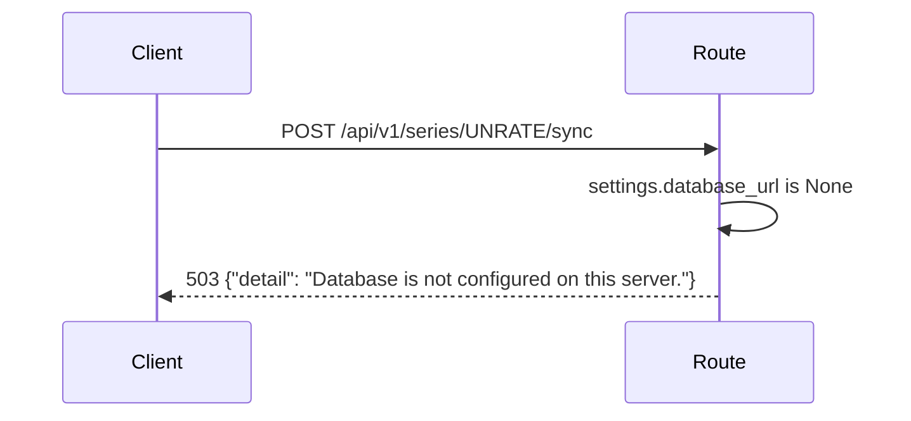

# Request Flows

Runtime flows through the system as it exists today. See
[`current-architecture.md`](current-architecture.md) for the static
component picture.

- Flow 1 — Health Check
- Flow 2 — Economic Series Request (`GET`, read-only, unchanged since Increment 002)
- Flow 3 — Failure Scenarios for the `GET` flow
- Flow 4 — Economic Series Sync (`POST .../sync`, persists to PostgreSQL) — new in Increment 003
- Flow 5 — Sync Failure Scenarios, including transaction rollback — new in Increment 003

## Flow 1 — Health Check



No dependencies, no I/O, no configuration involved — this route exists to
answer "is the process up" independent of anything else.

## Flow 2 — Economic Series Request (success path)



Two separate FRED requests happen per series lookup — one for metadata
(title, units), one for observations — each going through the same
`FREDClient._get` request path (timeout, error translation) independently.

## Flow 3 — Failure Scenarios

All failures below funnel through the same shape: `FREDClient` raises one
of a small set of typed exceptions, and `app/api/series.py` is the single
place that maps each one to an HTTP status code. Nothing upstream of the
route (the service, the client) ever produces an HTTP response directly.

| Scenario | Where it originates | Exception | Where translated | HTTP status |
|---|---|---|---|---|
| Nonexistent series ID | FRED responds `400`, `error_message` mentions the series | `FREDSeriesNotFoundError` | `app/api/series.py` | `404` |
| `FRED_API_KEY` not configured | Checked in the route before a client is built | *(none raised — early return)* | `app/api/series.py` | `503` |
| FRED rejects the API key | FRED responds `400`, `error_message` mentions `api_key` | `FREDAuthError` | `app/api/series.py` | `503` |
| Upstream request exceeds timeout | `httpx.TimeoutException` inside `FREDClient._get` | `FREDTimeoutError` | `app/api/series.py` | `504` |
| Network failure / malformed FRED response | `httpx.HTTPError`, JSON decode failure, or missing expected fields | `FREDUpstreamError` | `app/api/series.py` | `502` |

### Nonexistent series



### Missing FRED configuration



No `FREDClient` is even constructed in this case — the route short-circuits
before any FRED call would be attempted.

### Bad FRED credentials



The client-facing message is deliberately generic: FRED's raw
`error_message` and the fact that the failure is credential-related are
never exposed to the API consumer.

### Upstream timeout



## Flow 4 — Economic Series Sync (success path)

`POST /api/v1/series/{series_id}/sync` fetches from FRED (identical to
Flow 2) and then persists the result to PostgreSQL, all within one
database transaction.

```mermaid
sequenceDiagram
    participant C as Client
    participant R as Route (app/api/series.py)
    participant S as EconomicDataService
    participant FC as FREDClient
    participant FRED as FRED REST API
    participant SS as session_scope()
    participant Repo as SeriesRepository
    participant DB as PostgreSQL

    C->>R: POST /api/v1/series/UNRATE/sync
    R->>R: fred_api_key and database_url present?
    R->>SS: enter session_scope()
    SS->>DB: (session opened; transaction begins implicitly)
    R->>S: sync_series("UNRATE", session)
    S->>FC: get_series_info / get_observations (same as Flow 2)
    FC->>FRED: GET /fred/series, GET /fred/series/observations
    FRED-->>FC: 200 responses
    FC-->>S: raw metadata + observations
    S->>S: normalize -> SeriesResponse
    S->>Repo: save_series(SeriesResponse)
    Repo->>DB: SELECT economic_series WHERE series_id = 'UNRATE'
    alt series does not exist
        Repo->>DB: INSERT economic_series
        Repo->>DB: flush() (assigns new id, not yet committed)
    else series exists
        Repo->>DB: UPDATE economic_series SET title=..., units=..., source=...
    end
    Repo->>DB: SELECT existing economic_observations for this series
    loop each of the 10 normalized observations
        alt observation date already exists
            Repo->>DB: UPDATE economic_observations SET value=...
        else new date
            Repo->>DB: INSERT economic_observations
        end
    end
    Repo-->>S: EconomicSeries (persisted)
    S-->>R: SeriesResponse
    R->>SS: exit session_scope() normally
    SS->>DB: COMMIT
    R-->>C: 200 JSON (same contract as GET)
```

Calling this endpoint again with no change in FRED's data re-runs the same
sequence, but every branch takes the "already exists" path — no new rows,
no duplicate `(economic_series_id, observation_date)` pairs, because the
unique constraint backs up the upsert logic even if application logic
somehow missed a case.

## Flow 5 — Sync Failure Scenarios

Two failure categories are specific to the sync flow: FRED-side failures
(identical translation to Flow 3 — `FREDSeriesNotFoundError` → `404`,
`FREDAuthError` → `503`, `FREDTimeoutError` → `504`, `FREDUpstreamError` →
`502`) and database-side failures, new in this increment:

| Scenario | Where it originates | Exception | HTTP status |
|---|---|---|---|
| `DATABASE_URL` not configured | Checked in the route before a session is opened | *(none — early return)* | `503` |
| Database unreachable (connection refused, wrong host/port) | `sqlalchemy.exc.OperationalError` when the engine/session tries to connect | `OperationalError` | `503` |
| Unique/FK constraint violated despite the upsert logic (e.g. a genuine race) | `sqlalchemy.exc.IntegrityError` on flush/commit | `IntegrityError` | `409` |
| Any other database-layer failure | `sqlalchemy.exc.SQLAlchemyError` (base class) | `SQLAlchemyError` | `500` |

### Transaction rollback on mid-operation failure

If persistence fails *after* some work has already been flushed to
PostgreSQL but *before* the transaction commits, nothing partial is left
behind — `session_scope()`'s `except`/`rollback()` path discards
everything done inside that transaction, flushed or not:



This was verified directly (not just reasoned about): a script opened a
`session_scope()`, flushed a new series row, then raised an injected
exception before committing — the series row was confirmed absent
afterward.

### Missing database configuration



No session is opened and FRED is never called in this case — the route
short-circuits before any work begins, the same pattern used for a
missing `FRED_API_KEY`.
