# Request Flows

Runtime flows through the system as it exists today. See
[`current-architecture.md`](current-architecture.md) for the static
component picture.

- Flow 1 — Health Check
- Flow 2 — Economic Series Request (`GET`, FRED-backed, read-only, unchanged since Increment 002)
- Flow 3 — Failure Scenarios for the `GET` flow
- Flow 4 — Economic Series Sync (`POST .../sync`, persists to PostgreSQL) — new in Increment 003
- Flow 5 — Sync Failure Scenarios, including transaction rollback — new in Increment 003
- Flow 6 — Historical Observations Query (`GET .../observations`, PostgreSQL-only) — new in Increment 004
- Flow 7 — Observations Query Failure Scenarios — new in Increment 004
- Flow 8 — Transformation Query (`GET .../transform`, PostgreSQL-only + boundary context) — new in Increment 005
- Flow 9 — Transformation Failure Scenarios — new in Increment 005
- Flow 10 — Multi-Series Analysis Query (`GET /analysis/compare`, PostgreSQL-only) — new in Increment 006
- Flow 11 — Multi-Series Analysis Failure Scenarios, including undefined correlation — new in Increment 006
- Flow 12 — Composable Pipeline: raw/raw and mixed transformed composition — new in Increment 007
- Flow 13 — Composable Pipeline: boundary context with a `start_date` — new in Increment 007
- Flow 14 — Composable Pipeline Failure/Validation Scenarios — new in Increment 007
- Flow 15 — AI Query: no tool needed — new in Increment 008
- Flow 16 — AI Query: single-tool round (`get_observations`/`transform_series`) — new in Increment 008
- Flow 17 — AI Query: two-series tool call (`analyze_series`) — new in Increment 008
- Flow 18 — AI Query Failure Scenarios: invalid tool arguments, missing series, provider failure, tool-round limit — new in Increment 008
- Flow 19 — Series Discovery: local + FRED merge — new in Increment 013
- Flow 20 — Series Discovery: FRED degradation, local results survive — new in Increment 013
- Flow 21 — Series Discovery: no local match and FRED failure — new in Increment 013

## Flow 1 — Health Check

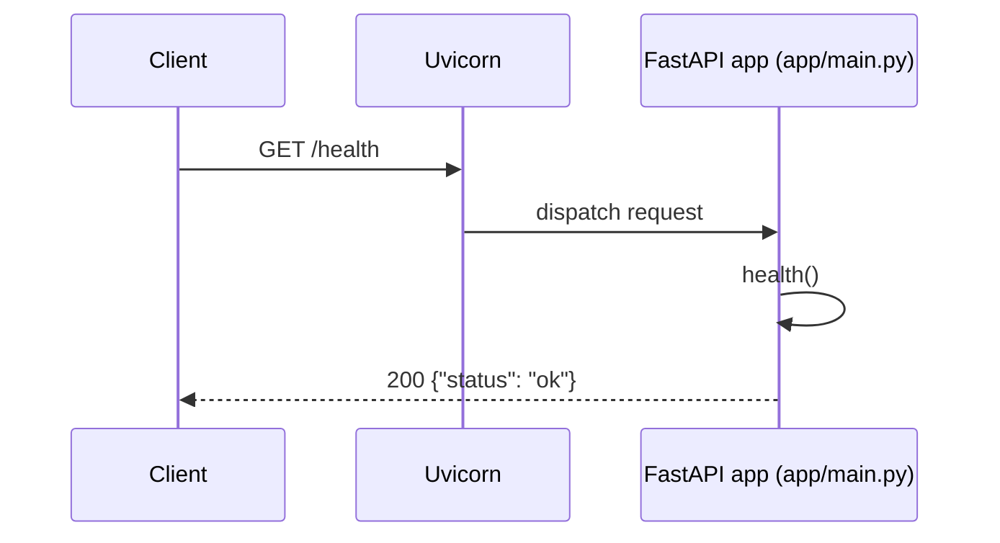

No dependencies, no I/O, no configuration involved — this route exists to
answer "is the process up" independent of anything else.

## Flow 2 — Economic Series Request (success path)

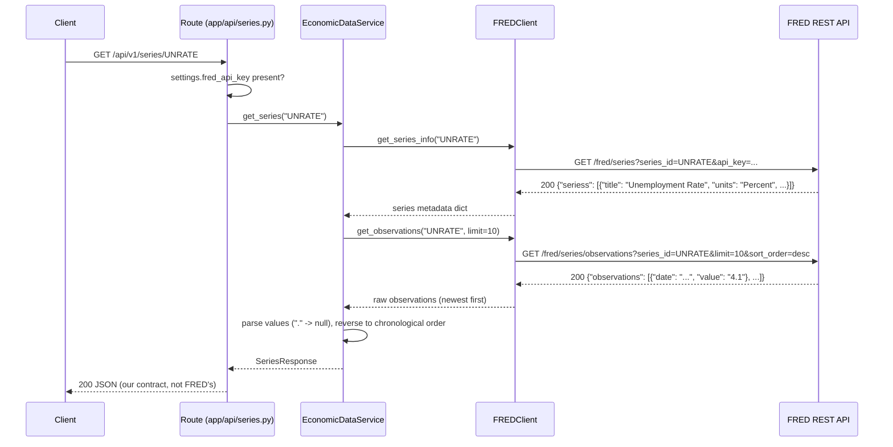

Two separate FRED requests happen per series lookup — one for metadata
(title, units), one for observations — each going through the same
`FREDClient._get` request path (timeout, error translation) independently.

## Flow 3 — Failure Scenarios

All failures below funnel through the same shape: `FREDClient` raises one
of a small set of typed exceptions, and `app/api/series.py` is the single
place that maps each one to an HTTP status code. Nothing upstream of the
route (the service, the client) ever produces an HTTP response directly.

| Scenario | Where it originates | Exception | Where translated | HTTP status |
|---|---|---|---|---|
| Nonexistent series ID | FRED responds `400`, `error_message` mentions the series | `FREDSeriesNotFoundError` | `app/api/series.py` | `404` |
| `FRED_API_KEY` not configured | Checked in the route before a client is built | *(none raised — early return)* | `app/api/series.py` | `503` |
| FRED rejects the API key | FRED responds `400`, `error_message` mentions `api_key` | `FREDAuthError` | `app/api/series.py` | `503` |
| Upstream request exceeds timeout | `httpx.TimeoutException` inside `FREDClient._get` | `FREDTimeoutError` | `app/api/series.py` | `504` |
| Network failure / malformed FRED response | `httpx.HTTPError`, JSON decode failure, or missing expected fields | `FREDUpstreamError` | `app/api/series.py` | `502` |

### Nonexistent series

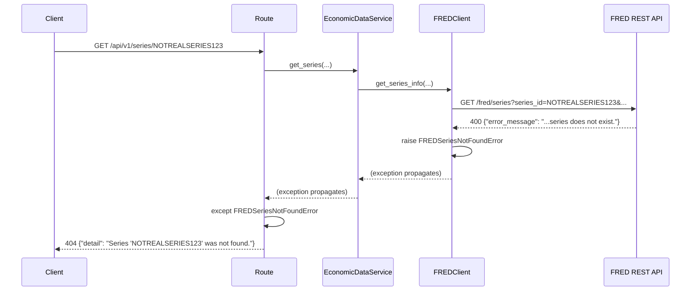

### Missing FRED configuration

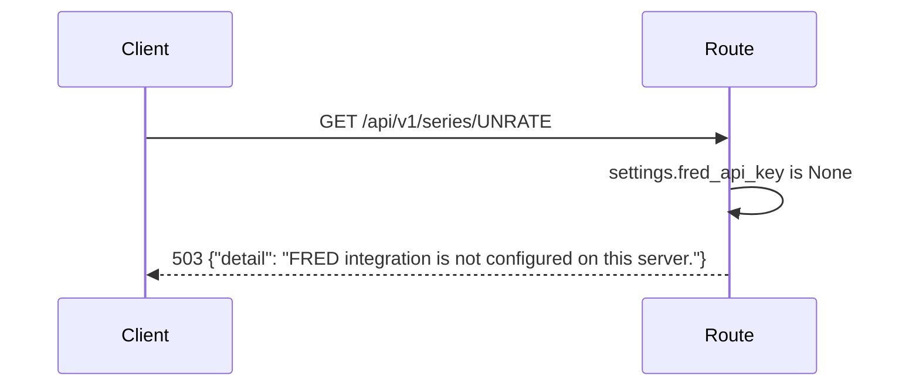

No `FREDClient` is even constructed in this case — the route short-circuits
before any FRED call would be attempted.

### Bad FRED credentials

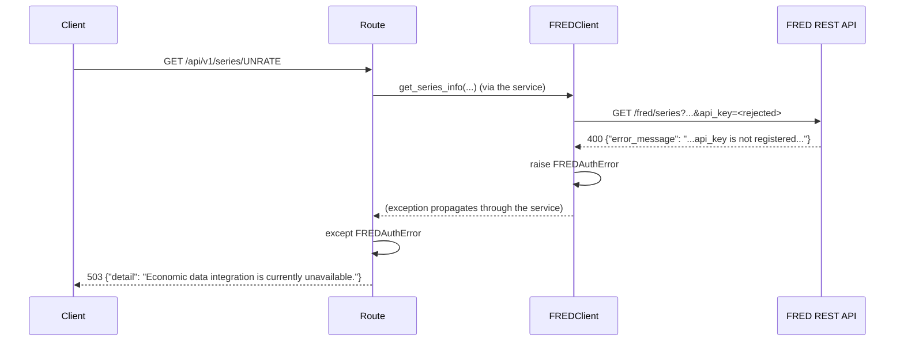

The client-facing message is deliberately generic: FRED's raw
`error_message` and the fact that the failure is credential-related are
never exposed to the API consumer.

### Upstream timeout

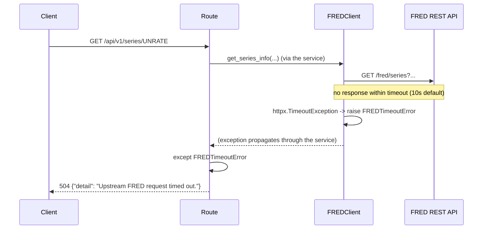

## Flow 4 — Economic Series Sync (success path)

`POST /api/v1/series/{series_id}/sync` fetches from FRED (identical to
Flow 2) and then persists the result to PostgreSQL, all within one
database transaction.

```mermaid
sequenceDiagram
    participant C as Client
    participant R as Route (app/api/series.py)
    participant S as EconomicDataService
    participant FC as FREDClient
    participant FRED as FRED REST API
    participant SS as session_scope()
    participant Repo as SeriesRepository
    participant DB as PostgreSQL

    C->>R: POST /api/v1/series/UNRATE/sync
    R->>R: fred_api_key and database_url present?
    R->>SS: enter session_scope()
    SS->>DB: (session opened; transaction begins implicitly)
    R->>S: sync_series("UNRATE", session)
    S->>FC: get_series_info / get_observations (same as Flow 2)
    FC->>FRED: GET /fred/series, GET /fred/series/observations
    FRED-->>FC: 200 responses
    FC-->>S: raw metadata + observations
    S->>S: normalize -> SeriesResponse
    S->>Repo: save_series(SeriesResponse)
    Repo->>DB: SELECT economic_series WHERE series_id = 'UNRATE'
    alt series does not exist
        Repo->>DB: INSERT economic_series
        Repo->>DB: flush() (assigns new id, not yet committed)
    else series exists
        Repo->>DB: UPDATE economic_series SET title=..., units=..., source=...
    end
    Repo->>DB: SELECT existing economic_observations for this series
    loop each of the 10 normalized observations
        alt observation date already exists
            Repo->>DB: UPDATE economic_observations SET value=...
        else new date
            Repo->>DB: INSERT economic_observations
        end
    end
    Repo-->>S: EconomicSeries (persisted)
    S-->>R: SeriesResponse
    R->>SS: exit session_scope() normally
    SS->>DB: COMMIT
    R-->>C: 200 JSON (same contract as GET)
```

Calling this endpoint again with no change in FRED's data re-runs the same
sequence, but every branch takes the "already exists" path — no new rows,
no duplicate `(economic_series_id, observation_date)` pairs, because the
unique constraint backs up the upsert logic even if application logic
somehow missed a case.

## Flow 5 — Sync Failure Scenarios

Two failure categories are specific to the sync flow: FRED-side failures
(identical translation to Flow 3 — `FREDSeriesNotFoundError` → `404`,
`FREDAuthError` → `503`, `FREDTimeoutError` → `504`, `FREDUpstreamError` →
`502`) and database-side failures, new in this increment:

| Scenario | Where it originates | Exception | HTTP status |
|---|---|---|---|
| `DATABASE_URL` not configured | Checked in the route before a session is opened | *(none — early return)* | `503` |
| Database unreachable (connection refused, wrong host/port) | `sqlalchemy.exc.OperationalError` when the engine/session tries to connect | `OperationalError` | `503` |
| Unique/FK constraint violated despite the upsert logic (e.g. a genuine race) | `sqlalchemy.exc.IntegrityError` on flush/commit | `IntegrityError` | `409` |
| Any other database-layer failure | `sqlalchemy.exc.SQLAlchemyError` (base class) | `SQLAlchemyError` | `500` |

### Transaction rollback on mid-operation failure

If persistence fails *after* some work has already been flushed to
PostgreSQL but *before* the transaction commits, nothing partial is left
behind — `session_scope()`'s `except`/`rollback()` path discards
everything done inside that transaction, flushed or not:

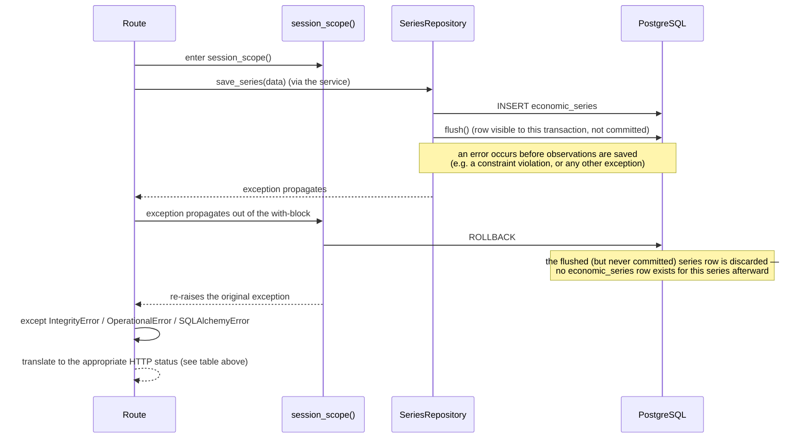

This was verified directly (not just reasoned about): a script opened a
`session_scope()`, flushed a new series row, then raised an injected
exception before committing — the series row was confirmed absent
afterward.

### Missing database configuration

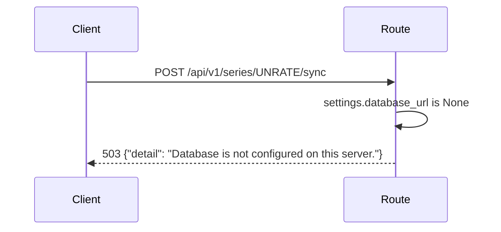

No session is opened and FRED is never called in this case — the route
short-circuits before any work begins, the same pattern used for a
missing `FRED_API_KEY`.

## Flow 6 — Historical Observations Query (success path)

`GET /api/v1/series/{series_id}/observations` reads only from PostgreSQL.
`FREDClient` never appears anywhere in this flow — no import, no
instantiation, no call.

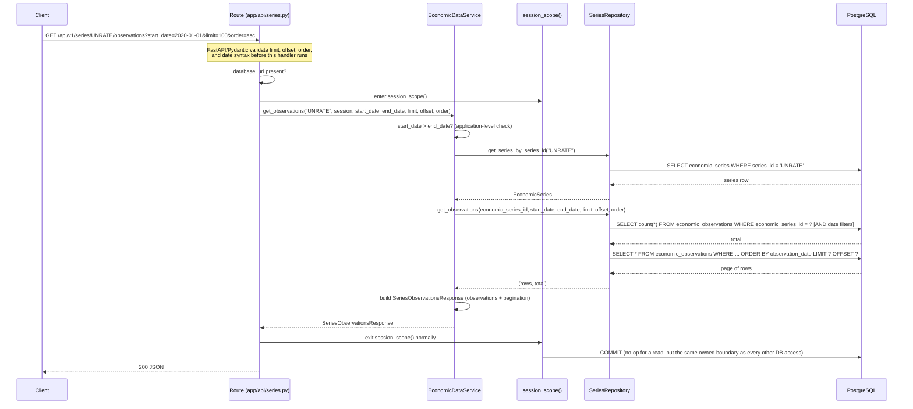

Both the count query and the page query share the same `WHERE`
conditions, which is what guarantees `pagination.total` always describes
exactly what `limit`/`offset` are paginating over.

## Flow 7 — Observations Query Failure Scenarios

| Scenario | Where it's caught | HTTP status |
|---|---|---|
| Malformed `limit`/`offset`/`order`/date syntax | FastAPI/Pydantic, before the route body runs | `422` |
| `start_date` after `end_date` | `InvalidDateRangeError` from `EconomicDataService.get_observations` | `400` |
| Series not persisted in PostgreSQL | `SeriesNotFoundError` from the service (repository returned no series row) | `404` |
| Series persisted, but no observation matches the filters | *(no exception — a normal empty result)* | `200`, `observations: []`, `total: 0` |
| `DATABASE_URL` not configured | Checked in the route before a session is opened | `503` |
| Database unreachable | `sqlalchemy.exc.OperationalError` | `503` |
| Any other database-layer failure | `sqlalchemy.exc.SQLAlchemyError` (base class) | `500` |

Note what's *not* in this table compared to Flow 5's write-side table:
`IntegrityError` has no branch here. A read-only `SELECT` cannot violate a
unique or foreign-key constraint, so there is no realistic way for this
endpoint to raise one — a handler for it would be dead code, not defense.

### Nonexistent persisted series vs. an empty filtered result

These look similar from the outside (no observations come back) but mean
different things and are handled differently:

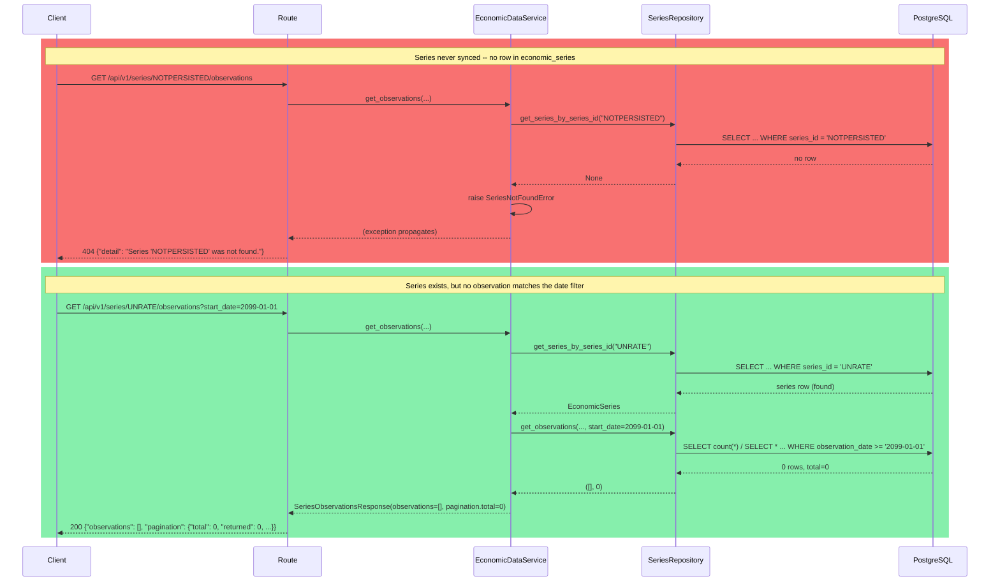

## Flow 8 — Transformation Query (with boundary-context retrieval)

`GET /api/v1/series/{series_id}/transform` reads only from PostgreSQL,
same as Flow 6 — `FREDClient` never appears here either. The distinctive
part of this flow is fetching enough *preceding* context to compute
correct values at the start of the requested range, then trimming that
context back out before responding.

```mermaid
sequenceDiagram
    participant C as Client
    participant R as Route (app/api/series.py)
    participant S as EconomicDataService
    participant Repo as SeriesRepository
    participant Eng as Transformation engine<br/>(app/domain/transformations.py)
    participant DB as PostgreSQL

    C->>R: GET .../UNRATE/transform?transformation=percent_change&start_date=2026-02-01
    Note over R: FastAPI/Pydantic validate transformation (Literal),<br/>window bounds (2-365 if given), and date syntax
    R->>R: database_url present?
    R->>S: get_transformed_observations("UNRATE", session, transformation, start_date, end_date, window)
    S->>S: start_date > end_date? window required/inapplicable for this transformation?
    S->>Repo: get_series_by_series_id("UNRATE")
    Repo->>DB: SELECT economic_series WHERE series_id = 'UNRATE'
    DB-->>Repo: series row
    Repo-->>S: EconomicSeries
    S->>Repo: get_observations_in_range(series.id, start_date, end_date)
    Repo->>DB: SELECT * WHERE economic_series_id = ? AND observation_date >= '2026-02-01' ORDER BY observation_date
    DB-->>Repo: requested-range rows
    Repo-->>S: requested
    Note over S: start_date given and context_size > 0 -->> fetch leading context
    S->>Repo: get_preceding_observations(series.id, before_date=start_date, count=context_size)
    Repo->>DB: SELECT * WHERE economic_series_id = ? AND observation_date < '2026-02-01' ORDER BY observation_date DESC LIMIT context_size
    DB-->>Repo: up to context_size preceding rows (most recent first)
    Repo-->>S: context (reversed back to ascending)
    S->>S: combined = context + requested  (one continuous ascending list)
    S->>Eng: percent_change(combined)
    Note over Eng: pure function -- no DB, no HTTP, no FRED;<br/>processes the list positionally, unaware<br/>any of it is "context"
    Eng-->>S: transformed (one result per input point, same length as combined)
    S->>S: output = transformed[len(context):]  (drop the context-only leading results)
    S-->>R: SeriesTransformResponse(transformation, observations=output)
    R-->>C: 200 JSON -- only dates >= 2026-02-01, but the first one's<br/>value is computed correctly against the point before it
```

The count query/page query symmetry from Flow 6 doesn't apply here —
`.../transform` has no `total`/pagination metadata at all (see Flow 9's
table and the journal for why).

## Flow 9 — Transformation Failure Scenarios

| Scenario | Where it's caught | HTTP status |
|---|---|---|
| Malformed `window`/date syntax, or an unrecognized `transformation` value | FastAPI/Pydantic, before the route body runs | `422` |
| `start_date` after `end_date` | `InvalidDateRangeError` from the service | `400` |
| `transformation=moving_average` with no `window` | `InvalidWindowError` from the service | `400` |
| `window` supplied for `absolute_change`/`percent_change` | `InvalidWindowError` from the service | `400` |
| Series not persisted in PostgreSQL | `SeriesNotFoundError` from the service | `404` |
| `DATABASE_URL` not configured | Checked in the route before a session is opened | `503` |
| Database unreachable | `sqlalchemy.exc.OperationalError` | `503` |
| Any other database-layer failure | `sqlalchemy.exc.SQLAlchemyError` (base class) | `500` |

As with Flow 7, there is no `IntegrityError` branch: this endpoint never
writes. `window`'s numeric bounds (`2`–`365`) are enforced structurally by
FastAPI whenever a value is supplied at all; whether a value is *allowed*
to be supplied depends on `transformation`, which FastAPI can't know on
its own — that cross-field decision is exactly what `InvalidWindowError`
exists for:

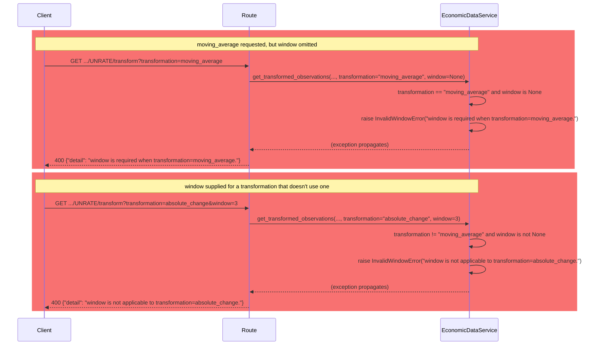

## Flow 10 — Multi-Series Analysis Query (success path)

`GET /api/v1/analysis/compare` reads only from PostgreSQL, twice —
independently for `series_a` and `series_b` — then aligns and analyzes
in-process. `FREDClient` never appears anywhere in this flow.

```mermaid
sequenceDiagram
    participant C as Client
    participant R as Route (app/api/analysis.py)
    participant S as AnalysisService
    participant Repo as SeriesRepository
    participant Eng as Analysis engine<br/>(app/domain/analysis.py)
    participant DB as PostgreSQL

    C->>R: GET /analysis/compare?series_a=UNRATE&series_b=CPIAUCSL&analysis=correlation
    Note over R: FastAPI/Pydantic validate analysis (Literal)<br/>and date syntax before this handler runs
    R->>R: database_url present?
    R->>S: compare("UNRATE", "CPIAUCSL", session, analysis, start_date, end_date)
    S->>S: start_date > end_date?
    S->>Repo: get_series_by_series_id("UNRATE")
    Repo->>DB: SELECT economic_series WHERE series_id = 'UNRATE'
    DB-->>Repo: series_a row
    S->>Repo: get_series_by_series_id("CPIAUCSL")
    Repo->>DB: SELECT economic_series WHERE series_id = 'CPIAUCSL'
    DB-->>Repo: series_b row
    S->>Repo: get_observations_in_range(series_a.id, start_date, end_date)
    Repo->>DB: SELECT * WHERE economic_series_id = ? [AND date filters] ORDER BY observation_date
    DB-->>Repo: series A's observations
    S->>Repo: get_observations_in_range(series_b.id, start_date, end_date)
    Repo->>DB: SELECT * WHERE economic_series_id = ? [AND date filters] ORDER BY observation_date
    DB-->>Repo: series B's observations
    S->>Eng: align_series(observations_a, observations_b)
    Note over Eng: exact-date inner join (dict keys, never zip/position);<br/>pure -- no DB, no HTTP, no FRED
    Eng-->>S: aligned pairs (matching_pairs = len(aligned))
    S->>Eng: count_usable_pairs(aligned)
    Eng-->>S: usable_pairs
    S->>Eng: pearson_correlation(aligned)
    Note over Eng: computed over usable pairs only;<br/>null if <2 usable or zero variance
    Eng-->>S: correlation (float or null)
    S->>S: build SeriesComparisonResponse (observations=[] for correlation)
    S-->>R: SeriesComparisonResponse
    R-->>C: 200 JSON
```

Both `get_observations_in_range` calls are the *same* repository method
Increment 005 already built for single-series use — reused unchanged,
called once per compared series, with no analysis-specific repository
method added.

## Flow 11 — Multi-Series Analysis Failure Scenarios

| Scenario | Where it's caught | HTTP status |
|---|---|---|
| Malformed date syntax, or an unrecognized `analysis` value | FastAPI/Pydantic, before the route body runs | `422` |
| Missing `series_a` or `series_b` (required query params) | FastAPI/Pydantic, before the route body runs | `422` |
| `start_date` after `end_date` | `InvalidDateRangeError` from the service | `400` |
| `series_a` not persisted in PostgreSQL | `SeriesNotFoundError` from the service, naming `series_a` | `404` |
| `series_b` not persisted in PostgreSQL | `SeriesNotFoundError` from the service, naming `series_b` | `404` |
| `DATABASE_URL` not configured | Checked in the route before a session is opened | `503` |
| Database unreachable | `sqlalchemy.exc.OperationalError` | `503` |
| Any other database-layer failure | `sqlalchemy.exc.SQLAlchemyError` (base class) | `500` |

As with Flows 7 and 9, there is no `IntegrityError` branch — this endpoint
never writes.

### Zero matching dates and undefined correlation — both valid `200`s, not errors

Neither of these is a failure; both are legitimate answers a caller needs
to be able to receive without the response looking like something broke:

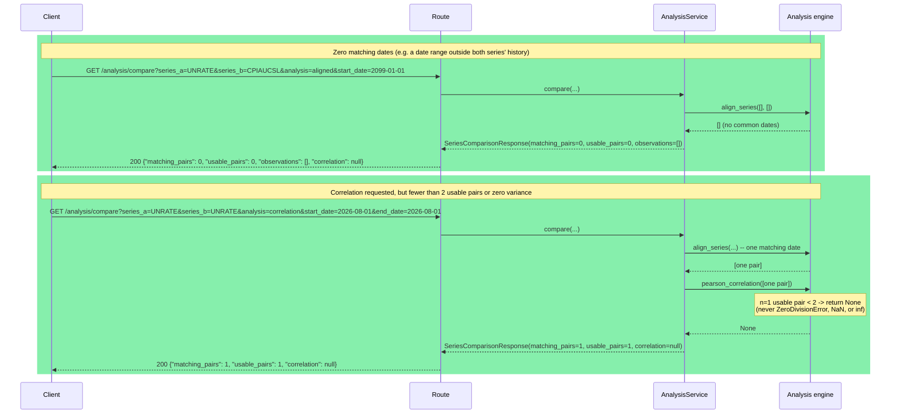

## Flow 12 — Composable Pipeline (raw/raw and mixed transformed composition)

`POST /api/v1/analysis/pipeline` reads only from PostgreSQL; `FREDClient`
never appears here either. Each side is resolved independently (raw
persisted values, or transformed via the exact same pure functions
`.../transform` uses) *before* the two sides are aligned.

```mermaid
sequenceDiagram
    participant C as Client
    participant R as Route (app/api/analysis.py)
    participant S as AnalysisService
    participant Repo as SeriesRepository
    participant TEng as Transformation engine<br/>(app/domain/transformations.py)
    participant AEng as Analysis engine<br/>(app/domain/analysis.py)
    participant DB as PostgreSQL

    C->>R: POST /analysis/pipeline<br/>{series_a: {CPIAUCSL, percent_change}, series_b: {UNRATE}, analysis: correlation}
    Note over R: Pydantic validates the whole body structurally<br/>(transformation type, window bounds if given, analysis type)
    R->>R: database_url present?
    R->>S: pipeline(request, session)
    S->>S: (1) validate: start_date<=end_date; each side's transformation applicability
    S->>Repo: (2) get_series_by_series_id("CPIAUCSL"), get_series_by_series_id("UNRATE")
    Repo->>DB: SELECT economic_series WHERE series_id IN (...)
    DB-->>Repo: both series rows
    Note over S,DB: (3)-(6) per series, independently
    S->>Repo: get_observations_in_range(series_a.id, ...)
    Repo->>DB: SELECT * WHERE economic_series_id = ? ORDER BY observation_date
    DB-->>Repo: series A's requested-range observations
    S->>TEng: percent_change(observations_a)
    Note over TEng: pure -- no DB, no HTTP, no FRED;<br/>receives plain Observation(date, value)
    TEng-->>S: series A's FINAL values (percent_change results)
    S->>Repo: get_observations_in_range(series_b.id, ...)
    Repo->>DB: SELECT * WHERE economic_series_id = ? ORDER BY observation_date
    DB-->>Repo: series B's observations (no transformation requested -- used as-is)
    S->>AEng: (7) align_series(final_a, final_b)
    Note over AEng: exact-date inner join over the FINAL values --<br/>unaware either side was ever transformed
    AEng-->>S: aligned pairs
    S->>AEng: (8) pearson_correlation(aligned)
    AEng-->>S: correlation
    S->>S: (9) build PipelineResponse (series_a.transformation = {percent_change, null})
    S-->>R: PipelineResponse
    R-->>C: 200 JSON
```

Raw+raw through this endpoint reproduces `GET /analysis/compare`'s result
exactly for the same series/analysis/dates — verified directly by
comparing the returned correlation coefficient from both endpoints to
full float precision.

## Flow 13 — Composable Pipeline: boundary context with `start_date`

The critical ordering: context is fetched *before* transforming, and
trimmed *before* aligning — never the reverse.

```mermaid
sequenceDiagram
    participant S as AnalysisService
    participant Repo as SeriesRepository
    participant TEng as Transformation engine
    participant AEng as Analysis engine

    Note over S: request: series_a = percent_change(CPIAUCSL), start_date = Feb
    S->>Repo: get_observations_in_range(series_a.id, start_date=Feb, end_date=None)
    Repo-->>S: [Feb, Mar, ...]  (requested range only)
    Note over S: start_date given -> fetch 1 preceding point (percent_change's context_size)
    S->>Repo: get_preceding_observations(series_a.id, before_date=Feb, count=1)
    Repo-->>S: [Jan]  (context; strictly before Feb)
    S->>S: combined = [Jan] + [Feb, Mar, ...]
    S->>TEng: percent_change(combined)
    TEng-->>S: [Jan: null, Feb: 5.0, Mar: ...]  (Feb correctly computed against Jan)
    S->>S: output = transformed[1:]  -- drop Jan (the context), keep Feb onward
    Note over S: output = [Feb: 5.0, Mar: ...] -- Jan never reaches alignment
    S->>AEng: align_series(output, series_b's final values)
    Note over AEng: only Feb onward can possibly appear in the aligned result --<br/>Jan was never a candidate, by construction
```

This was verified by exact-value comparison (the same technique used in
Increment 005): the pipeline's Feb value for `percent_change(CPIAUCSL)`
with `start_date=Feb` matched the unfiltered single-series
`GET .../transform` computation for Feb exactly, and Jan was confirmed
absent from the pipeline's `observations`. The same check was repeated
for `absolute_change` and for `moving_average(window=4)` (which needs 3
preceding points, not 1) with matching results.

## Flow 14 — Composable Pipeline Failure/Validation Scenarios

| Scenario | Where it's caught | HTTP status |
|---|---|---|
| Malformed request body, unsupported `transformation.type`, or unsupported `analysis` | FastAPI/Pydantic, before the route body runs | `422` |
| `transformation.window` outside `[2, 365]` | FastAPI/Pydantic (`TransformationSpec.window`'s `Field(ge=2, le=365)`) | `422` |
| `start_date` after `end_date` | `InvalidDateRangeError` from the service | `400` |
| `type=moving_average` with no `window` | `InvalidWindowError` from the service (reused from Increment 005) | `400` |
| `window` supplied for `absolute_change`/`percent_change` | `InvalidWindowError` from the service (reused from Increment 005) | `400` |
| `series_a`/`series_b` not persisted | `SeriesNotFoundError` from the service, naming the missing one | `404` |
| `DATABASE_URL` not configured | Checked in the route before a session is opened | `503` |
| Database unreachable | `sqlalchemy.exc.OperationalError` | `503` |
| Any other database-layer failure | `sqlalchemy.exc.SQLAlchemyError` (base class) | `500` |

As with every other read-only endpoint in this project, there is no
`IntegrityError` branch — this endpoint never writes. Note that the
window-applicability rule maps to the *same* status code (`400`) via the
*same* exception class (`InvalidWindowError`) as the single-series
`.../transform` endpoint's identical rule (Flow 9) — not a new,
differently-coded validation path for what is conceptually the same
check.

## Flow 15 — AI Query: no tool needed

The simplest case: the model can answer without touching persisted data
at all (e.g. small talk, or a question this system's data genuinely can't
answer).

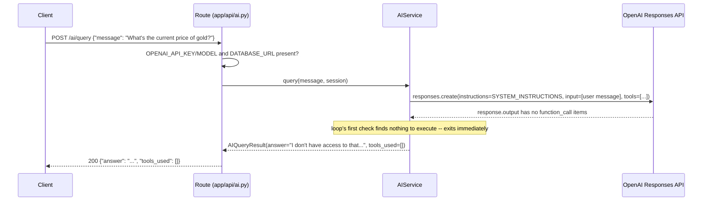

Verified with a real request: asked about gold prices (data this system
has no series for), the model correctly declined to invent a number and
called no tool.

## Flow 16 — AI Query: single-tool round

A request needing one persisted-data lookup or transformation.
`get_observations` and `transform_series` follow the identical shape;
this shows `transform_series`.

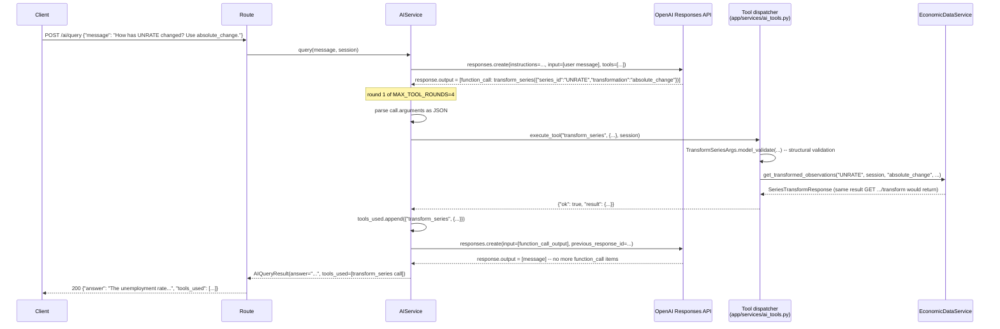

Verified with a real request and real OpenAI response: the model called
`transform_series` with exactly these arguments, and the returned table's
values matched the deterministic `absolute_change` engine's known output
exactly (e.g. `+0.1` for 2026-02-01).

## Flow 17 — AI Query: two-series tool call

`analyze_series` maps directly onto `AnalysisService.pipeline` — the
exact same code path as `POST /analysis/pipeline` (Flow 12), just invoked
by the model instead of a direct HTTP call.

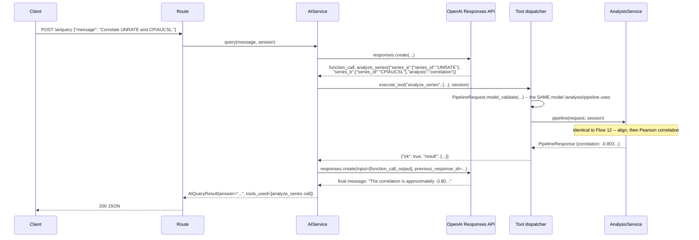

Verified with a real request: the model reported "-0.80" (matching
`-0.8030258377001954` rounded) and explicitly noted the relationship
without claiming causation, per the system instruction.

## Flow 18 — AI Query Failure Scenarios

| Scenario | Where it's caught | Result |
|---|---|---|
| `OPENAI_API_KEY`/`OPENAI_MODEL` not configured | Route, before `AIService` is constructed | `503` |
| `DATABASE_URL` not configured | Route, before `AIService` is constructed | `503` |
| OpenAI rejects the API key | `AIService._create_response`, `AuthenticationError` | `503`, generic message |
| OpenAI unreachable/timed out | `AIService._create_response`, `APITimeoutError`/`APIConnectionError` | `503`, generic message |
| Model requests an unknown tool name | `execute_tool` returns `{"ok": false, "error": {"type": "unknown_tool", ...}}` | Loop continues; model sees the error and can respond accordingly |
| Model's tool arguments don't validate (or aren't valid JSON at all) | `execute_tool` / `AIService._parse_arguments` | Loop continues; same structured error shape |
| Series in a tool call isn't persisted | `execute_tool` catches `SeriesNotFoundError` | Loop continues; structured `series_not_found` error |
| Database unavailable during a tool call | `execute_tool` catches `OperationalError` | Loop continues; structured `database_unavailable` error |
| Model keeps requesting tools past `MAX_TOOL_ROUNDS` | `AIService.query`, `ToolRoundLimitExceededError` | `503` |
| Anything genuinely unexpected | Not caught in the AI path | FastAPI's default `500` |

The middle four rows never end the request — they hand the model a
structured error it can react to (apologize, try different arguments, or
explain the limitation), which is why `POST /ai/query` can still return
`200` even when a tool call inside it failed. Verified directly:

```mermaid
sequenceDiagram
    participant C as Client
    participant R as Route
    participant S as AIService
    participant AI as OpenAI Responses API
    participant D as Tool dispatcher

    C->>R: POST /ai/query {"message": "Show me NOTPERSISTED"}
    R->>S: query(...)
    S->>AI: responses.create(...)
    AI-->>S: function_call: get_observations({"series_id": "NOTPERSISTED"})
    S->>D: execute_tool("get_observations", {...}, session)
    D->>D: EconomicDataService.get_observations(...) raises SeriesNotFoundError
    D-->>S: {"ok": false, "error": {"type": "series_not_found", "message": "Series 'NOTPERSISTED' is not persisted."}}
    S->>AI: responses.create(input=[function_call_output], previous_response_id=...)
    AI-->>S: final message: "That series isn't available in our persisted data."
    S-->>R: AIQueryResult(answer="...", tools_used=[get_observations call])
    R-->>C: 200 {"answer": "...", "tools_used": [...]}  -- not an error response
```

Also verified: a client that always requests another tool call was
stopped exactly at round 4 (`ToolRoundLimitExceededError`), never running
indefinitely; the round counter counts *rounds* (one round may contain
several parallel tool calls, verified separately), not individual calls.

## Flow 19 — Series Discovery: local + FRED merge

```mermaid
sequenceDiagram
    participant C as Client
    participant R as Route (app/api/series.py)
    participant DS as SeriesDiscoveryService
    participant Repo as SeriesRepository
    participant FC as FREDClient
    participant FRED as FRED REST API
    participant DB as PostgreSQL

    C->>R: GET /api/v1/series/search?q=unemployment&limit=10
    R->>R: q.strip() non-empty? database configured?
    R->>DS: search("unemployment", 10, session)
    DS->>Repo: search_series("unemployment", 10)
    Repo->>DB: ILIKE '%unemployment%' on series_id OR title
    DB-->>Repo: [UNRATE]  (local match)
    Repo-->>DS: [UNRATE]
    DS->>FC: search_series("unemployment", limit=10)
    FC->>FRED: GET fred/series/search?search_text=unemployment&search_type=full_text&...
    FRED-->>FC: 200 {"seriess": [UNRATE, UNRATENSA, U6RATE, ...]}
    FC-->>DS: raw FRED rows (catalog metadata only)
    DS->>DS: merge by series_id (UNRATE deduplicated: persisted=true, discovery_source=local_and_fred)
    DS->>DS: rank: exact-id tier, then persisted tier, then FRED search_rank order; limit applied last
    DS-->>R: SeriesSearchResponse(candidates=[...], external_search_available=true)
    R-->>C: 200 JSON
```

Route ordering matters here: `GET /search` is declared before
`GET /{series_id}` in `app/api/series.py` specifically so `"search"`
is never captured as a `series_id` path parameter — verified directly
(not just by reading the declaration order) by mocking
`FREDClient.get_series_info` to raise if ever called and
`FREDClient.search_series` to succeed, then confirming a real request
to `/series/search` returns a clean discovery response with
`get_series_info` never invoked.

Verified with a real FRED response and a persisted local row: searching
"unemployment" surfaces `UNRATE` as a single, deduplicated,
`persisted: true`, `discovery_source: "local_and_fred"` candidate with
FRED's richer metadata (frequency, seasonal adjustment, observation
range, popularity) layered onto the local match — never two separate
rows for the same series.

## Flow 20 — Series Discovery: FRED degradation, local results survive

```mermaid
sequenceDiagram
    participant C as Client
    participant R as Route
    participant DS as SeriesDiscoveryService
    participant Repo as SeriesRepository
    participant FC as FREDClient
    participant FRED as FRED REST API

    C->>R: GET /api/v1/series/search?q=unemployment
    R->>DS: search("unemployment", 10, session)
    DS->>Repo: search_series(...)
    Repo-->>DS: [UNRATE]  (local match still found)
    DS->>FC: search_series("unemployment", limit=10)
    FC->>FRED: GET fred/series/search?...
    Note over FC,FRED: timeout, auth rejection, or upstream failure
    FC->>FC: raise FREDTimeoutError / FREDAuthError / FREDUpstreamError
    DS->>DS: except FREDError -> external_search_available = False
    DS-->>R: SeriesSearchResponse(candidates=[UNRATE], external_search_available=false)
    R-->>C: 200 JSON  -- NOT an error; local results are still useful
```

Verified directly for all three FRED exception types, plus the
`FRED_API_KEY`-unconfigured case (no `FREDClient` even constructed):
every one degrades identically — `200`, local candidates intact,
`external_search_available: false`. The search endpoint never becomes
unavailable merely because FRED's catalog search is unavailable when a
useful local result exists.

## Flow 21 — Series Discovery: no local match and FRED failure

```mermaid
sequenceDiagram
    participant C as Client
    participant R as Route
    participant DS as SeriesDiscoveryService
    participant Repo as SeriesRepository
    participant FC as FREDClient

    C->>R: GET /api/v1/series/search?q=totallyunknownXYZ
    R->>DS: search("totallyunknownXYZ", 10, session)
    DS->>Repo: search_series(...)
    Repo-->>DS: []  (no local match)
    DS->>FC: search_series("totallyunknownXYZ", limit=10)
    FC->>FC: raise FREDUpstreamError (or any FREDError)
    DS->>DS: except FREDError -> external_search_available = False
    DS-->>R: SeriesSearchResponse(candidates=[], external_search_available=false)
    R-->>C: 200 {"query": "...", "candidates": [], "external_search_available": false}
```

This is the existing `SeriesDiscoveryService` contract, unchanged,
newly locked down by a permanent test: no local match combined with a
FRED failure is **not** an error — it's an honestly empty result. The
service never raises here; "nothing was confidently found" and
"something went wrong" are deliberately different outcomes, consistent
with how every other read path in this project treats an empty result
as success, not failure.

## Flow 22 — Inflation Monitor (`inflation_v1.0`)

`GET /api/v1/monitors/inflation` reads only from PostgreSQL, for exactly
the four canonical series named in
[docs/methodology/inflation-monitor-v1.0.md](../methodology/inflation-monitor-v1.0.md).
`FREDClient` never appears anywhere in this flow, and no AI service is
imported or called. All four series are fetched independently; a series
that isn't persisted at all yields an empty observation list rather
than an error, so the flow below is identical whether zero, some, or
all four canonical series have data.

```mermaid
sequenceDiagram
    participant C as Client
    participant R as Route (app/api/inflation.py)
    participant S as InflationMonitorService
    participant SS as session_scope()
    participant Repo as SeriesRepository
    participant DB as PostgreSQL
    participant D as app.domain.inflation (pure)

    C->>R: GET /api/v1/monitors/inflation
    R->>R: database_url present?
    R->>SS: enter session_scope()
    R->>S: get_result(session)
    loop for each of PCEPILFE, CPILFESL, PCEPI, CPIAUCSL
        S->>Repo: get_series_by_series_id(series_id)
        Repo->>DB: SELECT economic_series WHERE series_id = ?
        DB-->>Repo: row or None
        alt series persisted
            Repo-->>S: EconomicSeries
            S->>Repo: get_observations_in_range(economic_series_id, None, None)
            Repo->>DB: SELECT * FROM economic_observations WHERE economic_series_id = ? ORDER BY observation_date
            DB-->>Repo: all rows (values may include NULL, per FRED's "." convention)
            Repo-->>S: list[Observation]
        else series not persisted
            S->>S: observations = [] (never SeriesNotFoundError)
        end
    end
    S->>D: compute_inflation_monitor_result(primary, confirmation, target, headline_cpi)
    Note over D: pure -- no session, no HTTP, no FRED, no OpenAI,<br/>no environment access; exact-calendar-month endpoint<br/>resolution throughout (never row-position)
    D-->>S: InflationMonitorResult
    S-->>R: InflationMonitorResult
    R->>SS: exit session_scope() normally
    SS->>DB: COMMIT (no-op for a read, but the same owned boundary as every other DB access)
    R-->>C: 200 JSON (methodology_id, data_basis, target,<br/>underlying_momentum, confirmation, headline_context,<br/>periods, coverage)
```

Missing or insufficient economic data for any component is **not** an
error: `compute_inflation_monitor_result` always returns a complete,
typed result, with that component's own `INSUFFICIENT_DATA`/
`available: false`/`UNAVAILABLE` value inside a normal `200` response.
Only a genuine database/infrastructure failure produces a non-`200`
response — the same infrastructure-vs-economic-data distinction every
other PostgreSQL-backed route in this project already makes.

### Flow 23 — Inflation Monitor Failure Scenarios

| Scenario | Where it's caught | HTTP status |
|---|---|---|
| `DATABASE_URL` not configured | Checked in the route before a session is opened | `503` |
| Database unreachable | `sqlalchemy.exc.OperationalError` | `503` |
| Any other database-layer failure | `sqlalchemy.exc.SQLAlchemyError` (base class) | `500` |
| One or more canonical series not persisted at all | *(no exception — that component's own `INSUFFICIENT_DATA`/`available: false`)* | `200` |
| A persisted series has insufficient trailing history (e.g. brand new) | *(no exception — `state: "INSUFFICIENT_DATA"`, `missing_required_metrics` names which of r_3m/r_6m/r_12m)* | `200` |
| A required calendar-month endpoint is missing (e.g. the real 2025-10-01 Core CPI gap) | *(no exception — the affected derived metric is `null`; an unrelated later period whose own endpoints are all present remains valid)* | `200` |
| No period exists where both Core PCE and Core CPI have a valid state | *(no exception — `confirmation.latest_common_period: null`, `confirmation.relationship: "UNAVAILABLE"`)* | `200` |

No scenario in this table ever substitutes a different series, fetches
from FRED, triggers ingestion, or calls AI to resolve a gap.

## Flow 24 — Inflation What Changed (`inflation_what_changed_v1.0`)

`GET /api/v1/monitors/inflation/changes` reads only from PostgreSQL,
for the exact same four canonical series as Flow 22. It computes a
**month-over-month** comparison, section by section, each independently
anchored per
[docs/methodology/inflation-what-changed-v1.0.md](../methodology/inflation-what-changed-v1.0.md):
ordinary sections (primary momentum, target, headline PCE, headline
CPI) anchor to that series' own `latest_observation_period`; the
confirmation section anchors to `latest_shared_observation_period` (a
NEW period-selection concept this contract introduces — see the note
below) — never to `inflation_v1.0`'s own "latest valid" concepts, so an
unclassifiable current period is correctly reported as an availability
change rather than silently skipped.

```mermaid
sequenceDiagram
    participant C as Client
    participant R as Route (app/api/inflation.py)
    participant S as InflationMonitorService
    participant SS as session_scope()
    participant Repo as SeriesRepository
    participant DB as PostgreSQL
    participant D as app.domain.inflation (pure)
    participant W as app.domain.inflation_what_changed (pure)

    C->>R: GET /api/v1/monitors/inflation/changes
    R->>R: database_url present?
    R->>SS: enter session_scope()
    R->>S: get_what_changed_result(session)
    loop for each of PCEPILFE, CPILFESL, PCEPI, CPIAUCSL
        S->>Repo: get_series_by_series_id / get_observations_in_range
        Repo->>DB: SELECT ...
        DB-->>Repo: rows (or none -- observations = [], never an error)
        Repo-->>S: list[Observation]
    end
    Note over S,D: period selection, per section -- NOT the comparator's job
    S->>D: month_over_month_series_momentum(primary_obs, "PCEPILFE")
    D-->>S: (previous_period, current_period, previous_evidence, current_evidence)
    S->>D: month_over_month_target(target_obs)
    D-->>S: (previous_period, current_period, previous_evidence, current_evidence)
    S->>D: month_over_month_series_momentum(target_obs, "PCEPI")  %% headline PCE
    D-->>S: (...)
    S->>D: month_over_month_series_momentum(headline_cpi_obs, "CPIAUCSL")
    D-->>S: (...)
    S->>D: month_over_month_confirmation(primary_obs, confirmation_obs)
    Note over D: current_confirmation_period = latest_shared_observation_period(...)<br/>-- date-set intersection only, NOT inflation_v1.0's latest_common_period
    D-->>S: (previous_period, current_period, 4x SeriesMomentumResult, 2x relationship)
    S->>D: compute_inflation_monitor_result(...)  %% optional convenience snapshot only
    D-->>S: InflationMonitorResult
    Note over S,W: comparison -- the ONLY step touching app.domain.inflation_what_changed
    S->>W: compare_series_momentum_section / compare_target_section / compare_confirmation_section (x5)
    Note over W: pure diffing only -- W never imports app.domain.inflation<br/>(enforced by the architectural-independence test)
    W-->>S: 5x SectionChanges
    S->>W: assemble_what_changed_result(...)
    W-->>S: InflationWhatChangedResult
    S-->>R: InflationWhatChangedResult
    R->>SS: exit session_scope() normally
    SS->>DB: COMMIT (no-op for a read)
    R-->>C: 200 JSON (5 sections, flattened ordered `changes`, summary flags)
```

**`latest_shared_observation_period`** (new, this contract only): the
latest calendar month for which *both* Core PCE and Core CPI have *any*
observation row, regardless of classifiability — a plain intersection
of the two already-fetched observation date sets, `max()`. It never
modifies `inflation_v1.0`, never replaces `latest_common_period` in the
Monitor (Flow 22 is completely unaffected), and requires no new
repository query — both observation lists are already in memory from
the loop above.

Missing or insufficient economic data for any section is **not** an
error: each section reports its own `comparison_available`/
`INSUFFICIENT_DATA`/`UNAVAILABLE` evidence inside a normal `200`
response. Only a genuine database/infrastructure failure produces a
non-`200` response.

### Flow 25 — Inflation What Changed Failure Scenarios

| Scenario | Where it's caught | HTTP status |
|---|---|---|
| `DATABASE_URL` not configured | Checked in the route before a session is opened | `503` |
| Database unreachable | `sqlalchemy.exc.OperationalError` | `503` |
| Any other database-layer failure | `sqlalchemy.exc.SQLAlchemyError` (base class) | `500` |
| A section's series has no observation at all (no current anchor) | *(no exception — `comparison_available: false`, both periods `null`, `changes: []`)* | `200` |
| A section's current period is classifiable but its exact previous calendar month is not (e.g. July valid / August missing) | *(no exception — `availability_lost: true`, no fabricated state transition)* | `200` |
| A section's current period is itself unclassifiable (e.g. August missing, latest observed) | *(no exception — `current_evidence.state: "INSUFFICIENT_DATA"`, still `comparison_available: true`)* | `200` |
| Confirmation has a shared observation row but one side's canonical state fails there | *(no exception — `current_relationship: "UNAVAILABLE"`, `confirmation_availability_lost: true`)* | `200` |
| Core PCE and Core CPI share no observation date anywhere in history | *(no exception — `confirmation_changes.comparison_available: false`)* | `200` |

No scenario in this table ever searches backward past the exact
previous calendar month, substitutes a different series, fetches from
FRED, triggers ingestion, or calls AI to resolve a gap.

## Flow 26 — Frontend Local Development Proxy

The infrastructure path every frontend request takes in local
development, independent of which endpoint or page triggers it — see
Flow 27 below for what actually calls this now that the `/inflation`
page (Increment #16B) is real:

```mermaid
sequenceDiagram
    participant B as Browser
    participant V as Vite dev server (localhost:5173)
    participant F as FastAPI (localhost:8000)

    B->>V: GET /api/v1/monitors/inflation
    Note over V: frontend/vite.config.ts's server.proxy --<br/>matches the "/api" prefix, forwards unchanged
    V->>F: GET /api/v1/monitors/inflation
    F-->>V: 200 JSON (canonical InflationMonitorResult)
    V-->>B: 200 JSON (proxied through, unmodified)
```

Because the proxy makes every request same-origin from the browser's
perspective, **no backend CORS configuration exists or is required**.
Application code never hardcodes `http://localhost:8000` — it calls
relative paths, and the proxy target
(`frontend/vite.config.ts`'s `BACKEND_PROXY_TARGET`, default
`http://localhost:8000`) is a Node-side, dev-only setting, never bundled
into the browser. In production, the built frontend instead uses the
explicit, non-secret `VITE_API_BASE_URL` (`frontend/.env.example`) to
address the deployed API directly — no proxy exists outside local
development.

## Flow 27 — `/inflation` Page Load (Increment #16B)

`frontend/src/pages/Inflation.tsx` calls `useApiResource(getInflationMonitor)`
and `useApiResource(getInflationWhatChanged)` in the same render, each
independently owning its own `loading`/`success`/`error` state (see
`frontend/src/api/useApiResource.ts`). Neither call waits on, retries
from, or fabricates data for the other.

```mermaid
sequenceDiagram
    participant B as Browser (InflationPage)
    participant H1 as useApiResource(getInflationMonitor)
    participant H2 as useApiResource(getInflationWhatChanged)
    participant API as FastAPI (via Flow 26's proxy in dev)

    par independent requests
        B->>H1: mount
        H1->>API: GET /api/v1/monitors/inflation
    and
        B->>H2: mount
        H2->>API: GET /api/v1/monitors/inflation/changes
    end
    API-->>H1: 200 InflationMonitorResult (or non-2xx / network failure)
    API-->>H2: 200 InflationWhatChangedResult (or non-2xx / network failure)
    H1-->>B: {status: "success", data} | {status: "error", error: ApiError} | {status: "loading"}
    H2-->>B: {status: "success", data} | {status: "error", error: ApiError} | {status: "loading"}
    Note over B: Page composes both states independently --<br/>see the rendering table below.
```

How the page renders each combination — the only failure mode
`ApiError` ever represents here is *infrastructure* (network/HTTP); a
`200` carrying `state: "INSUFFICIENT_DATA"`, `relationship:
"UNAVAILABLE"`, or `comparison_available: false` is `{status:
"success"}` and rendered as normal canonical content, never routed
through the error path:

| Monitor state | What Changed state | Rendered result |
|---|---|---|
| loading | loading | `LoadingSkeleton` (role="status") in both slots; no numbers rendered anywhere |
| success | success | `InflationHero`, `WhatChangedSection`, `MomentumMetrics`, `TargetPanel`, `ConfirmationPanel`, `HeadlineContext`, `MethodologyDisclosure` — full page |
| error | success | `ErrorMessage` ("Inflation data could not be loaded.", with Retry) in place of the monitor-driven sections; `WhatChangedSection` still renders normally |
| success | error | Monitor-driven sections render normally; `ErrorMessage` ("What changed could not be loaded.", with Retry) in place of `WhatChangedSection` |
| error | error | Both `ErrorMessage`s render; nothing else on the page claims to be inflation data |

Clicking a section's Retry button calls that resource's own `reload()`
(an incrementing token that re-runs its effect) — it never touches the
other resource. Every economic value, state, relationship, and period
shown is exactly what the corresponding endpoint returned;
`frontend/src/lib/format.ts` and `frontend/src/lib/inflationLabels.ts`
only format/label already-canonical values (see
`docs/architecture/current-architecture.md`'s "Frontend architecture"
for the full section-by-section breakdown, and
`frontend/src/test/no-economic-logic.test.ts` for the guard preventing
any of this from silently becoming a second implementation of
`inflation_v1.0` / `inflation_what_changed_v1.0`).

## Flow 28 — Release Calendar Read (`GET /api/v1/releases`, Increment #17A)

Database-only, exactly like `.../observations`/`.../transform` — never
calls FRED. Implements
[docs/architecture/release-intelligence-v1.md](./release-intelligence-v1.md)
#9/#10.

```mermaid
sequenceDiagram
    participant C as Client
    participant R as Route (app/api/releases.py)
    participant S as ReleaseReadService
    participant SS as session_scope()
    participant Repo as ReleaseRepository
    participant DB as PostgreSQL
    participant D as app.domain.releases (pure)

    C->>R: GET /api/v1/releases?start_date&end_date&limit&offset&order
    R->>R: database_url present? as_of_date = today (UTC)
    R->>SS: enter session_scope()
    R->>S: list_releases(session, filters..., as_of_date)
    S->>Repo: list_occurrences(start_date, end_date, limit, offset, order)
    Repo->>DB: SELECT economic_releases JOIN release_occurrences WHERE ... ORDER BY scheduled_date, name, id
    DB-->>Repo: page of (EconomicRelease, ReleaseOccurrence) rows + total count
    Repo-->>S: (rows, total)
    loop for each row
        S->>D: classify_schedule_status(scheduled_date, as_of_date)
        Note over D: pure -- no session, no HTTP, no FRED,<br/>as_of_date passed explicitly, never date.today()
        D-->>S: "SCHEDULED" | "PAST_DUE"
    end
    S-->>R: ReleaseListResponse (releases, pagination)
    R->>SS: exit session_scope() normally
    R-->>C: 200 JSON
```

`ReleaseReadService` has no method that accepts or constructs a
`FREDClient` at all (checked structurally, not just by convention --
see `tests/integration/test_release_calendar_service.py`). A scheduled
date being `PAST_DUE` carries no claim that data is or isn't available
-- that signal doesn't exist anywhere in this response.

| Scenario | Where it's caught | HTTP status |
|---|---|---|
| `DATABASE_URL` not configured | Checked in the route before a session is opened | `503` |
| `start_date > end_date` | `InvalidDateRangeError` | `400` |
| Malformed query param (bad type, `limit` out of bounds, invalid `order`) | FastAPI/Pydantic query validation, before the route body runs | `422` |
| Database unreachable | `OperationalError` | `503` |
| Any other database-layer failure | `SQLAlchemyError` | `500` |
| FRED unreachable/unconfigured/never synced | *(no exception -- this endpoint never calls FRED; returns whatever is persisted, possibly nothing)* | `200` |

## Flow 29 — Release Calendar Sync (`POST /api/v1/releases/sync`, Increment #17A)

The one explicit, separate write path — never invoked by a read, never
scheduled/automatic. Mirrors `POST /series/{id}/sync`'s shape, widened
to the whole curated catalog since there is no single-release entry
point from the frontend.

```mermaid
sequenceDiagram
    participant C as Client
    participant R as Route (app/api/releases.py)
    participant S as ReleaseSyncService
    participant Repo as ReleaseRepository
    participant F as FREDClient
    participant FRED as FRED release/dates API
    participant DB as PostgreSQL

    C->>R: POST /api/v1/releases/sync
    R->>R: fred_api_key and database_url present?
    R->>S: sync_all(session)
    S->>Repo: get_active_releases()
    Repo->>DB: SELECT economic_releases WHERE active
    DB-->>Repo: curated, active releases (deterministic name order)
    loop for each active release, independently
        S->>F: get_release_dates(provider_release_id)
        F->>FRED: GET /release/dates?release_id=...&include_release_dates_with_no_data=true
        alt success
            FRED-->>F: {"release_dates": [{release_id, date}, ...]}
            F-->>S: list[FredReleaseDate] (normalized, date-only)
            loop for each date
                S->>Repo: upsert_occurrence(release.id, date)
                Repo->>DB: existing? update last_seen_at : insert (first_seen_at = last_seen_at = now())
            end
            S->>S: record this release under "synced"
        else FRED failure (auth/timeout/upstream/malformed)
            F-->>S: FREDAuthError | FREDTimeoutError | FREDUpstreamError
            S->>S: record this release under "failed" (safe, generic message) -- continue the loop
        end
    end
    S-->>R: ReleaseSyncResponse (synced, failed)
    R-->>C: 200 JSON
```

One release's FRED failure never aborts the loop and never touches any
previously persisted occurrence for any release (`ReleaseRepository`
has no delete method at all). Only a configuration or database failure
raises at the route level:

| Scenario | Where it's caught | HTTP status |
|---|---|---|
| `FRED_API_KEY` not configured | Checked in the route before a client is constructed | `503` |
| `DATABASE_URL` not configured | Checked in the route before a session is opened | `503` |
| Auth failure | `FREDAuthError` | *(per-release `failed` entry, route still `200`)* |
| Timeout | `FREDTimeoutError` | *(per-release `failed` entry, route still `200`)* |
| Upstream/malformed | `FREDUpstreamError` | *(per-release `failed` entry, route still `200`)* |
| Database unreachable | `OperationalError` | `503` |
| Any other database-layer failure | `SQLAlchemyError` | `500` |

Nothing in either flow ever writes `EconomicObservation`, recomputes a
monitor, or imports AI/news — checked structurally by
`tests/integration/test_transaction_and_safety.py`'s
`TestReleaseCalendarStructuralIndependence` (an import-level guard, the
same style already used for the domain layer's architectural
independence).

## Flow 30 — Release Calendar UI (`/releases`, Increment #17B)

Presentation only, on top of Flow 28 — the browser never reaches Flow
29 (the sync write path) at all.

```mermaid
sequenceDiagram
    participant B as Browser (ReleasesPage)
    participant H1 as useApiResource(fetchUpcomingReleases)
    participant H2 as useApiResource(fetchRecentReleases)
    participant API as FastAPI (via Flow 26's proxy in dev)

    par independent requests
        B->>H1: mount
        H1->>H1: upcomingWindow() -- today through +45 days
        H1->>API: GET /api/v1/releases?start_date&end_date&order=asc
    and
        B->>H2: mount
        H2->>H2: recentWindow() -- -30 days through today
        H2->>API: GET /api/v1/releases?start_date&end_date&order=desc
    end
    API-->>H1: 200 ReleaseListResponse (or a network/HTTP failure)
    API-->>H2: 200 ReleaseListResponse (or a network/HTTP failure)
    H1-->>B: {status: "success", data} | {status: "error", error} | {status: "loading"}
    H2-->>B: {status: "success", data} | {status: "error", error} | {status: "loading"}
    Note over B: groupReleasesByDate() groups same-date items for<br/>display only -- schedule_status is rendered exactly<br/>as returned, never reclassified client-side.
```

Rendering per combination, identical shape to Flow 27's table:

| Upcoming state | Recent state | Rendered result |
|---|---|---|
| loading | loading | `LoadingSkeleton` (role="status") in both slots; no release data rendered anywhere |
| success | success | Both `ReleaseCalendarSection`s render, grouped by date, backend order and `schedule_status` preserved exactly |
| error | success | `ErrorMessage` ("Upcoming releases could not be loaded.", with Retry) in place of Upcoming; Recent still renders normally |
| success | error | Upcoming renders normally; `ErrorMessage` ("Recent releases could not be loaded.", with Retry) in place of Recent |
| error | error | Both `ErrorMessage`s render; nothing on the page claims to be release data |

A successful response with zero occurrences in the requested window
(`releases: []`) is not an error — it renders "No scheduled releases in
this window."/"No recently scheduled releases in this window." as plain
text, the same infrastructure-failure-vs-canonical-empty-result
distinction Flow 27 already draws for Inflation.

The page never constructs a request to `POST /api/v1/releases/sync`
(Flow 29) — there is no code path from `ReleasesPage` or anything it
imports that could reach it; `frontend/src/test/no-release-sync-or-coupling.test.ts`
checks this statically across every release-related file, and the
literal path does not appear anywhere in the built frontend source.
