# Request Flows

Runtime flows through the system as it exists today. See
[`current-architecture.md`](current-architecture.md) for the static
component picture.

- Flow 1 — Health Check
- Flow 2 — Economic Series Request (`GET`, FRED-backed, read-only, unchanged since Increment 002)
- Flow 3 — Failure Scenarios for the `GET` flow
- Flow 4 — Economic Series Sync (`POST .../sync`, persists to PostgreSQL) — new in Increment 003
- Flow 5 — Sync Failure Scenarios, including transaction rollback — new in Increment 003
- Flow 6 — Historical Observations Query (`GET .../observations`, PostgreSQL-only) — new in Increment 004
- Flow 7 — Observations Query Failure Scenarios — new in Increment 004
- Flow 8 — Transformation Query (`GET .../transform`, PostgreSQL-only + boundary context) — new in Increment 005
- Flow 9 — Transformation Failure Scenarios — new in Increment 005
- Flow 10 — Multi-Series Analysis Query (`GET /analysis/compare`, PostgreSQL-only) — new in Increment 006
- Flow 11 — Multi-Series Analysis Failure Scenarios, including undefined correlation — new in Increment 006

## Flow 1 — Health Check

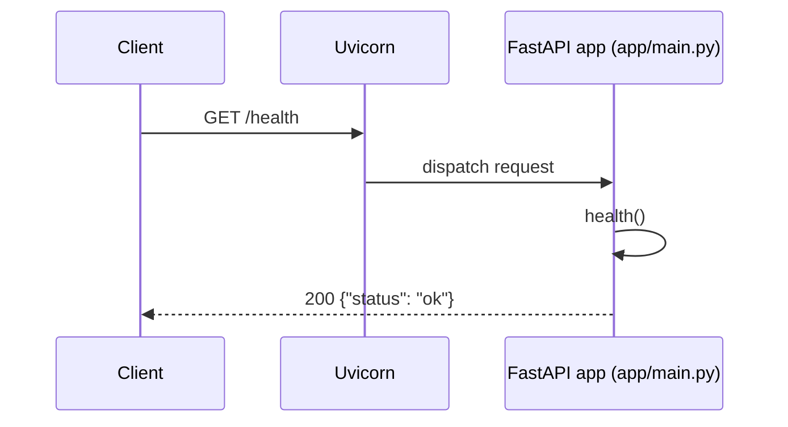

No dependencies, no I/O, no configuration involved — this route exists to
answer "is the process up" independent of anything else.

## Flow 2 — Economic Series Request (success path)

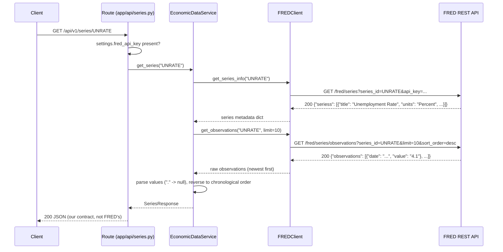

Two separate FRED requests happen per series lookup — one for metadata
(title, units), one for observations — each going through the same
`FREDClient._get` request path (timeout, error translation) independently.

## Flow 3 — Failure Scenarios

All failures below funnel through the same shape: `FREDClient` raises one
of a small set of typed exceptions, and `app/api/series.py` is the single
place that maps each one to an HTTP status code. Nothing upstream of the
route (the service, the client) ever produces an HTTP response directly.

| Scenario | Where it originates | Exception | Where translated | HTTP status |
|---|---|---|---|---|
| Nonexistent series ID | FRED responds `400`, `error_message` mentions the series | `FREDSeriesNotFoundError` | `app/api/series.py` | `404` |
| `FRED_API_KEY` not configured | Checked in the route before a client is built | *(none raised — early return)* | `app/api/series.py` | `503` |
| FRED rejects the API key | FRED responds `400`, `error_message` mentions `api_key` | `FREDAuthError` | `app/api/series.py` | `503` |
| Upstream request exceeds timeout | `httpx.TimeoutException` inside `FREDClient._get` | `FREDTimeoutError` | `app/api/series.py` | `504` |
| Network failure / malformed FRED response | `httpx.HTTPError`, JSON decode failure, or missing expected fields | `FREDUpstreamError` | `app/api/series.py` | `502` |

### Nonexistent series

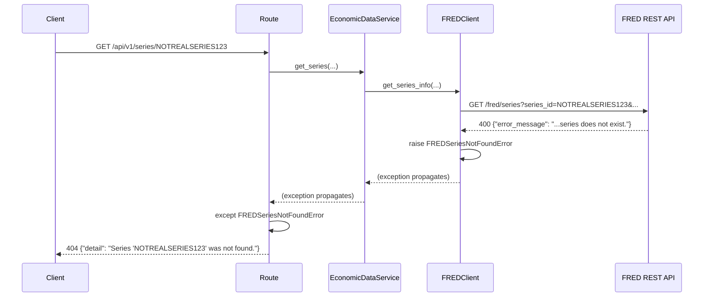

### Missing FRED configuration

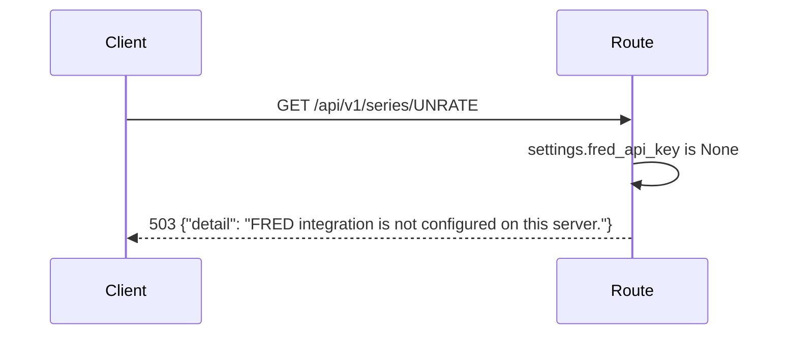

No `FREDClient` is even constructed in this case — the route short-circuits
before any FRED call would be attempted.

### Bad FRED credentials

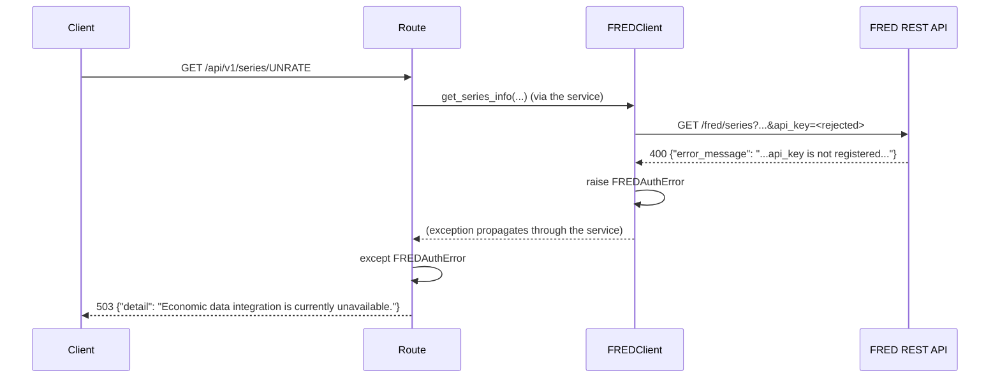

The client-facing message is deliberately generic: FRED's raw
`error_message` and the fact that the failure is credential-related are
never exposed to the API consumer.

### Upstream timeout

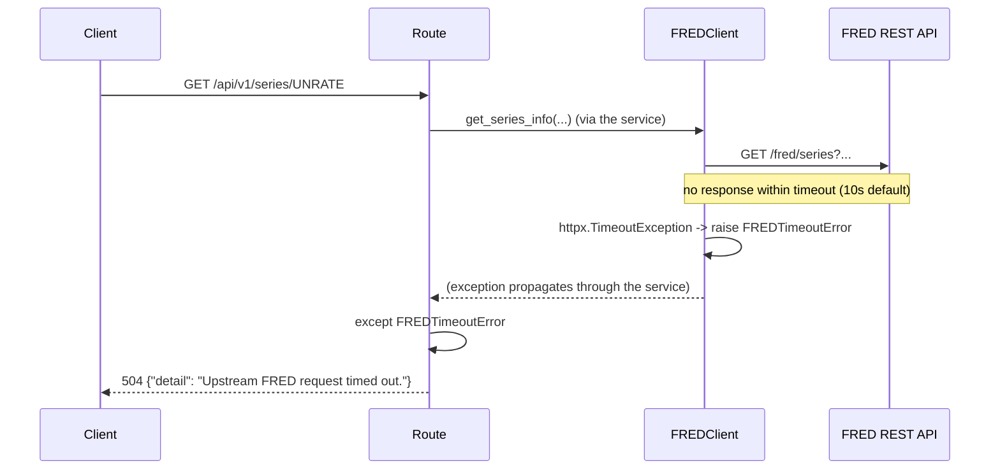

## Flow 4 — Economic Series Sync (success path)

`POST /api/v1/series/{series_id}/sync` fetches from FRED (identical to
Flow 2) and then persists the result to PostgreSQL, all within one
database transaction.

```mermaid
sequenceDiagram
    participant C as Client
    participant R as Route (app/api/series.py)
    participant S as EconomicDataService
    participant FC as FREDClient
    participant FRED as FRED REST API
    participant SS as session_scope()
    participant Repo as SeriesRepository
    participant DB as PostgreSQL

    C->>R: POST /api/v1/series/UNRATE/sync
    R->>R: fred_api_key and database_url present?
    R->>SS: enter session_scope()
    SS->>DB: (session opened; transaction begins implicitly)
    R->>S: sync_series("UNRATE", session)
    S->>FC: get_series_info / get_observations (same as Flow 2)
    FC->>FRED: GET /fred/series, GET /fred/series/observations
    FRED-->>FC: 200 responses
    FC-->>S: raw metadata + observations
    S->>S: normalize -> SeriesResponse
    S->>Repo: save_series(SeriesResponse)
    Repo->>DB: SELECT economic_series WHERE series_id = 'UNRATE'
    alt series does not exist
        Repo->>DB: INSERT economic_series
        Repo->>DB: flush() (assigns new id, not yet committed)
    else series exists
        Repo->>DB: UPDATE economic_series SET title=..., units=..., source=...
    end
    Repo->>DB: SELECT existing economic_observations for this series
    loop each of the 10 normalized observations
        alt observation date already exists
            Repo->>DB: UPDATE economic_observations SET value=...
        else new date
            Repo->>DB: INSERT economic_observations
        end
    end
    Repo-->>S: EconomicSeries (persisted)
    S-->>R: SeriesResponse
    R->>SS: exit session_scope() normally
    SS->>DB: COMMIT
    R-->>C: 200 JSON (same contract as GET)
```

Calling this endpoint again with no change in FRED's data re-runs the same
sequence, but every branch takes the "already exists" path — no new rows,
no duplicate `(economic_series_id, observation_date)` pairs, because the
unique constraint backs up the upsert logic even if application logic
somehow missed a case.

## Flow 5 — Sync Failure Scenarios

Two failure categories are specific to the sync flow: FRED-side failures
(identical translation to Flow 3 — `FREDSeriesNotFoundError` → `404`,
`FREDAuthError` → `503`, `FREDTimeoutError` → `504`, `FREDUpstreamError` →
`502`) and database-side failures, new in this increment:

| Scenario | Where it originates | Exception | HTTP status |
|---|---|---|---|
| `DATABASE_URL` not configured | Checked in the route before a session is opened | *(none — early return)* | `503` |
| Database unreachable (connection refused, wrong host/port) | `sqlalchemy.exc.OperationalError` when the engine/session tries to connect | `OperationalError` | `503` |
| Unique/FK constraint violated despite the upsert logic (e.g. a genuine race) | `sqlalchemy.exc.IntegrityError` on flush/commit | `IntegrityError` | `409` |
| Any other database-layer failure | `sqlalchemy.exc.SQLAlchemyError` (base class) | `SQLAlchemyError` | `500` |

### Transaction rollback on mid-operation failure

If persistence fails *after* some work has already been flushed to
PostgreSQL but *before* the transaction commits, nothing partial is left
behind — `session_scope()`'s `except`/`rollback()` path discards
everything done inside that transaction, flushed or not:

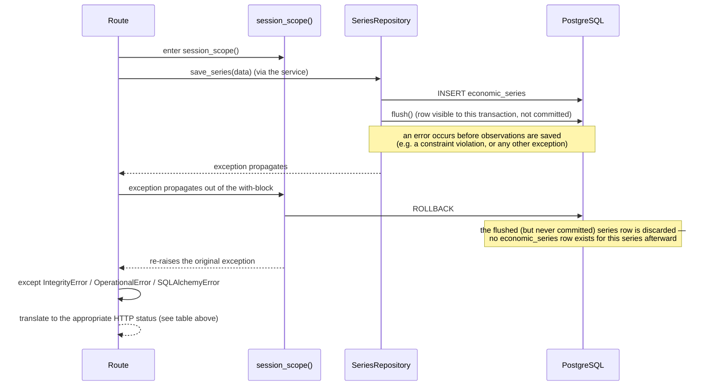

This was verified directly (not just reasoned about): a script opened a
`session_scope()`, flushed a new series row, then raised an injected
exception before committing — the series row was confirmed absent
afterward.

### Missing database configuration

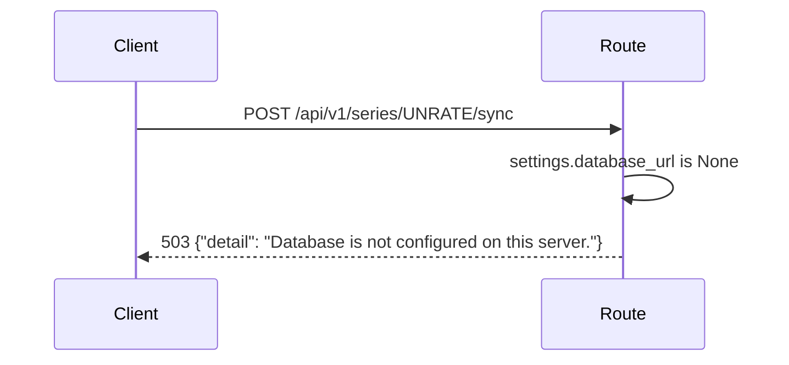

No session is opened and FRED is never called in this case — the route
short-circuits before any work begins, the same pattern used for a
missing `FRED_API_KEY`.

## Flow 6 — Historical Observations Query (success path)

`GET /api/v1/series/{series_id}/observations` reads only from PostgreSQL.
`FREDClient` never appears anywhere in this flow — no import, no
instantiation, no call.

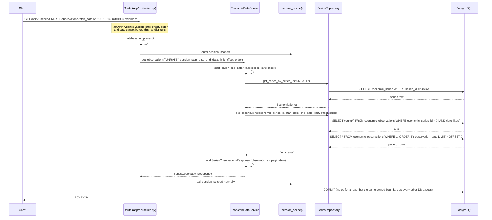

Both the count query and the page query share the same `WHERE`
conditions, which is what guarantees `pagination.total` always describes
exactly what `limit`/`offset` are paginating over.

## Flow 7 — Observations Query Failure Scenarios

| Scenario | Where it's caught | HTTP status |
|---|---|---|
| Malformed `limit`/`offset`/`order`/date syntax | FastAPI/Pydantic, before the route body runs | `422` |
| `start_date` after `end_date` | `InvalidDateRangeError` from `EconomicDataService.get_observations` | `400` |
| Series not persisted in PostgreSQL | `SeriesNotFoundError` from the service (repository returned no series row) | `404` |
| Series persisted, but no observation matches the filters | *(no exception — a normal empty result)* | `200`, `observations: []`, `total: 0` |
| `DATABASE_URL` not configured | Checked in the route before a session is opened | `503` |
| Database unreachable | `sqlalchemy.exc.OperationalError` | `503` |
| Any other database-layer failure | `sqlalchemy.exc.SQLAlchemyError` (base class) | `500` |

Note what's *not* in this table compared to Flow 5's write-side table:
`IntegrityError` has no branch here. A read-only `SELECT` cannot violate a
unique or foreign-key constraint, so there is no realistic way for this
endpoint to raise one — a handler for it would be dead code, not defense.

### Nonexistent persisted series vs. an empty filtered result

These look similar from the outside (no observations come back) but mean
different things and are handled differently:

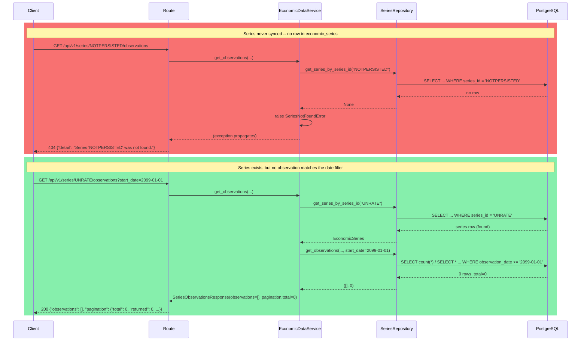

## Flow 8 — Transformation Query (with boundary-context retrieval)

`GET /api/v1/series/{series_id}/transform` reads only from PostgreSQL,
same as Flow 6 — `FREDClient` never appears here either. The distinctive
part of this flow is fetching enough *preceding* context to compute
correct values at the start of the requested range, then trimming that
context back out before responding.

```mermaid
sequenceDiagram
    participant C as Client
    participant R as Route (app/api/series.py)
    participant S as EconomicDataService
    participant Repo as SeriesRepository
    participant Eng as Transformation engine<br/>(app/domain/transformations.py)
    participant DB as PostgreSQL

    C->>R: GET .../UNRATE/transform?transformation=percent_change&start_date=2026-02-01
    Note over R: FastAPI/Pydantic validate transformation (Literal),<br/>window bounds (2-365 if given), and date syntax
    R->>R: database_url present?
    R->>S: get_transformed_observations("UNRATE", session, transformation, start_date, end_date, window)
    S->>S: start_date > end_date? window required/inapplicable for this transformation?
    S->>Repo: get_series_by_series_id("UNRATE")
    Repo->>DB: SELECT economic_series WHERE series_id = 'UNRATE'
    DB-->>Repo: series row
    Repo-->>S: EconomicSeries
    S->>Repo: get_observations_in_range(series.id, start_date, end_date)
    Repo->>DB: SELECT * WHERE economic_series_id = ? AND observation_date >= '2026-02-01' ORDER BY observation_date
    DB-->>Repo: requested-range rows
    Repo-->>S: requested
    Note over S: start_date given and context_size > 0 -->> fetch leading context
    S->>Repo: get_preceding_observations(series.id, before_date=start_date, count=context_size)
    Repo->>DB: SELECT * WHERE economic_series_id = ? AND observation_date < '2026-02-01' ORDER BY observation_date DESC LIMIT context_size
    DB-->>Repo: up to context_size preceding rows (most recent first)
    Repo-->>S: context (reversed back to ascending)
    S->>S: combined = context + requested  (one continuous ascending list)
    S->>Eng: percent_change(combined)
    Note over Eng: pure function -- no DB, no HTTP, no FRED;<br/>processes the list positionally, unaware<br/>any of it is "context"
    Eng-->>S: transformed (one result per input point, same length as combined)
    S->>S: output = transformed[len(context):]  (drop the context-only leading results)
    S-->>R: SeriesTransformResponse(transformation, observations=output)
    R-->>C: 200 JSON -- only dates >= 2026-02-01, but the first one's<br/>value is computed correctly against the point before it
```

The count query/page query symmetry from Flow 6 doesn't apply here —
`.../transform` has no `total`/pagination metadata at all (see Flow 9's
table and the journal for why).

## Flow 9 — Transformation Failure Scenarios

| Scenario | Where it's caught | HTTP status |
|---|---|---|
| Malformed `window`/date syntax, or an unrecognized `transformation` value | FastAPI/Pydantic, before the route body runs | `422` |
| `start_date` after `end_date` | `InvalidDateRangeError` from the service | `400` |
| `transformation=moving_average` with no `window` | `InvalidWindowError` from the service | `400` |
| `window` supplied for `absolute_change`/`percent_change` | `InvalidWindowError` from the service | `400` |
| Series not persisted in PostgreSQL | `SeriesNotFoundError` from the service | `404` |
| `DATABASE_URL` not configured | Checked in the route before a session is opened | `503` |
| Database unreachable | `sqlalchemy.exc.OperationalError` | `503` |
| Any other database-layer failure | `sqlalchemy.exc.SQLAlchemyError` (base class) | `500` |

As with Flow 7, there is no `IntegrityError` branch: this endpoint never
writes. `window`'s numeric bounds (`2`–`365`) are enforced structurally by
FastAPI whenever a value is supplied at all; whether a value is *allowed*
to be supplied depends on `transformation`, which FastAPI can't know on
its own — that cross-field decision is exactly what `InvalidWindowError`
exists for:

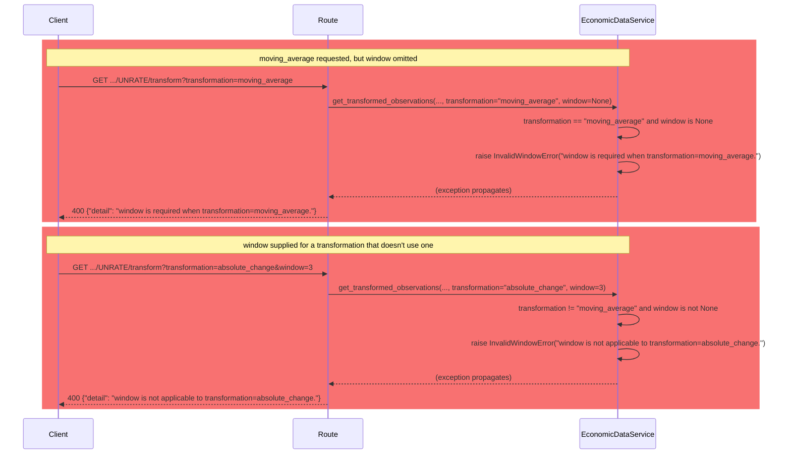

## Flow 10 — Multi-Series Analysis Query (success path)

`GET /api/v1/analysis/compare` reads only from PostgreSQL, twice —
independently for `series_a` and `series_b` — then aligns and analyzes
in-process. `FREDClient` never appears anywhere in this flow.

```mermaid
sequenceDiagram
    participant C as Client
    participant R as Route (app/api/analysis.py)
    participant S as AnalysisService
    participant Repo as SeriesRepository
    participant Eng as Analysis engine<br/>(app/domain/analysis.py)
    participant DB as PostgreSQL

    C->>R: GET /analysis/compare?series_a=UNRATE&series_b=CPIAUCSL&analysis=correlation
    Note over R: FastAPI/Pydantic validate analysis (Literal)<br/>and date syntax before this handler runs
    R->>R: database_url present?
    R->>S: compare("UNRATE", "CPIAUCSL", session, analysis, start_date, end_date)
    S->>S: start_date > end_date?
    S->>Repo: get_series_by_series_id("UNRATE")
    Repo->>DB: SELECT economic_series WHERE series_id = 'UNRATE'
    DB-->>Repo: series_a row
    S->>Repo: get_series_by_series_id("CPIAUCSL")
    Repo->>DB: SELECT economic_series WHERE series_id = 'CPIAUCSL'
    DB-->>Repo: series_b row
    S->>Repo: get_observations_in_range(series_a.id, start_date, end_date)
    Repo->>DB: SELECT * WHERE economic_series_id = ? [AND date filters] ORDER BY observation_date
    DB-->>Repo: series A's observations
    S->>Repo: get_observations_in_range(series_b.id, start_date, end_date)
    Repo->>DB: SELECT * WHERE economic_series_id = ? [AND date filters] ORDER BY observation_date
    DB-->>Repo: series B's observations
    S->>Eng: align_series(observations_a, observations_b)
    Note over Eng: exact-date inner join (dict keys, never zip/position);<br/>pure -- no DB, no HTTP, no FRED
    Eng-->>S: aligned pairs (matching_pairs = len(aligned))
    S->>Eng: count_usable_pairs(aligned)
    Eng-->>S: usable_pairs
    S->>Eng: pearson_correlation(aligned)
    Note over Eng: computed over usable pairs only;<br/>null if <2 usable or zero variance
    Eng-->>S: correlation (float or null)
    S->>S: build SeriesComparisonResponse (observations=[] for correlation)
    S-->>R: SeriesComparisonResponse
    R-->>C: 200 JSON
```

Both `get_observations_in_range` calls are the *same* repository method
Increment 005 already built for single-series use — reused unchanged,
called once per compared series, with no analysis-specific repository
method added.

## Flow 11 — Multi-Series Analysis Failure Scenarios

| Scenario | Where it's caught | HTTP status |
|---|---|---|
| Malformed date syntax, or an unrecognized `analysis` value | FastAPI/Pydantic, before the route body runs | `422` |
| Missing `series_a` or `series_b` (required query params) | FastAPI/Pydantic, before the route body runs | `422` |
| `start_date` after `end_date` | `InvalidDateRangeError` from the service | `400` |
| `series_a` not persisted in PostgreSQL | `SeriesNotFoundError` from the service, naming `series_a` | `404` |
| `series_b` not persisted in PostgreSQL | `SeriesNotFoundError` from the service, naming `series_b` | `404` |
| `DATABASE_URL` not configured | Checked in the route before a session is opened | `503` |
| Database unreachable | `sqlalchemy.exc.OperationalError` | `503` |
| Any other database-layer failure | `sqlalchemy.exc.SQLAlchemyError` (base class) | `500` |

As with Flows 7 and 9, there is no `IntegrityError` branch — this endpoint
never writes.

### Zero matching dates and undefined correlation — both valid `200`s, not errors

Neither of these is a failure; both are legitimate answers a caller needs
to be able to receive without the response looking like something broke:

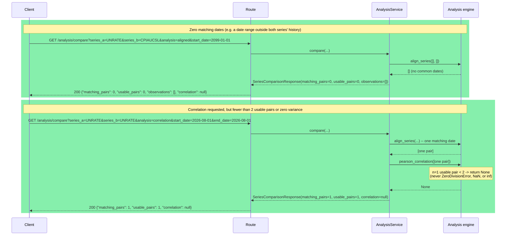
