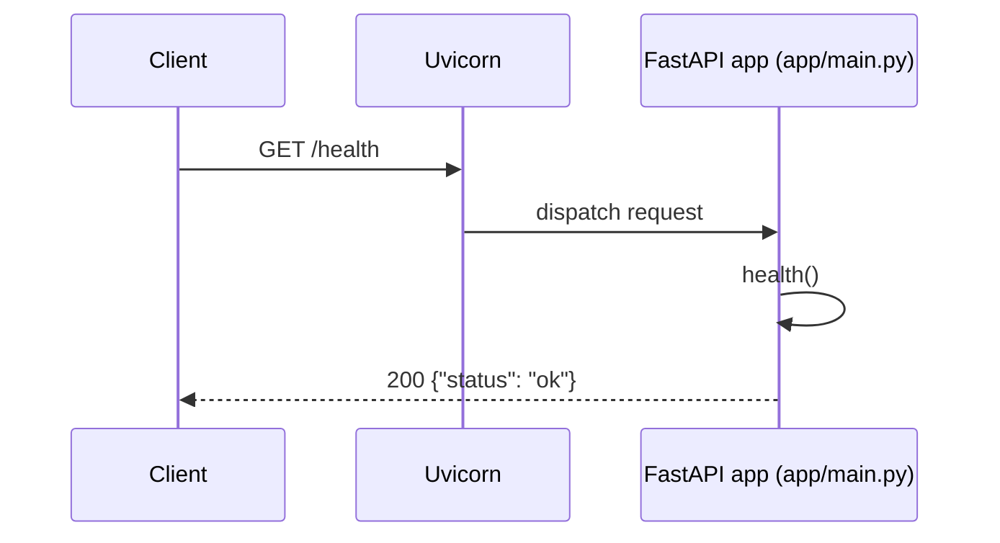
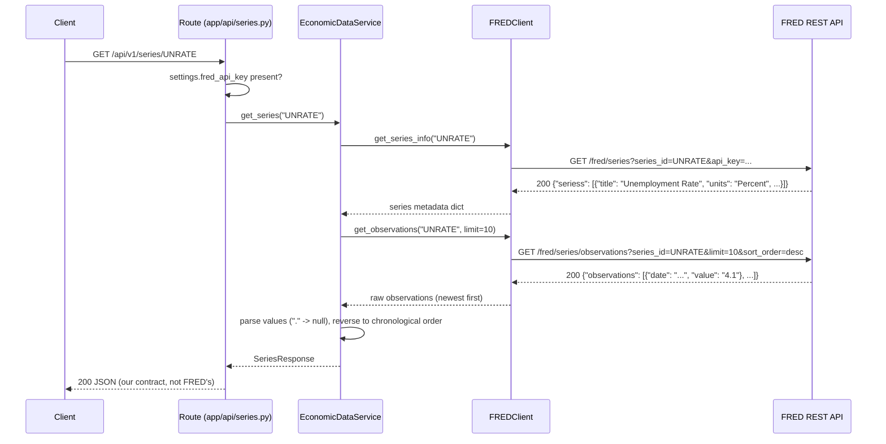
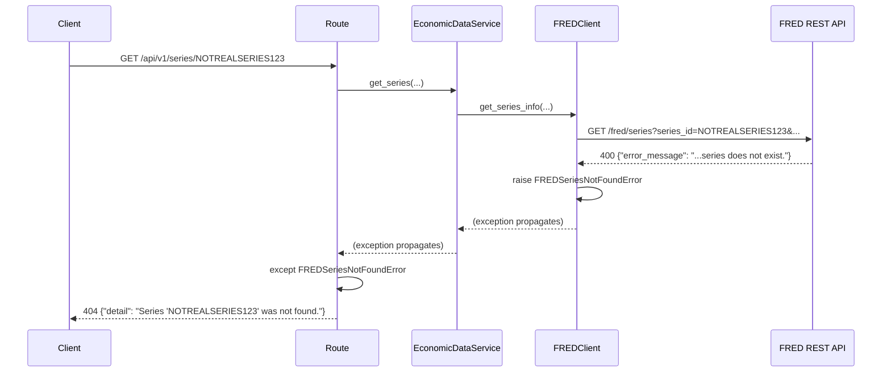
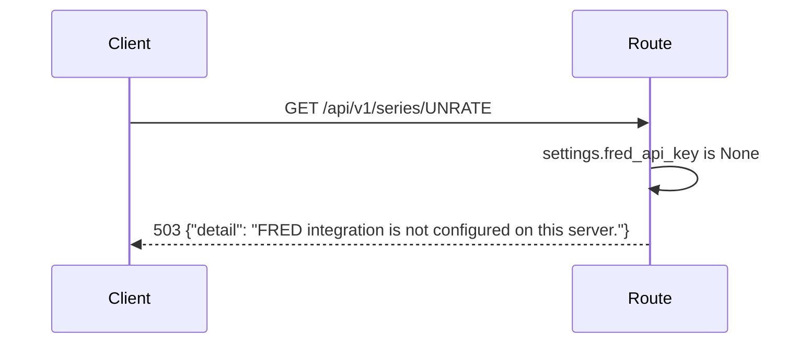
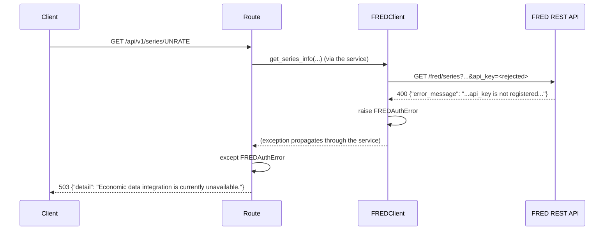
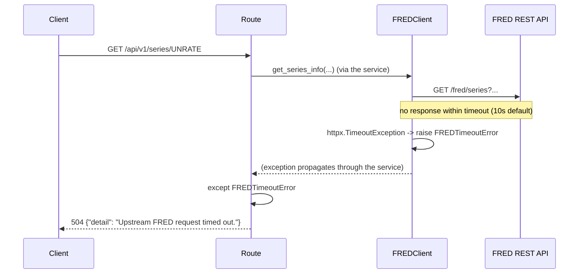

# Request Flows

Runtime flows through the system as it exists today. See
[`current-architecture.md`](current-architecture.md) for the static
component picture.

## Flow 1 — Health Check

No dependencies, no I/O, no configuration involved — this route exists to
answer "is the process up" independent of anything else.

## Flow 2 — Economic Series Request (success path)

Two separate FRED requests happen per series lookup — one for metadata
(title, units), one for observations — each going through the same
`FREDClient._get` request path (timeout, error translation) independently.

## Flow 3 — Failure Scenarios

All failures below funnel through the same shape: `FREDClient` raises one
of a small set of typed exceptions, and `app/api/series.py` is the single
place that maps each one to an HTTP status code. Nothing upstream of the
route (the service, the client) ever produces an HTTP response directly.

| Scenario | Where it originates | Exception | Where translated | HTTP status |
|---|---|---|---|---|
| Nonexistent series ID | FRED responds `400`, `error_message` mentions the series | `FREDSeriesNotFoundError` | `app/api/series.py` | `404` |
| `FRED_API_KEY` not configured | Checked in the route before a client is built | *(none raised — early return)* | `app/api/series.py` | `503` |
| FRED rejects the API key | FRED responds `400`, `error_message` mentions `api_key` | `FREDAuthError` | `app/api/series.py` | `503` |
| Upstream request exceeds timeout | `httpx.TimeoutException` inside `FREDClient._get` | `FREDTimeoutError` | `app/api/series.py` | `504` |
| Network failure / malformed FRED response | `httpx.HTTPError`, JSON decode failure, or missing expected fields | `FREDUpstreamError` | `app/api/series.py` | `502` |

### Nonexistent series

### Missing FRED configuration

No `FREDClient` is even constructed in this case — the route short-circuits
before any FRED call would be attempted.

### Bad FRED credentials

The client-facing message is deliberately generic: FRED's raw
`error_message` and the fact that the failure is credential-related are
never exposed to the API consumer.

### Upstream timeout

